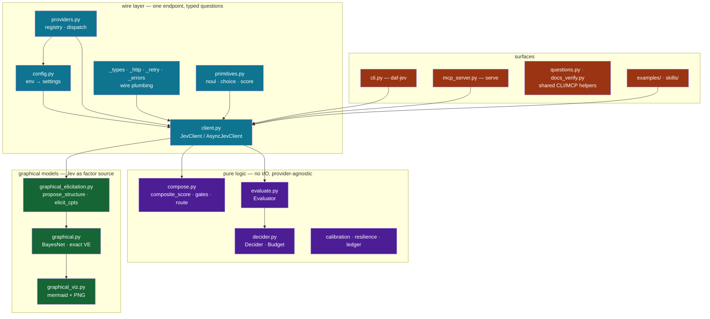
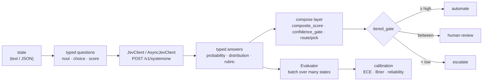
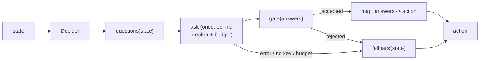
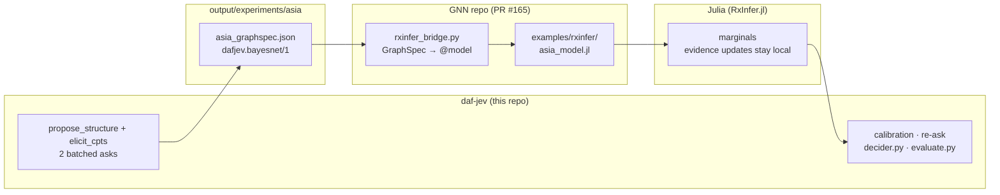
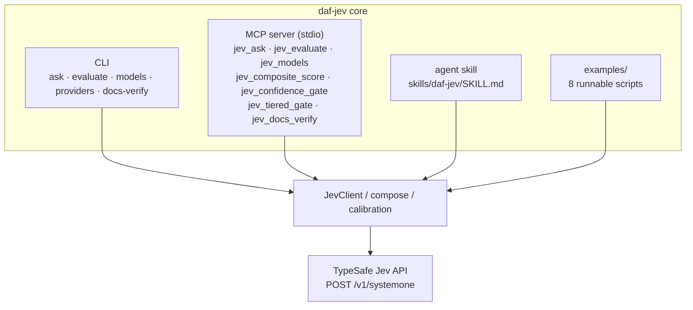

# daf-jev
[](https://doi.org/10.5281/zenodo.22816187)
[](pyproject.toml)
[](LICENSE)
[](https://zenodo.org/records/22921974)


Modular, composable Python client and decision toolkit for the **TypeSafe Jev
(System One) API**. One HTTP endpoint, three question primitives, and a set of
pure-logic composition patterns built on top of the answers — plus a
concurrent batch evaluation harness, an MCP server, a figure registry, and a
reproducible manuscript pipeline.

**Contents**: [What it provides](#what-it-provides) ·
[Architecture at a glance](#architecture-at-a-glance) ·
[How a decision flows](#how-a-decision-flows) · [Quickstart](#quickstart) ·
[Examples](#examples) · [Evaluating a corpus](#evaluating-a-corpus) ·
[Usage accounting and resilience](#usage-accounting-and-resilience) ·
[Decision-point decider](#decision-point-decider) ·
[Graphical models](#graphical-models) ·
[Jev to RxInfer.jl pipeline](#jev-to-rxinferjl-pipeline) · [CLI](#cli) ·
[MCP server](#mcp-server) · [Configuration](#configuration) ·
[Providers](#providers) · [Figures and manuscript](#figures-and-manuscript) ·
[Tests and benchmarks](#tests-and-benchmarks) · [Map](#map) ·
[Documentation](#documentation)

## What it provides

- **Primitives** — `noul` (yes/no), `choice` (pick an option from a
  probability distribution), `score` (rated on ordered levels). Build
  questions with `noul()` / `choice()` / `score()` and group them in a
  `QuestionSet`; batch any number of questions into a single API call.
- **Client** — `JevClient` / `AsyncJevClient` wrapping
  `POST https://api.typesafe.ai/v1/systemone`, with retries (429/529,
  exponential backoff, `Retry-After`), typed error mapping, and a
  `models()` listing. Retry policy, default timeout, and default model
  resolve from the environment (see [Configuration](#configuration)); every
  `ask` / `models` call also accepts a per-call `timeout` override and
  extra `request_headers` (merged over the defaults for that call only;
  `models()` retries per the same policy as `ask`).
- **Providers** — one wire contract, several backends: hosted `jev`
  (TypeSafe), self-hosted `jeff` / `kev` / `localjev` /
  `openthai-systemone`, and the `openrouter` proxy. A global `--provider`
  CLI flag, a keyless `providers` registry listing, and `for_provider()` /
  `open_client(provider, ...)` constructors dispatch across them (see
  [Providers](#providers)).
- **Composition patterns** — pure functions over answers:
  `composite_score` (probability-weighted expected value over score levels),
  `confidence_gate` (auto-escalate low-confidence answers), `route` /
  `pick` (intent routing by choice). `route`, `composite_score`, and
  `confidence_gate` are exported from the package root; `pick` and
  `tiered_gate` live only in `daf_jev.compose`.
- **Evaluation** — `Evaluator` runs a fixed question set over many states
  concurrently (thread pool for `JevClient`, `asyncio` semaphore for
  `AsyncJevClient`) without aborting the batch: per-state failures are
  captured in `EvaluationRecord.error`. `summary()` aggregates per-question
  means plus batch-level latency mean/p95 and token usage; `to_json()`
  serializes records.
- **Usage accounting** — `UsageLedger` (thread-safe) accumulates request
  counts and token totals across any loop of `ask` calls; it accepts `Usage`
  objects, full responses, or `None` for error paths, and
  `snapshot().to_dict()` is JSON-safe.
- **Resilience** — an opt-in, composable `CircuitBreaker`: after
  `failure_threshold` consecutive failures it fails fast for
  `cooldown_seconds`, then admits a single recovery probe. It wraps any
  callable, never sleeps, and takes an injectable clock; it complements the
  per-request retry policy.
- **Decider** — the decision-point loop as one reusable class: observe a
  state, compose a batched ask, gate the answers, and fail open to a
  deterministic fallback, with a call/token budget, a per-decision cache,
  a consecutive-failure latch, and JSON-safe event receipts.
- **Graphical models** — Jev as a factor source for discrete Bayes nets:
  `elicit_cpts` elicits every CPT of a network in one batched ask,
  `propose_structure` proposes the topology via pairwise choices, and
  `BayesNet` runs exact local inference (pure-Python variable
  elimination) plus MPE, ancestral sampling, and what-if scenario
  sweeps; `to_json()` emits the `dafjev.bayesnet/1` GraphSpec
  interchange for GNN / RxInfer.jl / GTSAM-style engines (see
  [Graphical models](#graphical-models)).
- **Calibration** — pure reliability statistics in `daf_jev.calibration`
  (`bucket_index`, `reliability_table`, `expected_calibration_error`,
  `brier_score`) over `(confidence, correct)` pairs, plus a live calibration
  benchmark (`benchmarks/bench_calibration.py`).
- **Model jaggedness** — pure uniformity statistics in `daf_jev.jaggedness`
  (`uniform_chi2`, `uniform_deviation`, `runs_test_z`, `max_streak`,
  `position_slope`, `noul_choice_delta`) over repeated stochastic prompts
  (coin, d6), plus a live multi-provider jaggedness benchmark
  (`benchmarks/bench_jaggedness.py`).
- **Figures & manuscript** — a matplotlib figure registry (7 figures +
  `figure_registry.json`) and a `{{TOKEN}}` variable pipeline that keep the
  10-section manuscript in `manuscript/` free of hardcoded results.
- **MCP server** — `daf-jev serve` exposes the toolkit as seven MCP tools
  (`jev_ask`, `jev_evaluate`, `jev_models`, `jev_composite_score`,
  `jev_confidence_gate`, `jev_tiered_gate`, `jev_docs_verify`) plus a
  `jev://docs/snapshot` resource, over stdio (see [MCP server](#mcp-server)).

Dependencies: Python >= 3.10, `httpx`, `pyyaml` (plus `matplotlib` +
`pillow` for figures). Managed with `uv`.

## Architecture at a glance

Every box maps to a file — follow it into the [Map](#map) for source and
contract links. The per-module contract lives in
[Package layout](docs/ARCHITECTURE.md#package-layout-srcdaf_jev) in
[`docs/ARCHITECTURE.md`](docs/ARCHITECTURE.md).



The core runs on stdlib + `httpx` (+ `pyyaml`); `matplotlib` is optional
(the `figures` extra). Inference in `graphical.py` is pure-stdlib
variable elimination — no numpy, no network at query time.

## How a decision flows



The batched call carries *all* questions at once — live benchmarks show it
running up to ~18× faster than sequential single-question calls while the
sequential strategy consumes up to ~4× more tokens (see
[Tests and benchmarks](#tests-and-benchmarks)).


## Quickstart

```bash
uv sync
export JEV_API_KEY="sk-..."   # or TYPESAFE_API_KEY, or put it in .env
```

`.env` at the project root is auto-loaded (there is a `.env.example` to copy
from; `.env` itself is gitignored).

```python
from daf_jev import JevClient, choice, noul, score

with JevClient() as client:  # api_key resolved from env / .env
    resp = client.ask(
        "Customer message: I was charged twice this month and nobody has responded.",
        {
            "billing": noul("Is this about a billing problem?"),
            "tone": choice("What is the tone?", {"calm": None, "frustrated": "annoyed but civil"}),
            "severity": score("How severe?", ["minor", "noticeable", "blocking"]),
        },
    )

print(resp.nouls["billing"].noul)          # 0.0 (no) .. 1.0 (yes)
print(resp.choices["tone"].choice, resp.choices["tone"].confidence)
print(resp.scores["severity"].score)       # probability-weighted, may be fractional
```

Composing decisions:

```python
from daf_jev import confidence_gate, composite_score

value = composite_score(resp.scores["severity"])   # expected value over level indices
verdict = confidence_gate(resp.choices["tone"], threshold=0.6, below="review")
```

## Examples

Eight runnable scripts live in `examples/` (walkthrough per script in
[`examples/README.md`](examples/README.md)). Each resolves the API key from
the environment or `.env` and — when no key is found — prints
`SKIP: JEV_API_KEY not set` and exits 0, so all eight are offline-safe:

```bash
python examples/quickstart.py         # one mixed ask call; answers, usage, request id
python examples/triage_router.py      # tiered_gate + route over one choice answer
python examples/composite_scoring.py  # composite_score + confidence_gate
python examples/evaluate_corpus.py    # Evaluator over an inline four-state corpus
python examples/gated_fallback.py     # heuristic-first: model called only when it adds value
python examples/decider_loop.py       # decision-point loop: gate, budget, fail-open fallback
python examples/providers_example.py  # provider registry + dispatch; injected transport, no network
python examples/asia_bayes.py         # Bayes net from Jev factors: CPT elicitation, structure proposal, posterior walkthrough
```

All eight take `--model NAME` (default: provider-resolved — for the
default `jev` provider: `JEV_MODEL`, then `TYPESAFE_DEFAULT_MODEL`, then
`jev-latest`); `asia_bayes.py` also takes `--provider KEY` (default
`jev`); `evaluate_corpus.py` also takes `--concurrency N` (default 2).

## Evaluating a corpus

Run a fixed question set over many states, concurrently, with per-state error
capture (`evaluate` never aborts the batch on one bad state).

CLI — `--questions-file` is a YAML mapping of id to a spec string or a native
question mapping; `--states-file` is one state per line (blank lines skipped)
or a JSON array of strings:

```bash
uv run daf-jev evaluate \
  --questions-file questions.yaml \
  --states-file states.txt \
  --concurrency 8 \
  --include-records
```

Python — pass a sync or async client; bare `str` states get `state_0000`-style
ids. An `AsyncJevClient` is single-use through `evaluate()`: the Evaluator
closes the async session when the batch completes (its keep-alive connections
are bound to the private event loop).

Inside a running event loop, `await evaluator.evaluate_async([("id",
state), ...])` is the public async entry point: the same batch on your
own loop (`TypeError` unless the client is an `AsyncJevClient`).

```python
from daf_jev import Evaluator, JevClient, QuestionSet, noul, score

questions = QuestionSet().add(
    "billing", noul("Is this about a billing problem?")
).add(
    "severity", score("How severe?", ["minor", "noticeable", "blocking"]),
)

with JevClient() as client:
    evaluator = Evaluator(client, questions, concurrency=8)
    records = evaluator.evaluate(["state one text", "state two text", ...])

summary = evaluator.summary(records)      # per-question means + batch latency mean/p95 + usage
print(evaluator.to_json(records))         # per-state records incl. errors/latency
```

## Usage accounting and resilience

Long-running consumers need receipts and failure isolation beyond the
per-request retry policy. Both are small, opt-in, client-side helpers:

```python
from daf_jev import UsageLedger

ledger = UsageLedger()
for state in states:
    try:
        response = client.ask(state, questions)
    except TypeSafeError:
        response = None               # error paths produce no usage
    ledger.record(response)
print(ledger.snapshot().to_dict())    # {"requests": .., "input_tokens": .., ...}
```

`UsageLedger` accumulates request counts and token totals across any loop of
`ask` calls; `Evaluator.summary()` remains the aggregator for batch
evaluation runs. `reset()` returns the pre-reset totals and zeroes the
ledger.

```python
from daf_jev import CircuitBreaker, CircuitOpenError

breaker = CircuitBreaker(failure_threshold=5, cooldown_seconds=30.0)
try:
    response = breaker.call(client.ask, state, questions)
except CircuitOpenError as exc:
    ...                               # fail fast while the circuit is open
```

`CircuitBreaker` wraps any callable: `failure_threshold` consecutive
failures open the circuit for `cooldown_seconds`, after which a single
probe is admitted. It never sleeps — wait out the cooldown in your own loop
(`exc.remaining_seconds` reports what is left) — and composes with the
per-request retry policy.

## Decision-point decider

`Decider` distills the recurring decision-point loop — observe a state,
compose a batched ask, gate the answers, fail open to a deterministic
fallback — into one reusable class over injected I/O:



```python
from daf_jev import Budget, ConfidenceGate, Decider, choice

def fallback(state: str) -> str:
    return "hold"                      # deterministic floor action

decider = Decider(
    client,                             # any object with .ask(state, questions, timeout=)
    render_state=str,
    questions=lambda state: {
        "route": choice("Pick an action.", {"act": None, "hold": "wait"})
    },
    map_answers=lambda state, resp: resp.choices["route"].choice,
    fallback=fallback,
    gate=ConfidenceGate("route", threshold=0.7),
    budget=Budget(max_calls=100),
    on_event=lambda event: print(event.to_dict()),   # JSON-safe receipt
)
action = decider.decide("state text")   # never raises
```

`decide()` never raises: every failure — no API key, client construction,
budget exhaustion, compose/ask/gate/mapping errors, an open circuit, or
too many consecutive failures — falls back to the floor action and is
classified into a closed reason taxonomy on the emitted `DecisionEvent`
(`not_asked`, `no_key`, `client_error`, `latched`, `budget`, `breaker`,
`compose_error`, `ask_error`, `gate`, `mapping_error`). The default client
is single-attempt per ask (`JevClient(env=env, retry=RetryPolicy(
max_attempts=1))`), so worst-case blocking is one timeout, never timeout x
retries; consumers wanting retries pass their own `client_factory`. With a
`ConfidenceGate` configured, `decider.calibration_pairs()` accumulates
`(declared confidence, gate-accepted)` pairs — a self-consistency proxy to
feed into `daf_jev.calibration`.

## Graphical models

Jev doubles as a **factor source for graphical models**: zero-shot
probabilistic factors that a Bayes-net engine turns into reusable
inference (per Frank Dellaert's Jev+GTSAM experiments). Two batched
requests cover a whole discrete network — one asks for **every CPT at
once** (`elicit_cpts`: an 8-variable binary net is 18 rows in a single
call), the other proposes the **topology itself** via pairwise three-way
choices (`propose_structure`: `a->b` / `b->a` / `no-edge` over all
n(n-1)/2 pairs, scored into a DAG by log-probability). Inference is
local and exact: `BayesNet.query` / `.posterior` run pure-Python variable
elimination over the elicited factors — stdlib only, no numpy, no API
calls at query time.

Jev appears at three seams:

- **Upstream** — the net's structure and CPTs are elicited from a Jev
  provider (any of them; the provider is chosen where the client is
  built).
- **Within** — the factors themselves are Jev probabilities.
- **Downstream** — evidence queries run locally and exactly; a posterior
  can drive a follow-up `ask` (re-asking) in the same workflow.

```python
from daf_jev import Variable, elicit_cpts, propose_structure

variables = [...]                        # e.g. the 8 Asia variables
proposal = propose_structure(variables, client=client)      # edges only
net = elicit_cpts(variables, proposal.edges, client=client) # fills every CPT
p_tub = net.query("tub", evidence={"xray": "true"})[1]      # exact marginal
spec = net.to_json()                     # GraphSpec interchange
```

| Surface | What it does |
| --- | --- |
| `Variable(key, description, states)` | one discrete variable — unique key, natural-language meaning, ordered states (>= 2) |
| `Edge(parent, child)` | one DAG edge |
| `CPT(child, parents, table)` | one conditional probability table (empty `parents` = prior) |
| `BayesNet(variables, edges, cpts)` | the validated net: `.query(variable, evidence)`, `.posterior(evidence)` (exact variable elimination), `.validate()`, `.topological_order()` |
| `BayesNet.most_probable_explanation(evidence)` | most probable joint assignment consistent with the evidence (max-product argmax; deterministic lexicographic tiebreak); `ValueError` on unknown keys/states or zero-probability evidence |
| `BayesNet.sample(n, rng=None)` | ancestral sampling in topological order — per-variable categorical draw over the CPT CDF with an injectable `random.Random` |
| `BayesNet.conditional_scenarios(variable, evidence=None, targets=None)` | what-if sweep — for each state of `variable`, the posterior marginals of `targets` (default: all other variables) under evidence + {variable: state} |
| `BayesNet.to_json()` / `.from_json(data)` | GraphSpec `dafjev.bayesnet/1` interchange (lossless round-trip) |
| `elicit_cpts(variables, edges, *, client, ...)` | every CPT row as one batched ask; deterministic question ids and state options; chunking via `max_questions_per_request` |
| `propose_structure(variables, *, client, ...)` | one batched ask over all variable pairs -> DAG proposal (edges only); exact ordering search up to `exact_limit=8`, greedy above with `edge_penalty` |

`to_json()` emits **GraphSpec** (`"format": "dafjev.bayesnet/1"`), the
interchange between this client and downstream graphical-model engines:
the GNN bridge consumes/produces it and the RxInfer.jl example reads it;
GTSAM-style engines map the same elicited factors onto their own discrete
types. The format string is a cross-repo contract — it changes only
together with the consuming bridges in the same wave (see `AGENTS.md`).

End-to-end walkthrough: [`examples/asia_bayes.py`](examples/asia_bayes.py)
— the eighth example (keyless skip; `--provider` / `--model` flags) builds
the Asia variables, runs both batched requests, walks the posterior
trajectory from the experiment (`asia=false`, then `+xray=true`, then
`+dysp=true`, printing the tub/lung/bronc marginals at each step), and
writes `asia_graphspec.json`.

The same surfaces ship with **visualization**: `to_mermaid(net)` renders a
zero-dependency mermaid `graph TD` diagram of the DAG (one labeled node per
variable, one arrow per edge, deterministic order), and the two matplotlib
plotters write artifacts — `plot_network(net, path)` (layered layout:
topological generations top-to-bottom, deterministic coordinates) and
`plot_posterior_trajectory(net, query_keys, steps, path, labels=...)`
(grouped bars of P(state=true) per query variable across cumulative
evidence steps, where "true" is the last state of each variable's states
tuple and values come from `net.posterior`). `animate_posterior(net,
query_keys, evidence_steps, path, *, labels=None, fps=1, dpi=110)` and
`animate_network(net, evidence_steps, path, *, fps=1)` — both in
[`graphical_animation.py`](src/daf_jev/graphical_animation.py) — render
the same walkthrough as animated GIFs: grouped P(true) bars growing per
evidence step (same P(true)-is-last-state convention) and the network
with node fills shaded by P(true) at each step (coolwarm 0..1);
PillowWriter writes the frames (`pillow` ships in the `figures` extra).
Matplotlib imports lazily inside the plotters and animators; install the
`figures` extra with `uv sync --extra figures`.

The Dellaert-style Asia experiment runs end-to-end through one thin
orchestrator:

```bash
uv run python scripts/bayes_experiment.py [--provider KEY] [--model NAME] \
    [--edge-penalty FLOAT] [--propose-structure] [--animate] [--out-dir PATH]
```

It prints the mermaid diagram, elicits the Asia CPTs in one batched ask,
walks the posterior trajectory (`priors` -> `asia=false` -> `+xray=true`
-> `+dysp=true`) as a P(true) table for tub/lung/bronc, and writes five
artifacts into `--out-dir` (default `output/experiments/asia`):
`asia_graphspec.json`, `network.png`, `posterior_trajectory.png`,
`mermaid.txt`, and `receipts.json` (see [Live receipts](#live-receipts)).
With `--animate` the runner additionally writes `posterior_animation.gif`
and `network_animation.gif` into `--out-dir` and records them under
`animations` in `receipts.json`.
Keyless runs print `SKIP: JEV_API_KEY not set` and exit 0 before any
network use.

### Live receipts

The committed artifacts come from a real end-to-end run (provider
`openrouter`, model `jev-latest`, two batched asks: topology proposal
plus the full 8-CPT elicitation). Exact posteriors under cumulative
evidence — P(tub) climbs 0.120 → 0.371 → 0.434 as x-ray and dyspnea
arrive:

| evidence | P(tub) | P(lung) | P(bronc) |
| --- | --- | --- | --- |
| priors | 0.1575 | 0.1305 | 0.2275 |
| `asia=false` | 0.1200 | 0.1305 | 0.2275 |
| `+xray=true` | 0.3712 | 0.3894 | 0.2444 |
| `+dysp=true` | 0.4342 | 0.4604 | 0.3219 |

Committed run artifacts (reproduce with the command above; keyless runs
skip cleanly):

- [`asia_graphspec.json`](output/experiments/asia/asia_graphspec.json) —
  the elicited net as GraphSpec `dafjev.bayesnet/1`
- [`network.png`](output/experiments/asia/network.png) — layered DAG
  layout
- [`posterior_trajectory.png`](output/experiments/asia/posterior_trajectory.png) —
  the P(true) bars behind the table
- [`mermaid.txt`](output/experiments/asia/mermaid.txt) — the `to_mermaid`
  render of the DAG
- [`receipts.json`](output/experiments/asia/receipts.json) — provider,
  model, proposed edges, elicited CPTs, and the trajectory itself

## Jev to RxInfer.jl pipeline

GraphSpec (`dafjev.bayesnet/1`) is the interchange between daf-jev and
the GNN bridge — [PR #165](https://github.com/ActiveInferenceInstitute/Generalized_Notation_Notation/pull/165)
on branch `feat/rxinfer-bridge`. daf-jev elicits structure and factors,
the GNN bridge emits a RxInfer.jl `@model`, Julia runs the inference,
and the marginals come back to daf-jev for calibration and re-asking:



Runnable end to end — the [live receipts](#live-receipts) above are
step 1 with `--provider openrouter`:

```bash
# 1. daf-jev (this repo) — elicit the Asia net, write the five artifacts
uv run python scripts/bayes_experiment.py --provider openrouter --propose-structure

# 2. GNN repo — clone, check out the bridge branch, emit the Julia model
git clone https://github.com/ActiveInferenceInstitute/Generalized_Notation_Notation
cd Generalized_Notation_Notation && git checkout feat/rxinfer-bridge
python -m gnn.rxinfer_bridge emit /path/to/daf-jev/output/experiments/asia/asia_graphspec.json

# 3. Julia — run the generated model over the same GraphSpec
julia --project=examples/rxinfer examples/rxinfer/asia_model.jl \
      examples/rxinfer/asia_graphspec.json
```

Cross-repo note: the bridge (`src/gnn/rxinfer_bridge.py`), its 39 tests,
and the GNN-side walkthrough (`examples/rxinfer/README.md`, with the
verified capability/gap matrix) live in the GNN repository — a relative
link across repos does not resolve on GitHub, so
[PR #165](https://github.com/ActiveInferenceInstitute/Generalized_Notation_Notation/pull/165)
is the entry point (its Files list shows all five bridge files).
Verified capability status: single-parent nets run end-to-end with
correct posteriors; multi-parent `DiscreteTransition` nodes hit a
ReactiveMP structured-rule limitation (documented in the PR).

Downstream is plain Python and needs no bridge: feed the marginals back
into [`Decider`](src/daf_jev/decider.py) /
[`Evaluator`](src/daf_jev/evaluate.py) or the
[`calibration`](src/daf_jev/calibration.py) functions, re-asking Jev
with the new evidence when a posterior warrants it.

## CLI

```bash
uv run daf-jev ask \
  --state "I was charged twice this month." \
  --question billing=noul:Is this about a billing problem? \
  --question tone=choice:What is the tone?:calm=,angry=hostile \
  --question severity=score:How severe?:minor,noticeable,blocking \
  --pretty

uv run daf-jev models                       # list available models
uv run daf-jev models --pick latest         # pick one (latest|first|last)
uv run daf-jev models --pick latest --contains jev

uv run daf-jev providers                    # provider registry listing (keyless, no network)
uv run daf-jev --provider kev models        # route any command through a registered provider

uv run daf-jev evaluate \
  --questions-file questions.yaml --states-file states.txt \
  --concurrency 8 --include-records

uv run daf-jev docs-verify     # re-hash docs/reference/ against MANIFEST.json; reports missing/drifted/added
```

All commands print JSON to stdout (errors go to stderr as JSON); exit 0 on
success, 2 on usage error, 1 on runtime error.

## MCP server

`daf-jev serve` runs the toolkit as a Model Context Protocol (MCP) server
over stdio — the default and only supported transport. The server needs the
official `mcp` SDK, shipped in the optional `mcp` dependency group. Every
surface below calls the same core; there is no second implementation:



```bash
uv sync --extra mcp
uv run daf-jev serve          # stdio; --transport stdio is the only choice
```

Tools (each returns JSON-safe values; keys resolve per call from env or
`.env`, and a missing API key surfaces as a tool error):

| Tool | What it does |
| --- | --- |
| `jev_ask` | one mixed noul/choice/score API call over a state |
| `jev_evaluate` | run a fixed question set over many states concurrently (summary) |
| `jev_models` | list model cards, optionally filtered/picked |
| `jev_composite_score` | expected level value from a probability dict (no API call) |
| `jev_confidence_gate` | one-threshold confidence routing (no API call) |
| `jev_tiered_gate` | two-threshold automate/review/escalate routing (no API call) |
| `jev_docs_verify` | re-hash `docs/reference/` against its manifest (no API call) |
| resource `jev://docs/snapshot` | `{page_count, snapshot_id, scraped_at, index_sha256}` summary of the docs manifest |

Schema note: `jev_evaluate` accepts string, JSON-object, or JSON-array
states (`str | dict | list`); the CLI `evaluate --states-file` JSON mode
accepts strings only. `jev_docs_verify` returns
`{manifest, pages, missing, drifted, added, ok}` — `added` lists unlisted
`.md` files on disk.

Point any MCP client at the server with a stdio config, e.g.:

```json
{
  "mcpServers": {
    "daf-jev": {
      "command": "uv",
      "args": ["run", "--directory", "/path/to/daf-jev", "daf-jev", "serve"],
      "env": { "JEV_API_KEY": "sk-..." }
    }
  }
}
```

`env` may be omitted when a `.env` file is present in the server's working
directory; credentials are never returned in tool output.

## Configuration

Everything resolves from the environment (injected env mapping > process env
> `.env` file); unset or invalid values fall back to the defaults below.

Naming note (verified): the official TypeSafe SDK convention is
`TYPESAFE_API_KEY` / `TYPESAFE_BASE_URL` / `TYPESAFE_DEFAULT_MODEL`; daf-jev
keeps the `JEV_*` names as its own primaries with the `TYPESAFE_*` names as
fallbacks. Every provider's key and base-URL env vars additionally fall
back to `TYPESAFE_API_KEY` / `TYPESAFE_BASE_URL` last.

| Variable | Purpose | Default |
| --- | --- | --- |
| `JEV_API_KEY` / `TYPESAFE_API_KEY` | API key | none (error when no transport injected) |
| `JEV_BASE_URL` / `TYPESAFE_BASE_URL` | API base URL override | `https://api.typesafe.ai` |
| `JEV_MODEL` / `TYPESAFE_DEFAULT_MODEL` | default model (applies when `JevClient` / `AsyncJevClient` get `model=None`, their default) | `jev-latest` |
| `JEV_MAX_ATTEMPTS` | max attempts incl. the initial request (int >= 1) | `3` |
| `JEV_BACKOFF_BASE` | base backoff delay in seconds (float > 0) | `0.5` |
| `JEV_BACKOFF_MAX` | backoff cap in seconds | `8.0` |
| `JEV_JITTER` | uniform ± jitter on the delay (float >= 0) | `0.1` |
| `JEV_TIMEOUT` | default request timeout in seconds (positive float) | none (explicit 60.0 s) |

Per-field: a bad value keeps only that field's default. Per-call `timeout=`
and `request_headers=` on `ask()` / `models()` win over all of the above for
that call.

## Providers

One wire contract — `POST /v1/systemone` — many backends. daf-jev ships a
provider registry (`src/daf_jev/providers.py`) that parameterizes config
resolution, client construction, and CLI/MCP dispatch; the pure-logic
layers (`compose`, `evaluate`, `decider`, `calibration`, `resilience`) are
provider-agnostic. `daf-jev providers` prints the registry as JSON
(keyless, no network):

| key | backend | default base URL | default model | client env vars | caveats |
| --- | --- | --- | --- | --- | --- |
| `jev` | TypeSafe Jev (System One), hosted | `https://api.typesafe.ai` | `jev-latest` | `JEV_API_KEY` / `JEV_BASE_URL` / `JEV_MODEL` | the reference implementation |
| `jeff` | GLiFormer (self-hosted) | `http://localhost:8000` | `jev-latest` | `JEFF_API_KEY` / `JEFF_BASE_URL` / `JEFF_MODEL` | temperature-scaled probabilities; nominal output tokens — [logan-markewich/jeff](https://github.com/logan-markewich/jeff) |
| `kev` | Qwen3.5 0.8B/4B/9B (self-hosted) | `http://localhost:8009` | `kev-latest` | `KEV_API_KEY` / `KEV_BASE_URL` / `KEV_MODEL` | responses add a top-level `latency_ms` (parsed and ignored) — [jaredpalmer/kev](https://github.com/jaredpalmer/kev) |
| `localjev` | GitHub Next GLiFormer proxy — TS/Bun server over any OpenAI-compatible chat endpoint (self-hosted, MIT) | `http://127.0.0.1:8080` | `localjev-latest` | `LOCALJEV_API_KEY` / `LOCALJEV_BASE_URL` / `LOCALJEV_MODEL` | upstream is any OpenAI-compatible chat endpoint |
| `openthai-systemone` | Thai/English Qwen3.5-0.8B slot-softmax (self-hosted, Apache-2.0) | `http://localhost:8077` | `openthai-latest` | `OPENTHAI_API_KEY` / `OPENTHAI_BASE_URL` / `OPENTHAI_MODEL` | no server auth; no `/v1/models` — the `models` command is unsupported |
| `openrouter` | hosted proxy | `https://openrouter.ai/api` | `jev-latest` | `OPENROUTER_API_KEY` / `OPENROUTER_BASE_URL` / `OPENROUTER_MODEL` | responses add `id` / `provider` / `usage.cost` extras (parsed and ignored); `/v1/models` returns the OpenRouter shape, so `models` is unsupported |

The `jev` provider additionally falls back to `TYPESAFE_DEFAULT_MODEL` for
its model (see [Configuration](#configuration) for the naming convention).

Selecting a provider:

```bash
uv run daf-jev providers                 # registry listing, keyless, exit 0
uv run daf-jev --provider kev models     # any command; the flag precedes the subcommand
```

The global `--provider` flag selects the backend; precedence: `--provider`
> `DAF_JEV_PROVIDER` env var > `jev`. Invalid keys are usage errors
(exit 2). The MCP tools accept the same choice through an optional
`provider` argument (unknown keys return a JSON-safe error listing the
available providers).

Python selection — per-provider settings resolution plus `for_provider` /
`open_client` constructors (explicit arguments always win over the
provider's env resolution):

```python
from daf_jev import open_client, load_settings

settings = load_settings(provider="kev")   # KEV_API_KEY / KEV_BASE_URL / KEV_MODEL
with open_client("kev", api_key=settings.api_key) as client:
    response = client.ask(state, questions)
```

Extending: a third-party backend registers at runtime with
`register_provider(ProviderSpec(key="acme", ...))` and becomes first-class
everywhere (CLI, MCP, clients, settings). For a backend needing custom HTTP
behavior, inject a `Transport` / `AsyncTransport` implementation — the seam
between daf-jev's wire layer and anything upstream or downstream. Provider
keys are stable API: adding a built-in updates this section, the
architecture contract, and the agent skill in the same commit.

## Figures and manuscript

The repo renders its own paper: 10 manuscript sections under `manuscript/`,
with every measured number injected as a `{{TOKEN}}` placeholder — nothing is
hardcoded in the prose.

```bash
uv sync --extra figures
uv run python scripts/generate_figures.py    # 7 figures + figure_registry.json -> output/figures/
uv run python scripts/generate_figures.py --only batching   # single figure by name
```

Figures `architecture`, `primitives`, and `confidence` are drawn from code;
`batching`, `latency`, `calibration`, and `graphical_abstract` read the newest
`output/benchmarks/*.json`.

```bash
uv run python scripts/z_generate_manuscript_variables.py
# 49 tokens -> output/data/manuscript_variables.json, then {{TOKEN}}
# substitution into output/manuscript/ (inside the template checkout)
```

Rendering and validation run from the template checkout, which previously
resolved the project through a **leaf symlink**
`template/projects/ongoing/daf-jev -> ../../../projects/ongoing/Code_Tools/daf-jev`
(created 2026-09-16; intermediate symlinks are rejected by design). The
leaf symlink was **removed 2026-09-18 by owner decision**, so
template-pipeline render/validate is currently blocked (see AGENTS.md,
render-path invariant):

```bash
cd /Volumes/external_drive/Git/template
uv run python scripts/pipeline/stage_03_render.py --project ongoing/daf-jev
uv run python scripts/pipeline/stage_04_validate.py --project ongoing/daf-jev
```

Stage 04 runs 9 validation checks (including the figure registry and rendered
provenance); re-run render + validate after any manuscript or figure change.
The rendered PDF lands at `output/pdf/daf-jev_combined.pdf`.

## Tests and benchmarks

```bash
uv sync --extra dev --extra figures   # figures extra ships matplotlib/pillow — graphical animation tests importorskip silently without it
uv run pytest tests/unit --cov=src          # unit tests — counts live in output/data/manuscript_variables.json (refresh: uv run python scripts/z_generate_manuscript_variables.py); coverage gate >= 90%
JEV_API_KEY=... uv run pytest tests/live    # 2 live tests against the real API
```

Unit tests need no key: they run against a real local HTTP stub server
(`tests/conftest.py`). Live tests and benchmarks hit the real API and are
skipped with a `SKIP:` message when `JEV_API_KEY` is absent.

```bash
uv run python benchmarks/bench_batching.py --runs 3   # 1 call with N questions vs N calls
uv run python benchmarks/bench_patterns.py --runs 10  # composite-score / routing latency
```

Latest recorded results (2026-09-16, `output/benchmarks/`): batching is
4.0x–18.6x faster (N=5→20) and 2.8x–4.2x cheaper in tokens; decision-pattern
pipelines run at ~0.13 s p50.

### Calibration benchmark

`benchmarks/bench_calibration.py` measures how well the live model's
reported confidence tracks its behavior, plus noul answer stability:

```bash
JEV_API_KEY=... uv run python benchmarks/bench_calibration.py
# flags: --states N (default 6), --repeats N (default 5), --model NAME
```

It repeats one three-option classification question per state and treats
agreement with the modal (majority) choice across repeats as a
**self-consistency correctness proxy — not ground-truth accuracy** — so the
resulting error figures quantify confidence-vs-self-consistency, not
confidence-vs-correctness. The `(confidence, correct)` pairs feed the pure
`daf_jev.calibration` functions; a noul question repeated the same way
yields a mean pairwise |Δnoul| stability metric. Results land in
`output/benchmarks/calibration_<YYYYMMDD>.json` (latest recorded:
2026-09-16, `jev-latest`, 6 states x 5 repeats — ECE 0.0730, Brier 0.0252,
mean pairwise noul gap 0.0050). Without an API key (env or project `.env`)
it prints `SKIP: JEV_API_KEY not set` and exits 0; a failing call drops that
state's repeats into `n_errors` instead of aborting the batch.

### Jaggedness benchmark

`benchmarks/bench_jaggedness.py` measures how far repeated answers to
**stochastic prompts** (coin flips, six-sided rolls) deviate from their
stated uniform distributions:

```bash
uv run python benchmarks/bench_jaggedness.py --providers jeff,kev
# flags: --providers 'jeff,kev,jev', --fixtures, --repeats 50,
# --concurrent 32, --timeout, --model
```

Per provider and fixture it reports the uniformity chi-square (with
p-value) and total variation, chosen-label degeneracy over identical
repeats (deterministic servers make the choice a point mass, which is
itself the finding), option-order rotation sensitivity (position bias,
argmax flips), concurrent-batch wobble, and the noul-vs-choice
cross-instrument delta on the coin fixture. Keys resolve per provider
(`JEV_API_KEY` / `JEFF_API_KEY` / `KEV_API_KEY`; registry defaults
`localhost:8000` jeff, `localhost:8009` kev — see
[`docs/models.md` §10](docs/models.md#10-sibling-system-one-servers-jeff-and-kev));
a provider without its key prints `SKIP[<provider>]` and the run
continues. Results land in
`output/benchmarks/jaggedness_<YYYYMMDD>.json`. **Caveat:** the numbers
quantify stated-distribution deviation, NOT accuracy; local self-hosted
servers (jeff: temperature-scaled sigmoids; kev: calibrated pointer head)
behave differently from the hosted jev endpoint.

Releases are tagged on GitHub and archived as version deposits on the same
Zenodo concept — v0.3.0 as deposit 22817425 (released 2026-09-17); the
v0.4.x deposits publish on that concept, so the concept DOI below always
resolves to the latest published version.

[](https://doi.org/10.5281/zenodo.22816187)

- **Concept DOI** (all versions, stable):
  [10.5281/zenodo.22816187](https://doi.org/10.5281/zenodo.22816187)
- **v0.6.0 version record (latest)**: https://zenodo.org/records/22921974
  (version DOI `10.5281/zenodo.22921974`; earlier: v0.5.0 at
  [22921963](https://zenodo.org/records/22921963), v0.4.2 at
  [22921823](https://zenodo.org/records/22921823), v0.4.1 at
  [22884676](https://zenodo.org/records/22884676)
  (version DOI `10.5281/zenodo.22884676`; earlier: v0.4.0 at
  [22884305](https://zenodo.org/records/22884305), v0.3.0 at
  [22817425](https://zenodo.org/records/22817425)).
- **Public repository**: https://github.com/docxology/daf-jev
- **Rendered manuscript PDF**: [`daf-jev_combined.pdf`](daf-jev_combined.pdf)
  at the repo root (regenerated to `output/pdf/daf-jev_combined.pdf` by the
  template render pipeline; the root copy is refreshed at each release).
- Machine-readable release metadata: [`CITATION.cff`](CITATION.cff) and
  [`.zenodo.json`](.zenodo.json) at the repo root.

To cite daf-jev, use the metadata in `CITATION.cff` (cffconvert and Zenodo
both render it), or paste this BibTeX:

```bibtex
@software{friedman2026dafjev,
  title   = {daf-jev: A Composable Python Decision Toolkit for the TypeSafe Jev (System One) API},
  author  = {Friedman, Daniel Ari},
  year    = {2026},
  doi     = {10.5281/zenodo.22816187},
  url     = {https://github.com/docxology/daf-jev},
  version = {0.6.0}
}
```

New releases are added as new version deposits on the same Zenodo concept, so
the concept DOI always resolves to the latest published version.


## Map

Every module, example, script, and receipt — one click from prose to
source to contract. Module contracts live in
[Package layout](docs/ARCHITECTURE.md#package-layout-srcdaf_jev).

### Source modules

| Module | Source | Purpose |
| --- | --- | --- |
| `_types` | [`_types.py`](src/daf_jev/_types.py) | wire dataclasses — questions, answers, `Usage`; strict response parsing |
| `_errors` | [`_errors.py`](src/daf_jev/_errors.py) | typed error hierarchy mirroring the API's status codes |
| `_retry` | [`_retry.py`](src/daf_jev/_retry.py) | `RetryPolicy` — 429/529 backoff with jitter, `Retry-After` aware |
| `_http` | [`_http.py`](src/daf_jev/_http.py) | `Transport` / `AsyncTransport` protocols + httpx implementations |
| `config` | [`config.py`](src/daf_jev/config.py) | env / `.env` resolution, `Settings`, retry/timeout defaults |
| `providers` | [`providers.py`](src/daf_jev/providers.py) | provider registry, `for_provider` / `open_client` dispatch |
| `client` | [`client.py`](src/daf_jev/client.py) | `JevClient` / `AsyncJevClient` — `ask` / `models` |
| `primitives` | [`primitives.py`](src/daf_jev/primitives.py) | `noul()` / `choice()` / `score()` builders, `QuestionSet` |
| `questions` | [`questions.py`](src/daf_jev/questions.py) | native `{type, instructions, criteria}` mappings → typed questions (shared CLI/MCP) |
| `compose` | [`compose.py`](src/daf_jev/compose.py) | `composite_score`, `confidence_gate`, `route` / `tiered_gate` / `pick` |
| `evaluate` | [`evaluate.py`](src/daf_jev/evaluate.py) | `Evaluator` — concurrent batch evaluation with per-state error capture |
| `decider` | [`decider.py`](src/daf_jev/decider.py) | `Decider` decision loop, `ConfidenceGate`, `Budget`, JSON event receipts |
| `calibration` | [`calibration.py`](src/daf_jev/calibration.py) | ECE, Brier, reliability tables over `(confidence, correct)` pairs |
| `jaggedness` | [`jaggedness.py`](src/daf_jev/jaggedness.py) | `run_battery` uniformity/degeneracy/wobble/runs stats over repeated stochastic prompts (`COIN`, `D6`, `COIN_NOUL`) |
| `resilience` | [`resilience.py`](src/daf_jev/resilience.py) | opt-in `CircuitBreaker` with injectable clock |
| `ledger` | [`ledger.py`](src/daf_jev/ledger.py) | `UsageLedger` — thread-safe request/token accounting |
| `models` | [`models.py`](src/daf_jev/models.py) | `pick_model` over the models listing |
| `docs_verify` | [`docs_verify.py`](src/daf_jev/docs_verify.py) | docs-snapshot manifest verifier (CLI `docs-verify`, MCP `jev_docs_verify`) |
| `cli` | [`cli.py`](src/daf_jev/cli.py) | the `daf-jev` argparse CLI (JSON out, exit 0/1/2) |
| `mcp_server` | [`mcp_server.py`](src/daf_jev/mcp_server.py) | FastMCP stdio server — seven tools + docs resource |
| `graphical` | [`graphical.py`](src/daf_jev/graphical.py) | `Variable` / `Edge` / `CPT` / `BayesNet` — exact VE, GraphSpec round-trip |
| `graphical_elicitation` | [`graphical_elicitation.py`](src/daf_jev/graphical_elicitation.py) | `elicit_cpts` / `propose_structure` — Jev as factor source |
| `graphical_viz` | [`graphical_viz.py`](src/daf_jev/graphical_viz.py) | `to_mermaid`, `plot_network`, `plot_posterior_trajectory` |
| `graphical_animation` | [`graphical_animation.py`](src/daf_jev/graphical_animation.py) | `animate_posterior` / `animate_network` — GIF renders of the posterior trajectory and network walkthroughs |
| `figures` | [`figures.py`](src/daf_jev/figures.py) | matplotlib figure registry (7 figures + registry JSON) |
| `manuscript_variables` | [`manuscript_variables.py`](src/daf_jev/manuscript_variables.py) | 49 `{{TOKEN}}` manuscript variables generated from the tree |

### Example scripts

| Example | File | What it shows |
| --- | --- | --- |
| quickstart | [`quickstart.py`](examples/quickstart.py) | one mixed ask — nouls, choices, scores, usage |
| triage_router | [`triage_router.py`](examples/triage_router.py) | `tiered_gate` + `route` over one choice answer |
| composite_scoring | [`composite_scoring.py`](examples/composite_scoring.py) | weighted `composite_score` + `confidence_gate` |
| evaluate_corpus | [`evaluate_corpus.py`](examples/evaluate_corpus.py) | `Evaluator` over an inline four-state corpus |
| gated_fallback | [`gated_fallback.py`](examples/gated_fallback.py) | heuristic-first — the model is called only when it adds value |
| decider_loop | [`decider_loop.py`](examples/decider_loop.py) | decision-point loop — gate, budget, fail-open fallback |
| providers_example | [`providers_example.py`](examples/providers_example.py) | registry + dispatch via injected transport (no network) |
| asia_bayes | [`asia_bayes.py`](examples/asia_bayes.py) | Bayes net from Jev factors; GraphSpec + experiment artifacts |

Per-script walkthroughs: [`examples/README.md`](examples/README.md#at-a-glance).

### Scripts

| Script | Purpose |
| --- | --- |
| [`bayes_experiment.py`](scripts/bayes_experiment.py) | Asia experiment runner — elicits, walks posteriors, writes the five artifacts (+ the two GIFs with `--animate`) |
| [`generate_figures.py`](scripts/generate_figures.py) | renders the 7 figures + `figure_registry.json` |
| [`render_pdf.py`](scripts/render_pdf.py) | in-repo pandoc PDF render with validation gates |
| [`scrape_docs.py`](scripts/scrape_docs.py) | re-scrapes the docs snapshot; `--check` verifies the manifest |
| [`z_generate_manuscript_variables.py`](scripts/z_generate_manuscript_variables.py) | regenerates the 49-token variable map |

### Benchmarks

| Script | Committed receipts |
| --- | --- |
| [`bench_batching.py`](benchmarks/bench_batching.py) | [`batching_20260916.json`](output/benchmarks/batching_20260916.json) |
| [`bench_patterns.py`](benchmarks/bench_patterns.py) | [`patterns_20260916.json`](output/benchmarks/patterns_20260916.json) |
| [`bench_calibration.py`](benchmarks/bench_calibration.py) | [`calibration_20260916.json`](output/benchmarks/calibration_20260916.json) |
| [`bench_jaggedness.py`](benchmarks/bench_jaggedness.py) | [`jaggedness_20260924.json`](output/benchmarks/jaggedness_20260924.json) |

Methodology and the committed-receipts policy:
[`benchmarks/README.md`](benchmarks/README.md#committed-receipts).

### Skills, tests, docs, artifacts

- Agent skill: [`skills/daf-jev/SKILL.md`](skills/daf-jev/SKILL.md)
  (install notes in [`skills/README.md`](skills/README.md)).
- Test suite: the shared stub server [`tests/conftest.py`](tests/conftest.py),
  26 unit modules under [`tests/unit/`](tests/unit/) — incl.
  [`test_graphical_methods.py`](tests/unit/test_graphical_methods.py) and
  [`test_graphical_animation.py`](tests/unit/test_graphical_animation.py) —
  2 live tests in [`tests/live/test_live_api.py`](tests/live/test_live_api.py).
- Docs: contract [`docs/ARCHITECTURE.md`](docs/ARCHITECTURE.md), model
  reference [`docs/models.md`](docs/models.md), index
  [`docs/README.md`](docs/README.md), 108-page hashed snapshot under
  [`docs/reference/`](docs/reference/).
- Manuscript: 10 sections under [`manuscript/`](manuscript/) +
  [`config.yaml`](manuscript/config.yaml); rendered PDF
  [`daf-jev_combined.pdf`](daf-jev_combined.pdf).
- Generated figures:
  [`output/figures/figure_registry.json`](output/figures/figure_registry.json)
  (+ 7 PNGs alongside).
- Release metadata: [`CITATION.cff`](CITATION.cff),
  [`.zenodo.json`](.zenodo.json); dev environment template
  [`.env.example`](.env.example).

## Documentation
- [`docs/ARCHITECTURE.md`](docs/ARCHITECTURE.md) — the authoritative design
  contract (wire facts, module signatures, test and benchmark conventions).
- [`docs/models.md`](docs/models.md) — sourced technical reference on System
  One models and Jev, with primary vs third-party claims flagged.
- [`docs/`](docs/README.md) — index, including the 108-page hashed snapshot
  of docs.typesafe.ai in `docs/reference/`.
- [`skills/daf-jev/SKILL.md`](skills/daf-jev/SKILL.md) — the agent skill for
  this toolkit (when-to-use, API surface, CLI, MCP server, pitfalls). To use
  it with an agent outside the repo, copy the whole `skills/daf-jev/`
  directory into the agent's skills location — see
  [`skills/README.md`](skills/README.md).
- [Map](#map) — deep links to every module, example, script, and receipt.
