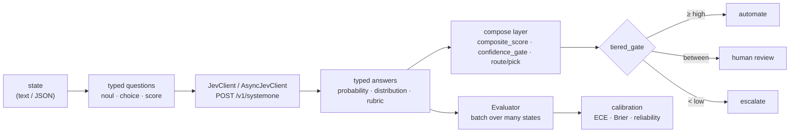
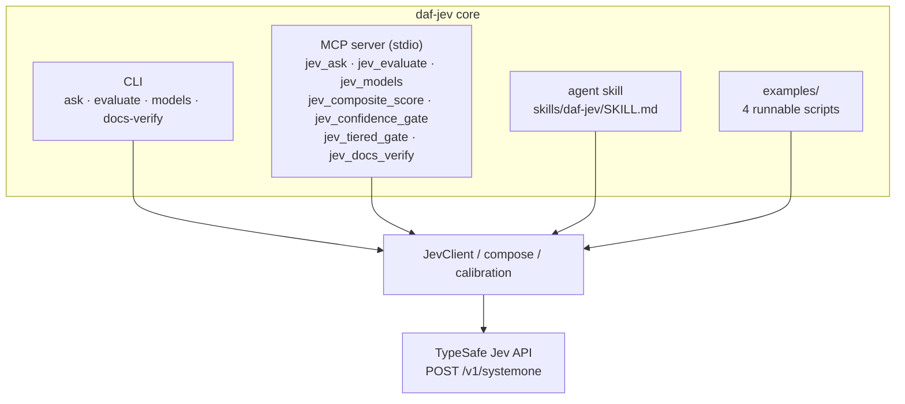

# daf-jev
[](https://doi.org/10.5281/zenodo.22816187)
[](pyproject.toml)
[](LICENSE)
[](https://zenodo.org/records/22817425)


Modular, composable Python client and decision toolkit for the **TypeSafe Jev
(System One) API**. One HTTP endpoint, three question primitives, and a set of
pure-logic composition patterns built on top of the answers — plus a
concurrent batch evaluation harness, an MCP server, a figure registry, and a
reproducible manuscript pipeline.

## What it provides

- **Primitives** — `noul` (yes/no), `choice` (pick an option from a
  probability distribution), `score` (rated on ordered levels). Build
  questions with `noul()` / `choice()` / `score()` and group them in a
  `QuestionSet`; batch any number of questions into a single API call.
- **Client** — `JevClient` / `AsyncJevClient` wrapping
  `POST https://api.typesafe.ai/v1/systemone`, with retries (429/529,
  exponential backoff, `Retry-After`), typed error mapping, and a
  `models()` listing. Retry policy, default timeout, and default model
  resolve from the environment (see [Configuration](#configuration)); every
  `ask` call also accepts a per-call `timeout` override and extra
  `request_headers` (merged over the defaults for that call only).
- **Composition patterns** — pure functions over answers:
  `composite_score` (probability-weighted expected value over score levels),
  `confidence_gate` (auto-escalate low-confidence answers), `route` /
  `pick` (intent routing by choice).
- **Evaluation** — `Evaluator` runs a fixed question set over many states
  concurrently (thread pool for `JevClient`, `asyncio` semaphore for
  `AsyncJevClient`) without aborting the batch: per-state failures are
  captured in `EvaluationRecord.error`. `summary()` aggregates per-question
  means/p95s; `to_json()` serializes records.
- **Usage accounting** — `UsageLedger` (thread-safe) accumulates request
  counts and token totals across any loop of `ask` calls; it accepts `Usage`
  objects, full responses, or `None` for error paths, and
  `snapshot().to_dict()` is JSON-safe.
- **Resilience** — an opt-in, composable `CircuitBreaker`: after
  `failure_threshold` consecutive failures it fails fast for
  `cooldown_seconds`, then admits a single recovery probe. It wraps any
  callable, never sleeps, and takes an injectable clock; it complements the
  per-request retry policy.
- **Calibration** — pure reliability statistics in `daf_jev.calibration`
  (`bucket_index`, `reliability_table`, `expected_calibration_error`,
  `brier_score`) over `(confidence, correct)` pairs, plus a live calibration
  benchmark (`benchmarks/bench_calibration.py`).
- **Figures & manuscript** — a matplotlib figure registry (7 figures +
  `figure_registry.json`) and a `{{TOKEN}}` variable pipeline that keep the
  10-section manuscript in `manuscript/` free of hardcoded results.
- **MCP server** — `daf-jev serve` exposes the toolkit as seven MCP tools
  (`jev_ask`, `jev_evaluate`, `jev_models`, `jev_composite_score`,
  `jev_confidence_gate`, `jev_tiered_gate`, `jev_docs_verify`) plus a
  `jev://docs/snapshot` resource, over stdio (see [MCP server](#mcp-server)).

Dependencies: Python >= 3.10, `httpx`, `pyyaml` (plus `matplotlib` for
figures). Managed with `uv`.

## How a decision flows



The batched call carries *all* questions at once — live benchmarks show it
running up to ~18× faster than sequential single-question calls while the
sequential strategy consumes ~4× more tokens (see
[Tests and benchmarks](#tests-and-benchmarks)).


## Quickstart

```bash
uv sync
export JEV_API_KEY="sk-..."   # or TYPESAFE_API_KEY, or put it in .env
```

`.env` at the project root is auto-loaded (there is a `.env.example` to copy
from; `.env` itself is gitignored).

```python
from daf_jev import JevClient, choice, noul, score

with JevClient() as client:  # api_key resolved from env / .env
    resp = client.ask(
        "Customer message: I was charged twice this month and nobody has responded.",
        {
            "billing": noul("Is this about a billing problem?"),
            "tone": choice("What is the tone?", {"calm": None, "frustrated": "annoyed but civil"}),
            "severity": score("How severe?", ["minor", "noticeable", "blocking"]),
        },
    )

print(resp.nouls["billing"].noul)          # 0.0 (no) .. 1.0 (yes)
print(resp.choices["tone"].choice, resp.choices["tone"].confidence)
print(resp.scores["severity"].score)       # probability-weighted, may be fractional
```

Composing decisions:

```python
from daf_jev import confidence_gate, composite_score

value = composite_score(resp.scores["severity"])   # expected value over level indices
verdict = confidence_gate(resp.choices["tone"], threshold=0.6, below="review")
```

## Examples

Five runnable scripts live in `examples/` (walkthrough per script in
[`examples/README.md`](examples/README.md)). Each resolves the API key from
the environment or `.env` and — when no key is found — prints
`SKIP: JEV_API_KEY not set` and exits 0, so all five are offline-safe:

```bash
python examples/quickstart.py         # one mixed ask call; answers, usage, request id
python examples/triage_router.py      # tiered_gate + route over one choice answer
python examples/composite_scoring.py  # composite_score + confidence_gate
python examples/evaluate_corpus.py    # Evaluator over an inline four-state corpus
python examples/gated_fallback.py     # heuristic-first: model called only when it adds value
```

All five take `--model NAME` (default: `JEV_MODEL`, then
`TYPESAFE_DEFAULT_MODEL`, then `jev-latest`); `evaluate_corpus.py` also takes
`--concurrency N` (default 2).

## Evaluating a corpus

Run a fixed question set over many states, concurrently, with per-state error
capture (`evaluate` never aborts the batch on one bad state).

CLI — `--questions-file` is a YAML mapping of id to a spec string or a native
question mapping; `--states-file` is one state per line (blank lines skipped)
or a JSON array of strings:

```bash
uv run daf-jev evaluate \
  --questions-file questions.yaml \
  --states-file states.txt \
  --concurrency 8 \
  --include-records
```

Python — pass a sync or async client; bare `str` states get `state_0000`-style
ids. An `AsyncJevClient` is single-use through `evaluate()`: the Evaluator
closes the async session when the batch completes (its keep-alive connections
are bound to the private event loop).

```python
from daf_jev import Evaluator, JevClient, QuestionSet, noul, score

questions = QuestionSet().add(
    "billing", noul("Is this about a billing problem?")
).add(
    "severity", score("How severe?", ["minor", "noticeable", "blocking"]),
)

with JevClient() as client:
    evaluator = Evaluator(client, questions, concurrency=8)
    records = evaluator.evaluate(["state one text", "state two text", ...])

summary = evaluator.summary(records)      # per-question means/p95s + usage
print(evaluator.to_json(records))         # per-state records incl. errors/latency
```

## Usage accounting and resilience

Long-running consumers need receipts and failure isolation beyond the
per-request retry policy. Both are small, opt-in, client-side helpers:

```python
from daf_jev import UsageLedger

ledger = UsageLedger()
for state in states:
    try:
        response = client.ask(state, questions)
    except TypeSafeError:
        response = None               # error paths produce no usage
    ledger.record(response)
print(ledger.snapshot().to_dict())    # {"requests": .., "input_tokens": .., ...}
```

`UsageLedger` accumulates request counts and token totals across any loop of
`ask` calls; `Evaluator.summary()` remains the aggregator for batch
evaluation runs. `reset()` returns the pre-reset totals and zeroes the
ledger.

```python
from daf_jev import CircuitBreaker, CircuitOpenError

breaker = CircuitBreaker(failure_threshold=5, cooldown_seconds=30.0)
try:
    response = breaker.call(client.ask, state, questions)
except CircuitOpenError as exc:
    ...                               # fail fast while the circuit is open
```

`CircuitBreaker` wraps any callable: `failure_threshold` consecutive
failures open the circuit for `cooldown_seconds`, after which a single
probe is admitted. It never sleeps — wait out the cooldown in your own loop
(`exc.remaining_seconds` reports what is left) — and composes with the
per-request retry policy.

## CLI

```bash
uv run daf-jev ask \
  --state "I was charged twice this month." \
  --question billing=noul:Is this about a billing problem? \
  --question tone=choice:What is the tone?:calm=,angry=hostile \
  --question severity=score:How severe?:minor,noticeable,blocking \
  --pretty

uv run daf-jev models                       # list available models
uv run daf-jev models --pick latest         # pick one (latest|first|last)
uv run daf-jev models --pick latest --contains jev

uv run daf-jev evaluate \
  --questions-file questions.yaml --states-file states.txt \
  --concurrency 8 --include-records

uv run daf-jev docs-verify     # re-hash docs/reference/ against MANIFEST.json
```

All commands print JSON to stdout; exit 0 on success, 2 on usage error, 1 on
runtime error.

## MCP server

`daf-jev serve` runs the toolkit as a Model Context Protocol (MCP) server
over stdio — the default and only supported transport. The server needs the
official `mcp` SDK, shipped in the optional `mcp` dependency group. Every
surface below calls the same core; there is no second implementation:



```bash
uv sync --extra mcp
uv run daf-jev serve          # stdio; --transport stdio is the only choice
```

Tools (each returns JSON-safe values; keys resolve per call from env or
`.env`, and a missing API key surfaces as a tool error):

| Tool | What it does |
| --- | --- |
| `jev_ask` | one mixed noul/choice/score API call over a state |
| `jev_evaluate` | run a fixed question set over many states concurrently (summary) |
| `jev_models` | list model cards, optionally filtered/picked |
| `jev_composite_score` | expected level value from a probability dict (no API call) |
| `jev_confidence_gate` | one-threshold confidence routing (no API call) |
| `jev_tiered_gate` | two-threshold automate/review/escalate routing (no API call) |
| `jev_docs_verify` | re-hash `docs/reference/` against its manifest (no API call) |
| resource `jev://docs/snapshot` | `{page_count, snapshot_id, scraped_at, index_sha256}` summary of the docs manifest |

Point any MCP client at the server with a stdio config, e.g.:

```json
{
  "mcpServers": {
    "daf-jev": {
      "command": "uv",
      "args": ["run", "--directory", "/path/to/daf-jev", "daf-jev", "serve"],
      "env": { "JEV_API_KEY": "sk-..." }
    }
  }
}
```

`env` may be omitted when a `.env` file is present in the server's working
directory; credentials are never returned in tool output.

## Configuration

Everything resolves from the environment (injected env mapping > process env
> `.env` file); unset or invalid values fall back to the defaults below.

| Variable | Purpose | Default |
| --- | --- | --- |
| `JEV_API_KEY` / `TYPESAFE_API_KEY` | API key | none (error when no transport injected) |
| `JEV_BASE_URL` / `TYPESAFE_BASE_URL` | API base URL override | `https://api.typesafe.ai` |
| `JEV_MODEL` / `TYPESAFE_DEFAULT_MODEL` | default model | `jev-latest` |
| `JEV_MAX_ATTEMPTS` | max attempts incl. the initial request (int >= 1) | `3` |
| `JEV_BACKOFF_BASE` | base backoff delay in seconds (float > 0) | `0.5` |
| `JEV_BACKOFF_MAX` | backoff cap in seconds | `8.0` |
| `JEV_JITTER` | uniform ± jitter on the delay (float >= 0) | `0.1` |
| `JEV_TIMEOUT` | default request timeout in seconds (positive float) | none (transport default) |

Per-field: a bad value keeps only that field's default. Per-call `timeout=`
and `request_headers=` on `ask()` win over all of the above for that call.

## Figures and manuscript

The repo renders its own paper: 9 manuscript sections under `manuscript/`,
with every measured number injected as a `{{TOKEN}}` placeholder — nothing is
hardcoded in the prose.

```bash
uv sync --extra figures
uv run python scripts/generate_figures.py    # 7 figures + figure_registry.json -> output/figures/
uv run python scripts/generate_figures.py --only batching   # single figure by name
```

Figures `architecture`, `primitives`, and `confidence` are drawn from code;
`batching`, `latency`, `calibration`, and `graphical_abstract` read the newest
`output/benchmarks/*.json`.

```bash
uv run python scripts/z_generate_manuscript_variables.py
# 46 tokens -> output/data/manuscript_variables.json, then {{TOKEN}}
# substitution into output/manuscript/ (inside the template checkout)
```

Rendering and validation run from the template checkout, which resolves the
project through a **leaf symlink**
`template/projects/ongoing/daf-jev -> ../../../projects/ongoing/Code_Tools/daf-jev`
(created 2026-09-16; intermediate symlinks are rejected by design):

```bash
cd /Volumes/external_drive/Git/template
uv run python scripts/pipeline/stage_03_render.py --project ongoing/daf-jev
uv run python scripts/pipeline/stage_04_validate.py --project ongoing/daf-jev
```

Stage 04 runs 9 validation checks (including the figure registry and rendered
provenance); re-run render + validate after any manuscript or figure change.
The rendered PDF lands at `output/pdf/daf-jev_combined.pdf`.

## Tests and benchmarks

```bash
uv sync --extra dev --extra bench
uv run pytest tests/unit --cov=src          # 294 unit tests; coverage gate >= 90%
JEV_API_KEY=... uv run pytest tests/live    # 2 live tests against the real API
```

Unit tests need no key: they run against a real local HTTP stub server
(`tests/conftest.py`). Live tests and benchmarks hit the real API and are
skipped with a `SKIP:` message when `JEV_API_KEY` is absent.

```bash
uv run python benchmarks/bench_batching.py --runs 3   # 1 call with N questions vs N calls
uv run python benchmarks/bench_patterns.py --runs 10  # composite-score / routing latency
```

Latest recorded results (2026-09-16, `output/benchmarks/`): batching is
3.5x–20.5x faster (N=5→20) and 2.8x–4.2x cheaper in tokens; decision-pattern
pipelines run at ~0.12 s p50.

### Calibration benchmark

`benchmarks/bench_calibration.py` measures how well the live model's
reported confidence tracks its behavior, plus noul answer stability:

```bash
JEV_API_KEY=... uv run python benchmarks/bench_calibration.py
# flags: --states N (default 6), --repeats N (default 5), --model NAME
```

It repeats one three-option classification question per state and treats
agreement with the modal (majority) choice across repeats as a
**self-consistency correctness proxy — not ground-truth accuracy** — so the
resulting error figures quantify confidence-vs-self-consistency, not
confidence-vs-correctness. The `(confidence, correct)` pairs feed the pure
`daf_jev.calibration` functions; a noul question repeated the same way
yields a mean pairwise |Δnoul| stability metric. Results land in
`output/benchmarks/calibration_<YYYYMMDD>.json` (latest recorded:
2026-09-16, `jev-latest`, 6 states x 5 repeats — ECE 0.0730, Brier 0.0252,
mean pairwise noul gap 0.0050). Without an API key (env or project `.env`)
it prints `SKIP: JEV_API_KEY not set` and exits 0; a failing call drops that
state's repeats into `n_errors` instead of aborting the batch.

v0.3.0 is published on Zenodo (deposit 22816188, released 2026-09-17) and
mirrored to the public repository at
[github.com/docxology/daf-jev](https://github.com/docxology/daf-jev).

[](https://doi.org/10.5281/zenodo.22816187)

- **Concept DOI** (all versions, stable):
  [10.5281/zenodo.22816187](https://doi.org/10.5281/zenodo.22816187)
- **v0.3.0 version record**: https://zenodo.org/records/22816188
  (version DOI `10.5281/zenodo.22816188`)
- **Public repository**: https://github.com/docxology/daf-jev
- **Rendered manuscript PDF**: [`daf-jev_combined.pdf`](daf-jev_combined.pdf)
  at the repo root (regenerated to `output/pdf/daf-jev_combined.pdf` by the
  template render pipeline; the root copy is refreshed at each release).
- Machine-readable release metadata: [`CITATION.cff`](CITATION.cff) and
  [`.zenodo.json`](.zenodo.json) at the repo root.

To cite daf-jev, use the metadata in `CITATION.cff` (cffconvert and Zenodo
both render it), or paste this BibTeX:

```bibtex
@software{friedman2026dafjev,
  title   = {daf-jev: A Composable Python Decision Toolkit for the TypeSafe Jev (System One) API},
  author  = {Friedman, Daniel Ari},
  year    = {2026},
  doi     = {10.5281/zenodo.22816187},
  url     = {https://github.com/docxology/daf-jev},
  version = {0.3.0}
}
```

New releases are added as new version deposits on the same Zenodo concept, so
the concept DOI always resolves to the latest published version.


## Documentation
- [`docs/ARCHITECTURE.md`](docs/ARCHITECTURE.md) — the authoritative design
  contract (wire facts, module signatures, test and benchmark conventions).
- [`docs/models.md`](docs/models.md) — sourced technical reference on System
  One models and Jev, with primary vs third-party claims flagged.
- [`docs/`](docs/README.md) — index, including the 108-page hashed snapshot
  of docs.typesafe.ai in `docs/reference/`.
- [`skills/daf-jev/SKILL.md`](skills/daf-jev/SKILL.md) — the agent skill for
  this toolkit (when-to-use, API surface, CLI, MCP server, pitfalls). To use
  it with an agent outside the repo, copy the whole `skills/daf-jev/`
  directory into the agent's skills location — see
  [`skills/README.md`](skills/README.md).
