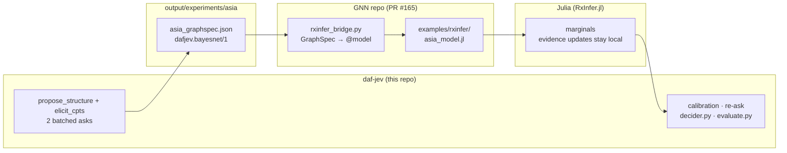

# daf-jev — Architecture Contract (v1, 2026-09-16)

Single source of truth for the package build. All workers MUST match these signatures
exactly. Wire facts below are verified against the local docs snapshot
(`docs/reference/`, snapshot `b79c9cd6008489f1`); per-module workers MUST also read
their listed snapshot pages for details and keep this contract accurate if they find
contradictions (report the delta; do not silently deviate).

## Wire facts (verified)

- Endpoint: `POST https://api.typesafe.ai/v1/systemone`
  - Headers: `Authorization: Bearer <API_KEY>`, `Content-Type: application/json`
  - Response header of record: `x-typesafe-request-id`
- Body: `{"state": <str|obj|arr>, "model": "jev-latest", "questions": {<id>: Question}}`
- Question (discriminated by `type`):
  - `noul`: `instructions` (required), optional `criteria: {"true": str?, "false": str?}`
  - `choice`: `instructions`, required `criteria: {option: str|null}`
  - `score`: `instructions`, required `criteria: [levels...]` (ordered, >= 2)
- Answer:
  - `noul`: `{type, noul: float}` (0=no, 1=yes)
  - `choice`: `{type, choice: str, probabilities: {option: float} (sum 1), confidence: float}`
  - `score`: `{type, score: float (probability-weighted, may be fractional),
    legend: {level_index_str: desc}, probabilities: {level_index_str: float}, confidence: float}`
- Top response: `{model, answers: {id: Answer}, usage: {input_tokens, output_tokens}}`
- Errors: 401 auth, 403 permission, 404 not found, 400 bad request, 422 validation,
  429 rate limit, 529 overloaded, 5xx internal. Retry 429/529 with exponential backoff,
  honoring `Retry-After` when present: the `Retry-After-ms` header wins when set, then
  the numeric `Retry-After` form — both clamped to [0, 300] seconds; the HTTP-date form
  is intentionally unsupported and falls back to exponential backoff.
  Status→exception mapping is centralized in `_errors.py`: each
  status-specific `_HTTPStatusError` subclass pins a `_STATUS` ClassVar
  (400/401/403/404/422/429/529) and `error_from_status()` resolves a
  status code to that class — unmapped 5xx become `InternalServerError`,
  statuses < 400 return `None`.
- Models listing exists in the official SDK (Models resource). Exact HTTP path/shape:
  read `docs/reference/sdk/python/api/clients/sync/models.md` and `.../client.md`
  before implementing; if the snapshot gives a path, use it. If no explicit path is
  documented, implement `models()` as `GET /v1/models` and note the assumption in code.

Wire strictness (pinned by `tests/unit/test_types.py:249-353`): answer
float fields (`noul`, `choice` `probabilities` values, `score`,
`confidence`) reject bools AND numeric strings — no `float()` coercion;
usage integer fields (`input_tokens`, `output_tokens`) reject `None`,
numeric strings, and bools, and deliberately accept integral floats
(`100.0` means 100 tokens; non-integral floats like `3.7` are rejected);
score `legend` parsing is strict (`legend` required, string level-index
keys → string descriptions; non-string values rejected). Nothing on the
wire path is silently coerced.

## Environment

- `JEV_API_KEY` preferred; fall back to `TYPESAFE_API_KEY` (official SDK's name).
- `JEV_BASE_URL` optional override (default `https://api.typesafe.ai`).
- Verified naming fact: the official TypeSafe SDK convention is
  `TYPESAFE_API_KEY` / `TYPESAFE_BASE_URL` / `TYPESAFE_DEFAULT_MODEL`;
  daf-jev keeps `JEV_*` as its own primary names with `TYPESAFE_*`
  fallbacks. The provider registry mirrors this: every provider's
  api-key / base-URL var tuples end with the `TYPESAFE_*` names (model
  fallback `TYPESAFE_DEFAULT_MODEL` on the `jev` provider only).
- `.env` in the working directory (`Path(".env")` default) is auto-loaded by a tiny
  built-in loader (NO python-dotenv dep). Values are stripped before use, so
  whitespace-only values count as unset at every layer (injected env > process env >
  `.env`). `.env` is gitignored and MUST never be read into tests; tests inject `env={...}`.

## Package layout (src/daf_jev/)

- `_types.py` — wire dataclasses. No I/O.
  - `JSONContent = Union[str, list, dict]` (values inside dicts may be None; state itself may not)
  - `NoulQuestion(instructions: JSONContent, criteria: Optional[dict] = None)`,
    `ChoiceQuestion(instructions, criteria: Mapping[str, str | None])`,
    `ScoreQuestion(instructions, criteria: Sequence[str])` — all frozen dataclasses,
    class attr `type`, method `to_wire() -> dict` producing exactly the documented shape
    (omit `criteria` when None for noul; score criteria MUST be a list of >= 2 strings —
    raise `ValueError` otherwise; choice criteria MUST be a non-empty `Mapping` whose
    values are `str | None` — `ValueError` otherwise).
  - `Question = Union[NoulQuestion, ChoiceQuestion, ScoreQuestion]`
  - Answers (frozen dataclasses): `NoulAnswer(noul: float)`,
    `ChoiceAnswer(choice: str, probabilities: dict[str, float], confidence: float)`,
    `ScoreAnswer(score: float, legend: dict[str, str], probabilities: dict[str, float],
    confidence: float)` — each with `type` attr; `answer_from_wire(payload) -> Answer`.
  - `Usage(input_tokens: int = 0, output_tokens: int = 0)`
  - `SystemOneResponse(model: str, answers: dict[str, Answer], usage: Usage,
    request_id: Optional[str] = None)` with cached `nouls` / `choices` / `scores`
    dict views filtered by answer type.
  - `parse_response(payload: dict, request_id: Optional[str] = None) -> SystemOneResponse`
    (strict: unknown answer type or missing keys raise `ValueError`).
  - Strict parsing (hardened): numeric wire fields reject `bool` and numeric strings
    (int/float only); `choice`/`model` require an actual `str`; malformed
    `probabilities`/`legend`/`usage` shapes raise `ValueError`, never
    `TypeError`/`AttributeError`. `Usage` token counts follow the same numeric
    contract: an `int` passes as-is (`bool` never does), a float only when
    integral (`100.0` -> `100`), and numeric strings raise `ValueError`
    ("input_tokens must be an integer number"). `legend` values must already be
    strings (`ValueError` "legend values must be strings" — `None`/bool/int are
    never `str()`-coerced; level keys stay stringified).
- `_errors.py` — exception hierarchy (mirror the JS SDK classes):
  `TypeSafeError` base; `APIConnectionError`, `APITimeoutError`;
  `APIStatusError` (carries `status_code`, `body`, `request_id`) with subclasses
  `BadRequestError(400)`, `AuthenticationError(401)`, `PermissionDeniedError(403)`,
  `NotFoundError(404)`, `UnprocessableEntityError(422)`, `RateLimitError(429)`,
  `OverloadedError(529)`, `InternalServerError(5xx)`;
  `error_from_status(status_code, body=None, request_id=None) -> APIStatusError | None`.
  Read `docs/reference/sdk/python/api/exceptions.md` for messages/details.
- `_retry.py` — `RetryPolicy` frozen dataclass:
  `max_attempts=3, retryable_statuses=frozenset({429, 529}), backoff_base=0.5,
  backoff_max=8.0, jitter=0.1, respect_retry_after=True` and PURE method
  `next_delay(attempt: int, retry_after: Optional[float]) -> float`
  (exponential `backoff_base * 2**(attempt-1)` capped at `backoff_max`, plus uniform
  `±jitter/2`; `retry_after` wins when `respect_retry_after` and provided; >= 0).
  Sleep happens in the client (injectable clock/sleep for tests).
- `_http.py` — `Transport` protocol: `post_json(path: str, json_body: dict,
  headers: dict[str, str], *, timeout=None) -> httpx.Response` (+ `close()`).
  `HttpxTransport(base_url, timeout, headers)` implements it with `httpx`.
  Also `AsyncTransport` / `AsyncHttpxTransport` with `async` signature.
  Both httpx transports also expose `get_json(path, headers, *, timeout=None)`
  (models listing) under the same per-call timeout rule.
  `timeout=None` keeps the transport's configured default; a per-call value
  overrides it for that single request (explicit `None` is never forwarded to
  httpx, which would disable timeouts entirely). A transport constructed
  without a timeout passes `DEFAULT_TIMEOUT_SECONDS = 60.0` to httpx instead of
  httpx's own 5-second default; `_normalize_base_url` ensures a base URL with a
  path component ends with `/`.
- `client.py` —
  - `JevClient(api_key=None, *, base_url=None, model=None, transport=None,
    retry=None, sleep=time.sleep, timeout=None, env=None)`:
    resolves key via `config.resolve_api_key(env)`; `model=None` resolves via
    `config.resolve_model(env)` (`JEV_MODEL` / `TYPESAFE_DEFAULT_MODEL`, then
    `jev-latest`); empty/whitespace `api_key` or `model` raises `ValueError`;
    raises `TypeSafeError` when no key found and no transport injected. When
    `retry` / `timeout` are not passed they resolve from the environment via
    `config.resolve_retry(env)` / `config.resolve_timeout(env)` (that timeout
    may be None → the transport's 60.0 s default); explicit arguments always
    win.
  - `ask(state, questions: Mapping[str, Question], *, model=None,
    timeout=None, request_headers=None) -> SystemOneResponse`
    — single POST; retries per policy; maps errors. `timeout` overrides the
    client default for this call only; `request_headers` are merged over the
    default headers for this call only (per-call entries win, stored defaults
    never mutated).
  - `models(*, timeout=None, request_headers=None) -> list[ModelCard]` — a
    GET retried per the same policy as `ask` (shared send/retry path);
    per-call `timeout`/`request_headers` semantics identical to `ask`
    (explicit `None` never forwarded — constructor/env default applies;
    per-call header entries win, stored defaults never mutated).
    `ModelCard` is a dataclass per snapshot shape.
  - `close()`; context-manager support. `close()` sets the closed flag only
    after the transport close completes; `ask`/`models` after close raise
    `TypeSafeError("client is closed")`.
  - `AsyncJevClient` — same surface, `async def ask/models`, `async close`.
  - httpx exception mapping (checked in order): `httpx.TimeoutException` →
    `APITimeoutError` FIRST; then `httpx.HTTPError` (TransportError +
    RequestError, incl. `DecodingError`/`TooManyRedirects`) and
    `httpx.StreamError` → `APIConnectionError`.
  - Provider dispatch: keyword-only `provider=` on `_BaseClient.__init__`,
    `for_provider` classmethods on both clients, `open_client` /
    `open_async_client` module functions — full signatures in the Provider
    dispatch section below.
- `primitives.py` — ergonomic builders + composition container. No I/O.
  - `noul(instructions, *, true_desc=None, false_desc=None) -> NoulQuestion`
  - `choice(instructions, options: Mapping[str, str | None]) -> ChoiceQuestion`
  - `score(instructions, levels: Sequence[str]) -> ScoreQuestion`
    (every builder validates `instructions` is str/list/dict — `ValueError`
    otherwise)
  - `QuestionSet(Mapping[str, Question])` — `QuestionSet()`, `.add(id, q)`,
    `.merge(other)`, `to_wire()`, plus builder methods mirroring the free functions.
- `compose.py` — composable decision patterns (docs: /patterns/*). Pure logic
  over answers; no I/O and no client dependency.
  - `composite_score(answer: ScoreAnswer, weights: Optional[Sequence[float]] = None)
    -> float` — weighted (default uniform) expected value over level indices.
    Probabilities validated once on a shared canonical path: keys parsed via
    `int()` (`ValueError` "probability keys must be integer level indices"
    otherwise), values must be finite and non-negative (`ValueError` naming
    key/value); duplicate integer spellings of one level ('1', '01')
    accumulate onto that level, and both weighting paths iterate the canonical
    sorted indices. With weights: length must match the level count, weights
    finite, sum positive, weighted mass non-zero (each `ValueError`). The
    `[min index, max index]` range guarantee holds for non-negative weights;
    negative weights are accepted deliberately (scale-invariant reweighting)
    but void it.
  - `confidence_gate(answer, *, threshold: float, below: str = "review") -> str`
    — returns the primary value when confidence >= threshold else `below`;
    a Score answer's level maps via `round` (nearest, ties to even) clamped
    to the probable level range; a non-finite score raises `ValueError`.
  - `route(answer: ChoiceAnswer, handlers: Mapping[str, Callable[[], T]],
    *, min_confidence: float = 0.0, fallback: Callable[[], T] | None = None) -> T`
    — NaN confidence fails the `>= min_confidence` comparison and routes to
    the fallback (fail-closed; `ValueError` when no fallback is provided).
  - `tiered_gate(answer, *, high=0.85, low=0.6, high_label="automate",
    middle_label="review", low_label="escalate") -> str` — two-threshold
    routing: confidence >= high → high_label, >= low → middle_label, else
    low_label; non-finite thresholds, `low > high`, or empty labels raise
    `ValueError`; a NaN confidence compares False against both thresholds and
    escalates; answers without a `confidence` field raise `TypeError`.
  - `pick(actions: Mapping[str, Callable], choices: Mapping[str, ChoiceAnswer | Answer])`
    convenience wrapper; isinstance-narrows to `ChoiceAnswer` and silently
    skips other answers (unchanged).
- `models.py` — pure selection over the models listing; no I/O.
  - `pick_model(cards, *, contains=None, prefer="latest") -> ModelCard`
    — case-insensitive substring filter on `name` (`contains`); `prefer`
    `latest` = max `release_date` (None dates sort last, ties → first in
    input order), `first`/`last` = input order. `ValueError` on empty input,
    no match after filtering, or unknown `prefer`.
- `evaluate.py` — concurrent evaluation of a fixed question set over many
  states. `Evaluator(client, questions, *, concurrency=4, model=None)` with
  `client` typed `JevClient | AsyncJevClient` (a foreign client raises
  `TypeError` from `evaluate()`); thread pool for the sync client,
  `asyncio.Semaphore` for the async one. The public
  `async def evaluate_async(items)` is the ONE async path: it takes the
  normalized `(state_id, state)` items, requires an `AsyncJevClient`
  (`TypeError` otherwise), runs the semaphore path on the caller's event
  loop, and stores records so `summary()`/`to_json()` work exactly like
  after `evaluate()`; `evaluate()` normalizes raw states, then drives that
  same method on a private event loop (worker thread when called from
  inside a running loop) so it stays synchronous. Per-state failures are
  captured into `EvaluationRecord.error`, never aborting the batch. The
  async session is closed in a `finally`, so a cancelled gather still
  closes it (an `AsyncJevClient` is single-use through one evaluation).
  `summary()` latency mean/p95 span ALL records, failed included — a
  deliberate ops signal; token totals and per-question aggregates cover
  successful records only. Aggregation keys off the question's DECLARED
  type with per-type `isinstance` narrowing; an unknown declared type is
  skipped.
- `calibration.py` — pure confidence-calibration statistics over
  (confidence, correct) pairs: `bucket_index`, `reliability_table`,
  `expected_calibration_error`, `brier_score`. Every entry point validates
  each confidence in [0, 1] through the shared `_check_confidence` (NaN fails
  the chained comparison) — `ValueError` otherwise; `brier_score` also
  rejects empty `pairs`.
- `jaggedness.py` — model-jaggedness instrument: repeated asking of
  stochastic prompts (coin flips, dice rolls) across the provider registry,
  quantifying statistical deviation from the stated uniform distribution.
  `JaggednessFixture` plus the built-in fixtures `COIN` / `D6` /
  `COIN_NOUL`; pure statistics `chi2_sf`, `uniform_chi2`,
  `uniform_deviation`, `runs_test_z`, `max_streak`, `position_slope`;
  `noul_choice_delta` — the cross-instrument noul-vs-choice gap on the coin
  fixture; `run_battery` drives a fixture battery and returns a JSON-safe
  dict (choice counts, uniformity chi-square, degeneracy, prob mean/std,
  wobble, runs/streak, order-rotation and concurrent-batch metrics).
- `config.py` —
  - `load_dotenv(path: Path = Path(".env")) -> dict[str, str]` (KEY=VALUE, ignore
    comments/blank, no quoting gymnastics needed; never raise on missing file).
  - `resolve_api_key(env: Optional[Mapping[str, str]] = None) -> Optional[str]`
    — precedence: injected env mapping > process env > `.env` file
    (`JEV_API_KEY` then `TYPESAFE_API_KEY`).
  - `resolve_base_url(env=None) -> str` (JEV_BASE_URL or default).
  - `resolve_retry(env=None) -> RetryPolicy` — per-field overrides from
    `JEV_MAX_ATTEMPTS` (int >= 1), `JEV_BACKOFF_BASE` (float > 0),
    `JEV_BACKOFF_MAX`, `JEV_JITTER` (float >= 0); unset/invalid keeps the
    `RetryPolicy()` default for that field.
  - `resolve_timeout(env=None) -> float | None` — `JEV_TIMEOUT` seconds
    (positive float); unset/invalid → None.
  - `resolve_model(env=None) -> str` (`JEV_MODEL` / `TYPESAFE_DEFAULT_MODEL`
    or default `jev-latest`).
  - `Settings` frozen dataclass (`api_key, base_url, model, retry=RetryPolicy(),
    timeout=None`) + `load_settings(env=None)` — reads `.env` exactly once and
    shares the parsed mapping across the private resolvers (the public
    `resolve_*` signatures are unchanged).
  - Provider dispatch: `load_settings(env=None, provider=...)` and the
    `Settings.provider` field — full signatures in the Provider dispatch
    section below.
- `ledger.py` — thread-safe usage accounting across call loops (no I/O):
  `UsageLedger.record(Usage | SystemOneResponse | None) -> None` (None is a
  silent no-op for error paths; anything else raises `TypeError`);
  `snapshot()` / `reset()` (returns pre-reset
  totals, then zeroes) return a frozen `UsageSnapshot` (`requests`,
  `input_tokens`, `output_tokens`, `total_tokens` property, JSON-safe
  `to_dict()`). Complements `Evaluator.summary()`, which aggregates usage
  per evaluation batch.
- `providers.py` — provider registry (no I/O): frozen `ProviderSpec`,
  `register_provider` / `get_provider` / `list_providers`, and the three
  per-provider resolvers delegating to `config._lookup`; built-ins
  registered at import — full contract in the Provider dispatch section
  below.
- `resilience.py` — opt-in client-side failure isolation:
  `CircuitState` (closed / open / half_open), `CircuitOpenError(TypeSafeError)`
  (carries `remaining_seconds`), `CircuitBreaker(failure_threshold=5,
  cooldown_seconds=30.0, clock=time.monotonic)` with `call(fn, *args,
  **kwargs)`, `record_success()` / `record_failure()`, pure-read `state` /
  `consecutive_failures`, and a JSON-safe `to_dict()`. N consecutive
  failures open the circuit for the cooldown; a single probe is admitted
  after it (probe failure reopens with a fresh stamp). `call()` records a
  failure on any `BaseException` (KeyboardInterrupt, SystemExit,
  CancelledError included) and always re-raises, so a HALF_OPEN probe can
  never wedge the breaker; `CircuitOpenError.remaining_seconds` is always a
  float >= 0 (`0.0` for the probe-rejection race). The wrapped callable
  always runs outside the lock and the breaker never sleeps — the same
  pure-computation philosophy as `RetryPolicy`. Default OFF: `JevClient`
  is not wired to it.
- `decider.py` — decision-point decider: the observe -> compose -> ask ->
  gate -> fail-open -> act loop as one reusable class. Pure orchestration
  over injected I/O; `decide()` never raises (the fallback hook is the
  floor and must not raise).
  - `DecisionEvent(source, reason, error, latency_s, usage, request_id)`
    frozen dataclass with a JSON-safe `to_dict()`; `source` is
    `"model"` / `"cache"` / `"fallback"`, `reason` follows the closed
    fallback taxonomy: `not_asked`, `no_key` (latched for the Decider's
    lifetime), `client_error` (latched), `latched`
    (`max_consecutive_failures` reached), `budget`, `breaker`,
    `compose_error`, `ask_error` (counts toward the latch), `gate`,
    `mapping_error` (counts toward the latch), `error` LAST (belt-and-suspenders:
    any unexpected exception inside `decide()` that no earlier guard catches —
    a raising `cache_key`, a raising cache mapping operation, or a raising
    `should_ask`/gate hook).
  - `ConfidenceGate(answer_id, threshold)` — frozen; threshold validated
    in [0, 1] else `ValueError`. Returns None to accept, a rejection
    reason otherwise; noul answers (no confidence attr) are not gated.
  - `Budget(max_calls=None, max_input_tokens=None, max_output_tokens=None,
    max_total_tokens=None, attempts=0)` — at least one threshold required, and
    every provided threshold must be >= 0 (`max_calls=0` stays valid — a
    deliberate "no calls" budget), else `ValueError`; `charge()` once per ask
    attempt (success or
    failure); `exceeded(usage: UsageSnapshot)` returns a human-readable
    reason when any limit is met/passed; JSON-safe `to_dict()`.
  - `Decider(Generic[S, T])(client=None, *, render_state, questions,
    map_answers, fallback, gate=None, should_ask=None, budget=None,
    cache=None, cache_key=None, ledger=None, breaker=None, timeout=None,
    max_consecutive_failures=3, client_factory=None, env=None,
    clock=time.monotonic, on_event=None)` — `client`/`client_factory`
    mutually exclusive, `cache`/`cache_key` together, latch >= 1,
    timeout > 0 (else `ValueError`). `decide()` order: cache hit (the
    `cache_key` is computed once per decide and reused by the final store) ->
    `should_ask` -> client resolution (latching: injected client;
    factory called once — an exception OR a None return latches
    `client_error`; default path
    resolves the key — None latches `no_key`, else
    `JevClient(env=env, retry=RetryPolicy(max_attempts=1))`, single
    attempt per ask so worst-case blocking is one timeout) -> budget gate
    -> compose (`compose_error`) -> one ask behind the optional breaker
    (`CircuitOpenError` -> `breaker`; other exceptions count toward the
    latch, reason `ask_error`) -> ledger record + failure-counter reset ->
    gate (`gate`) -> map (`mapping_error`, counts toward the latch) ->
    cache store + `"model"` event. Extra surface: `last_event`,
    `usage_snapshot()`, `calibration_pairs()` (declared-confidence /
    gate-accepted pairs when the gate is a `ConfidenceGate` — a
    self-consistency proxy, NOT correctness), `dead` property.
- `cli.py` — argparse (stdlib), thin. `main(argv=None) -> int`. Common flags:
  `--base-url` (ask/models/evaluate), the global `--provider` flag (all
  commands; see Provider dispatch below), and `--json`/`--pretty` (mutually
  exclusive; compact is the default).
  - `daf-jev ask --state-file FILE | --state TEXT [--question ID=SPEC ...] [--model M]
    [--json | --pretty]` where SPEC is `noul:<instructions>` |
    `choice:<instructions>:opt1=desc,opt2=…` | `score:<instructions>:level1,level2,…`
    (option/level descriptions may be empty → None for choice; `\,` `\:` `\\`
    escape the delimiters inside a SPEC). Duplicate `--question` ids are
    rejected; `--state-file` content parses only as dict/list JSON (scalar
    JSON such as `123` stays raw text). Usage errors — malformed `--question`,
    unreadable `--state-file`, zero questions, duplicate ids — exit 2 with
    `{"error": "UsageError", ...}` on stderr; runtime errors exit 1 with the
    exception class name in the JSON.
  - `daf-jev models [--pick latest|first|last] [--contains STR]` — list or
    pick models.
  - `daf-jev evaluate --questions-file PATH --states-file PATH
    [--concurrency N] [--model M] [--include-records]` — YAML questions (SPEC
    strings or native `{type, instructions, criteria}` mappings; duplicate
    keys rejected, nested included), states one per line or a JSON array of
    strings; prints the summary JSON (`--include-records` adds per-state
    records).
  - `daf-jev docs-verify [--manifest PATH]` — delegates to
    `daf_jev.docs_verify.verify_manifest` (default: the absolute
    repo-root-anchored `docs/reference/MANIFEST.json`, independent of the
    CWD); prints `{manifest, pages, missing, drifted, added, ok}` where
    `added` lists extra `.md` files the manifest does not list; exit 1 when
    `ok` is False.
  - `daf-jev posteriors-load FILE [--graphspec FILE]` — loads and
    validates a `dafjev.bayesnet-posteriors/1` or `gnn.marginals/1`
    sidecar (same loader as the MCP `jev_posteriors_load` tool);
    `--graphspec` cross-checks variables/states against a
    `dafjev.bayesnet/1` document. Prints `{ok, format, evidence_count,
    variable_count, min_row_sum_deviation, max_row_sum_deviation}`; a
    failed validation exits 1 with `{"error": "ValueError", ...}`.
    Keyless — no API call.
  - `daf-jev serve [--transport stdio]` — runs the MCP server (stdio only);
    a missing `mcp` extra prints a `uv sync --extra mcp` hint (exit 1).
  - `daf-jev providers` — prints the provider registry as a JSON array to
    stdout (one object per provider in registry order; keyless, exit 0, no
    network); the global `--provider` flag selects the backend for every
    command (invalid keys are usage errors, exit 2). Details in the
    Provider dispatch section.
  - All output JSON to stdout; exit 0 ok, 2 usage, 1 runtime error.
- `__init__.py` — eager imports only (no ImportError guards). Public exports
  (75 names incl. `__version__`): the wire/client/compose/evaluate/decider/
  provider-dispatch core plus the jaggedness fixtures and statistics
  (`COIN`, `COIN_NOUL`, `D6`, `JaggednessFixture`, `chi2_sf`, `max_streak`,
  `noul`, `noul_choice_delta`, `position_slope`, `run_battery`, `runs_test_z`,
  `uniform_chi2`, `uniform_deviation`), the graphical-model additions
  (`Variable`, `Edge`, `CPT`, `BayesNet`, `elicit_cpts`, `propose_structure`,
  `decompose_single_parent`), and the posteriors-ingest additions
  (`CalibrationPairing`, `PosteriorsSidecar`, `load_posteriors`,
  `pair_for_calibration`) — i.e.:
  `COIN, COIN_NOUL, CPT, D6, APIConnectionError, APITimeoutError, Answer,
  AsyncJevClient, BayesNet, Budget, CalibrationPairing, ChoiceAnswer,
  ChoiceQuestion, CircuitBreaker, CircuitOpenError, CircuitState,
  ConfidenceGate, Decider, DecisionEvent, Edge, EvaluationRecord, Evaluator,
  JSONContent, JaggednessFixture, JevClient, ModelCard, NoulAnswer,
  NoulQuestion, OverloadedError, PosteriorsSidecar, ProviderSpec, Question,
  QuestionSet, RateLimitError, RetryPolicy, ScoreAnswer, ScoreQuestion,
  Settings, SystemOneResponse, TypeSafeError, Usage, UsageLedger,
  UsageSnapshot, Variable, __version__, answer_from_wire, chi2_sf, choice,
  composite_score, confidence_gate, decompose_single_parent, elicit_cpts,
  get_provider, list_providers, load_posteriors, load_settings, max_streak,
  noul, noul_choice_delta, open_async_client, open_client,
  pair_for_calibration, parse_response, pick_model, position_slope,
  propose_structure, register_provider, resolve_retry, resolve_timeout,
  route, run_battery, runs_test_z, score, uniform_chi2, uniform_deviation`.
- `scripts/scrape_docs.py` — standalone (stdlib urllib) re-scraper: reads llms.txt,
  fetches every page into `docs/reference/` preserving `.md` paths, rewrites
  `MANIFEST.json` with per-page sha256 + `snapshot_id` (sha256 of concatenated page
  hashes, first 16 hex). CLI: `--check` mode exits 1 on drift, 0 on match (no
  writes); `--timeout` must be > 0; a derived page path containing `..` raises
  `ValueError` (a hostile index must not write outside the output dir);
  unrecognized llms.txt lines are skipped with a stderr warning.
- `scripts/generate_figures.py` — thin orchestrator over `figures.py` (needs
  the `figures` extra): renders the registry (or `--only NAME`, exit 2 on an
  unknown name), ALWAYS writes `figure_registry.json` — `--only` runs
  included — because template validation requires it, and always writes the
  sibling `architecture.mmd` (byte-deterministic mermaid source emitted by
  the pure `figures.architecture_mermaid()`; deliberately NOT a registry
  entry); exit 1 on unexpected error (missing benchmark data names the
  file), 0 on success.
- `scripts/z_generate_manuscript_variables.py` — thin orchestrator over
  `manuscript_variables.py`: writes `output/data/manuscript_variables.json`
  and (inside a template checkout) injects `{{TOKEN}}`s; strict mode (default)
  exits 1 with a `FileNotFoundError` naming the missing analysis output —
  manuscript config, docs snapshot manifest, benchmark JSONs, or
  `output/figures/figure_registry.json` (the `FIGURES` token derives from
  that registry, never a raw PNG glob) — rather than fabricating values;
  `--allow-draft` emits `N/A` sentinels instead.
- `figures.py` — the manuscript figure registry (matplotlib imported at
  module level, headless `Agg`; NEVER import from core modules). One
  `generate_<name>()` per manuscript figure — `graphical_abstract`,
  `architecture`, `primitives`, `batching`, `latency`, `confidence`,
  `calibration` (7 figures in `_REGISTRY`; `generate_one(name, ...)`
  raises `ValueError` naming the valid choices on an unknown name) —
  orchestrated by `generate_all(out_dir, project_root)`: renders in
  registry order and ALWAYS writes `figure_registry.json` after the
  PNGs via `write_figure_registry` (one entry per `fig:*` label:
  `figure_id` `figure_NNN`, filename, caption, section, width,
  `placement: "h"`, `metadata.alt_text` — static metadata, no measured
  statistics; template validation consumes it). Data-driven figures
  (`batching`, `latency`, `calibration`, `graphical_abstract`) read the
  newest benchmark JSONs under `output/benchmarks/` via
  `_latest_benchmark` and raise `FileNotFoundError` naming the missing
  file; `architecture`, `primitives`, and `confidence` are data-free
  and always renderable. `architecture_mermaid() -> str` re-renders the
  architecture diagram as byte-deterministic mermaid from the same
  static `_ARCHITECTURE_NODES` / `_ARCHITECTURE_EDGES` tables the PNG
  drawer consumes (nodes sorted by id, edges by (src, dst), the
  duplicate `primitives -> client` arrow kept; `graph TD`; no trailing
  newline) — deliberately NOT a registry entry; `generate_figures.py`
  writes it as the sibling `architecture.mmd` on every run. Shared
  style surface: `_style()` (module-level rcParams constants — DPI 200,
  DejaVu Sans, palette, light gridlines; every generator calls it
  first) and `_ROLE_FACECOLORS` (`main` / `side` / `external` role ->
  facecolor; side modules draw dashed).
- `manuscript_variables.py` — the `{{TOKEN}}` map generator (no
  matplotlib): `generate_variables(project_root, *,
  require_analysis_outputs=True) -> dict[str, str]` returns the flat
  UPPERCASE_KEY token map (no braces) and `save_variables(variables,
  output_path)` persists it as JSON. Strict mode (default) raises
  `FileNotFoundError` naming the missing analysis output — manuscript
  config, docs snapshot manifest, benchmark JSONs, or
  `output/figures/figure_registry.json`; draft mode (`--allow-draft`)
  emits `"N/A"` sentinels; test counts and coverage degrade to `"N/A"`
  in both modes. FIGURES derivation: the registry JSON is consumed
  entry-by-entry — every entry must be a dict with a string `filename`
  (`ValueError` naming the label otherwise), and `FIGURES` is the
  sorted filenames joined with ", " (empty registry -> `"N/A"`). The
  registry path is the module-local `_FIGURE_REGISTRY` constant, a
  deliberate mirror of `figures.FIGURE_REGISTRY_FILENAME` — never a
  `daf_jev.figures` import, which would pull matplotlib into core;
  `_load_manifest` (docs snapshot `MANIFEST.json`) follows the same
  loader shape (strict-raise vs draft-empty). The 49-token set derives
  from manuscript/config.yaml (`CONFIG_*`; batch-width token NAMES
  derive from the configured widths, canonical 5/10/20 fallback),
  pyproject metadata, AST-derived code stats, pytest collection +
  coverage, benchmark JSONs, and provenance — no hardcoded results.
- `scripts/bayes_experiment.py` — thin orchestrator over `graphical` +
  `graphical_elicitation` (+ `graphical_viz` for the rendered artifacts):
  CLI `--provider KEY` / `--model NAME` / `--edge-penalty FLOAT` /
  `--propose-structure` / `--out-dir PATH`; keyless SKIP. Full contract in
  the Graphical models section (Experiment runner block).
- `questions.py` — shared native question-mapping builder (no I/O):
  `question_from_mapping(value, *, context="question") -> Question` builds a
  `NoulQuestion`/`ChoiceQuestion`/`ScoreQuestion` from a
  `{type, instructions, criteria}` mapping with strict validation and
  actionable `ValueError` messages; the CLI (`evaluate --questions-file`) and
  the MCP server route native mappings through it so validation is defined
  exactly once.
- `docs_verify.py` — shared verifier for a docs snapshot manifest (read-only):
  `verify_manifest(manifest_path)` re-hashes every listed page (sha256 + byte
  length), flags `url`→path mismatches as `drifted`, and reports extra `.md`
  files as `added`; report schema `{manifest, pages, missing, drifted, added,
  ok}` with `ok` True only when all three finding lists are empty (the CLI
  treats `added` as failure, mirroring `scrape_docs.py --check`);
  `DEFAULT_MANIFEST` is anchored to the repo root this module is installed
  in, not the process CWD.
- `mcp_server.py` — FastMCP server (`build_server()`,
  `main(transport="stdio")`): 8 tools — `jev_ask` (state widened to
  str|dict|list; questions are SPEC strings or native dicts routed through
  `question_from_mapping`), `jev_evaluate` (async: `AsyncJevClient` +
  `Evaluator.evaluate_async()` on the serving loop; empty `states` →
  `ValueError`),
  `jev_models` (async; `pick` is a Literal schema; `contains=""` = no
  filter), `jev_composite_score` (finite/non-negative probability validation
  via `composite_score`), `jev_confidence_gate`, `jev_tiered_gate`,
  `jev_docs_verify` (error shape `{"error", "message", "ok": False}`),
  `jev_posteriors_load` (async sidecar ingest: `path` plus optional
  `graphspec_path` cross-checked against a `dafjev.bayesnet/1` document;
  same loader as the CLI `posteriors-load` command; makes no API call —
  the only tool that needs no provider/key; error shape
  `{error, message, ok: False}`) — plus
  the `jev://docs/snapshot` resource via `docs_verify` (CWD-independent).
  Every return is JSON-safe (`dataclasses.asdict`); stdio transport only;
  `mcp` imports at module level (optional extra — never from core modules);
  client/compose/evaluate import lazily inside the tools; the posteriors
  helpers import at module level (pure stdlib, no client).
  Every tool except `jev_posteriors_load` (sidecar ingest, no API call)
  additionally accepts an optional string `provider` argument
  (default `"jev"`; validated via `get_provider` — unknown providers return
  a JSON-safe error result listing the available keys, no traceback); MCP
  stays stdio-only. Details in the Provider dispatch section.
- `graphical.py` — discrete Bayes nets as frozen dataclasses (`Variable`,
  `Edge`, `CPT`, `BayesNet`): graph helpers (`variable`, `parents_of`,
  `children_of`, deterministic `topological_order`), `validate()`, exact
  inference (`posterior` / `query` — pure-stdlib variable elimination, no
  numpy), and the GraphSpec `dafjev.bayesnet/1` JSON round-trip. Full
  contract in the Graphical models section below.
- `graphical_elicitation.py` — Jev as a factor source: `elicit_cpts`
  (every CPT row of a net as one batched `choice` ask; deterministic ids,
  chunking via `max_questions_per_request`) and `propose_structure` (one
  batched ask over all variable pairs -> DAG proposal, edges only). Both
  take any object with `.ask(state, questions)`. Full contract in the
  Graphical models section below.
- `graphical_viz.py` — rendering over the public `BayesNet` API:
  `to_mermaid` (zero-dependency mermaid source; `direction="TD"` and
  `description_limit=40` kwargs), `plot_network` (deterministic layered
  PNG; matplotlib imported inside the function; `dpi=200`/`figsize=None`
  kwargs), and `plot_posterior_trajectory` (grouped P(true) bars over
  cumulative evidence steps; `dpi`/`figsize` kwargs). Full contract in the
  Visualization part of the Graphical models section below.
- `graphical_animation.py` — GIF animations over the public `BayesNet`
  API (optional `figures` extra): `animate_posterior` (grouped P(true)
  bars growing one cumulative evidence step per frame; `labels`/`fps`/
  `dpi` kwargs) and `animate_network` (the layered DAG layout with node
  fills set to P(true) per step; `fps`/`dpi` kwargs). matplotlib and
  Pillow import lazily INSIDE the call — without the `figures` extra
  the ImportError names `uv sync --extra figures`. Fail-closed
  validation precedes any figure; deterministic byte-identical output.
  Full contract in the Animation part of the Graphical models section
  below.
- `bayesnet_posteriors.py` — posteriors/marginals sidecar ingest (pure
  stdlib; the only I/O is reading the sidecar and optional GraphSpec JSON
  documents — no client, no matplotlib). Accepts both
  `dafjev.bayesnet-posteriors/1` (variant A) and `gnn.marginals/1`
  (variant B) documents fail-closed and pairs Jev assignments against
  sidecar rows for calibration. Full contract in the Posteriors sidecar
  ingest section below.

Shared figures theme: `figures.py` owns the single visual identity — the
named `COLOR_*` / `FONT_*` / `SIZE_*` constants, `DPI`, `ARROW_STYLE` /
`ARROW_LW`, the `_style()` rcParams including the 4-color
`axes.prop_cycle` (`COLOR_LAYER_MAIN` -> `COLOR_ACCENT` ->
`COLOR_LAYER_SIDE` -> `COLOR_EXTERNAL`), and `_ROLE_FACECOLORS` over the
shared `_ARCHITECTURE_NODES` / `_ARCHITECTURE_EDGES` spec consumed by
both the PNG drawer and `architecture_mermaid()` (the shared style
surface is noted in the `figures.py` bullet above). The figures-adjacent
plotters (`graphical_viz`, `graphical_animation`) import those constants
lazily per call, together with matplotlib — a module-level import would
break `to_mermaid`'s zero-dependency contract, pinned by
`test_plotters_without_matplotlib_name_figures_extra` (the
missing-matplotlib `ImportError` names `uv sync --extra figures`). The
def-time `dpi` signature defaults are the one accepted literal pair
(module-local, not resolved from the theme): `graphical_viz._DPI ==
figures.DPI` is sync-pinned by `test_dpi_default_matches_shared_theme`,
while the animation plotters keep their own `dpi: int = 110` GIF-frame
defaults, outside that pin. Documented viz-local exceptions (NOT theme
API): the node face `#EAF2FA`, the bar-grid alpha, the coolwarm posterior
fills, and the arrow curvature / mutation-scale geometry constants. Bar
series in `plot_posterior_trajectory` and `animate_posterior` follow the
`_style()` prop_cycle order (cycling per query-variable series); registry
PNGs never route through the viz modules — every `generate_<name>()`
draws inside `figures.py`. The posteriors-ingest module
`bayesnet_posteriors.py` is likewise outside the theme: pure stdlib with
no figure surface — it never imports `figures`, matplotlib, or the viz
modules.

## Provider dispatch

One shared wire contract (`POST /v1/systemone`, `GET /v1/models`), many
providers => a provider REGISTRY that parameterizes config resolution,
client construction, and CLI/MCP dispatch. No wire adapters:
`_types.parse_response` stays untouched — unknown top-level response fields
(kev's `latency_ms`, OpenRouter's `id` / `provider` / `usage.cost` extras)
already parse fine and are ignored (documented in its docstring). The
pure-logic layers (compose / evaluate / decider / calibration / resilience)
stay provider-agnostic and untouched.

Registry (`providers.py`):

- `ProviderSpec` — frozen dataclass: `key` (unique, lowercase,
  `[a-z][a-z0-9_-]*`), `display_name`, `default_base_url`, `api_key_vars`
  (primary first; `TYPESAFE_API_KEY` last for all — official-SDK compat),
  `base_url_vars` (provider var first, `TYPESAFE_BASE_URL` last),
  `default_model`, `model_vars`, `docs_url: str | None = None`,
  `notes: str | None = None` (behavioral caveats, one paragraph max).
- `register_provider(spec) -> None` — validates key pattern + non-empty
  required fields + duplicate key (`ValueError` naming the problem);
  appends to the registry (registration order kept, built-ins first).
- `get_provider(key) -> ProviderSpec` — case-insensitive; `ValueError`
  "unknown provider 'x': available: jev, jeff, kev, localjev,
  openthai-systemone, openrouter" (join of current registry keys in order).
- `list_providers() -> tuple[ProviderSpec, ...]`.
- `resolve_provider_api_key(spec, env: Mapping[str, str] | None = None) ->
  str | None`; `resolve_provider_base_url(spec, env=None) -> str` (falls
  back to `spec.default_base_url`); `resolve_provider_model(spec, env=None)
  -> str` — all three delegate to `config._lookup` (same truthiness
  semantics: falsy env values are skipped; explicit env mapping beats
  `.env` file beats None).
- Built-ins registered at import, in this order:
  - `jev` — "TypeSafe Jev (System One)"; base `https://api.typesafe.ai`;
    model `jev-latest`; key vars `JEV_API_KEY`, `TYPESAFE_API_KEY`;
    base-URL vars `JEV_BASE_URL`, `TYPESAFE_BASE_URL`; model vars
    `JEV_MODEL`, `TYPESAFE_DEFAULT_MODEL`; `docs_url` =
    `https://docs.typesafe.ai/concepts/system-one.md` (the official docs
    URL cited in `docs/models.md`).
  - `jeff` — "Jeff (self-hosted System One)"; base `http://localhost:8000`;
    model `jev-latest`; vars `JEFF_API_KEY` / `JEFF_BASE_URL` /
    `JEFF_MODEL`; notes: GLiFormer, drop-in wire compatibility,
    temperature-scaled probabilities, nominal output tokens;
    https://github.com/logan-markewich/jeff.
  - `kev` — "Kev (self-hosted System One)"; base `http://localhost:8009`;
    model `kev-latest`; vars `KEV_API_KEY` / `KEV_BASE_URL` / `KEV_MODEL`;
    notes: Qwen3.5 family 0.8B/4B/9B, drop-in wire compatibility, extra
    top-level `latency_ms` field; https://github.com/jaredpalmer/kev.
  - `localjev` — "LocalJev (GitHub Next)"; base
    `http://127.0.0.1:8080`; model `localjev-latest`; vars
    `LOCALJEV_API_KEY` / `LOCALJEV_BASE_URL` / `LOCALJEV_MODEL`; notes:
    GitHub Next GLiFormer proxy — TS/Bun server over any OpenAI-compatible
    chat endpoint; MIT.
  - `openthai-systemone` — "OpenThai System One"; base
    `http://localhost:8077`; model `openthai-latest`; vars
    `OPENTHAI_API_KEY` / `OPENTHAI_BASE_URL` / `OPENTHAI_MODEL`; notes:
    Thai/English Qwen3.5-0.8B slot-softmax; no server auth; no `/v1/models`
    (the `models` command is unsupported); Apache-2.0.
  - `openrouter` — "OpenRouter (hosted System One proxy)"; base
    `https://openrouter.ai/api`; model `jev-latest`; vars
    `OPENROUTER_API_KEY` / `OPENROUTER_BASE_URL` / `OPENROUTER_MODEL`;
    notes: responses add `id` / `provider` / `usage.cost` extras (parse
    fine and are ignored); `/v1/models` returns the OpenRouter shape, so
    the `models` command is unsupported there.

Config (`config.py`):

- `load_settings(env=None, provider: str | ProviderSpec | None = None)` —
  default None behaves exactly as today (jev); when given, per-provider
  resolution for api_key / base_url / model.
- `Settings` gains trailing field `provider: str = "jev"` (defaulted — no
  positional breakage).
- Existing `resolve_api_key` / `resolve_base_url` / `resolve_model` stay as
  the jev compatibility surface (delegate to the jev spec) — signatures
  unchanged. `_lookup` semantics unchanged.

Clients (`client.py`):

- `_BaseClient.__init__` gains keyword-only `provider: str | ProviderSpec |
  None = None` (after `env`). When `provider` is not None: api_key /
  base_url / model DEFAULTS come from that provider's resolvers (explicit
  args still win). The no-key `TypeSafeError` message names the provider's
  primary api_key var: "No API key found: pass api_key, set JEFF_API_KEY
  (or TYPESAFE_API_KEY), or inject a transport."
- Classmethods on both clients: `JevClient.for_provider(provider, *,
  api_key=None, base_url=None, model=None, retry=None, timeout=None,
  transport=None, env=None)` and `AsyncJevClient.for_provider(...)` — same
  signature, built via the normal `__init__` path with provider wired
  through.
- Module functions `open_client(provider="jev", **kwargs) -> JevClient`
  and `open_async_client(provider="jev", **kwargs) -> AsyncJevClient`
  (thin forwarding; kwargs go to `for_provider`).
- `_types.parse_response` stays untouched: unknown top-level response
  fields (kev `latency_ms`) already parse fine; add one docstring line
  documenting that extra top-level fields are tolerated and ignored.

CLI + MCP (`cli.py` / `mcp_server.py`):

- Global flag `--provider` on the MAIN parser (so `daf-jev --provider kev
  ask ...` works): value validated via `get_provider`; invalid => argparse
  usage error (exit 2 semantics preserved). Precedence: `--provider` flag >
  `DAF_JEV_PROVIDER` env var (read through the same .env-merged mapping as
  other settings) > "jev".
- New subcommand `providers`: prints a JSON array to stdout, one object per
  registered provider in registry order with keys `key`, `display_name`,
  `default_base_url`, `default_model`, `api_key_env` (first var),
  `base_url_env` (first var), `model_env` (first var), `docs_url`, `notes`.
  Keyless, exit 0, no network.
- ask/evaluate/models keep their current flags; the selected provider
  flows into client construction (`open_client` / `open_async_client`).
  The keyless error JSON for `--provider kev models` mentions
  `KEV_API_KEY`.
- `mcp_server.py`: every tool except `jev_posteriors_load` gains optional
  string arg `provider`
  (default "jev"), validated via `get_provider`; unknown provider => error
  result listing available keys (JSON-safe, no traceback). MCP stays
  stdio-only.

## Graphical models

Jev as a factor source for graphical models (per Dellaert's Jev+GTSAM
experiments): one batched request elicits every CPT of a Bayes net; a
second proposes the net's topology via pairwise 3-way choices; a
pure-Python engine turns those factors into exact inference. Jev sits
UPSTREAM (structure + CPTs), WITHIN (the factors are Jev probabilities),
and DOWNSTREAM (evidence queries / re-asking). Engines such as GTSAM or
RxInfer.jl consume the same factors through the GraphSpec interchange
below. Python >= 3.10, stdlib only — no numpy.

Core (`src/daf_jev/graphical.py` — frozen dataclasses, no I/O):

- `Variable`: `key: str` (unique, `[A-Za-z_][A-Za-z0-9_-]*`, e.g.
  `"tub"`), `description: str` (natural-language meaning; drives
  elicitation), `states: tuple[str, ...]` (ordered outcome labels, >= 2,
  e.g. `("false", "true")`).
- `Edge`: `parent: str`, `child: str`.
- `CPT`: `child: str`, `parents: tuple[str, ...]` (ordered; empty tuple =
  prior), `table: tuple[tuple[tuple[str, ...], tuple[float, ...]], ...]` —
  (assignment-tuple, probability-tuple) rows; assignment labels follow
  each parent's states order; every parent assignment present exactly
  once.
- `BayesNet`: `variables: tuple[Variable, ...]`, `edges: tuple[Edge, ...]`,
  `cpts: Mapping[str, CPT]` (child key -> CPT):
  - `variable(key) -> Variable` — `KeyError` with a message naming the
    key; `parents_of(key) -> tuple[str, ...]`; `children_of(key) ->
    tuple[str, ...]`.
  - `topological_order() -> tuple[str, ...]` — deterministic: Kahn with
    insertion-order tiebreak; `ValueError` on a cycle.
  - `validate() -> None` — rejects: unknown edge endpoints, duplicate
    edges, self-loops, missing/duplicate CPT, CPT parents not equal to
    the graph parents (same set; order asserted), CPT child states not
    equal to `Variable.states`, parent assignments not present exactly
    once, non-finite or negative probabilities, and any row not summing
    to 1 within 1e-6 (rows stored as given; renormalization is the
    caller's choice).
  - `to_json() -> dict` / `from_json(data) -> BayesNet` — GraphSpec
    interchange (below); `format` must be `"dafjev.bayesnet/1"` exactly;
    the round-trip is lossless (`==` after both directions).
  - `posterior(evidence: Mapping[str, str]) ->
    dict[str, tuple[float, ...]]` — exact inference: variable elimination
    over discrete factors; evidence reduces factors; returns the marginal
    distribution per variable in each `Variable.states` order; unknown
    evidence key/state => `ValueError` (empty evidence = priors). Factors
    are `dict[tuple[str, ...], float]` keyed by variable-key tuples (pure
    stdlib float math). Implementation freedom: factors multiply
    row-wise, eliminated variables are summed out in a deterministic
    elimination order (topological or min-degree; deterministic tiebreak
    REQUIRED — same input => same float result ordering); one elimination
    pass answers ALL marginals in `posterior` (or VE per hidden var — the
    RESULT must be exact and deterministic either way). Float discipline:
    factors never introduce negatives; sums normalize only by division at
    the final marginal.
  - `query(variable: str, evidence: Mapping[str, str] | None = None) ->
    tuple[float, ...]` — one marginal.
  - `most_probable_explanation(evidence: Mapping[str, str]) ->
    dict[str, str]` — most probable explanation: the single joint
    assignment over ALL variables with the highest probability
    consistent with `evidence` (evidence variables pinned to their
    observed states in the result). Consistent assignments are
    enumerated exhaustively and scored as the product of their CPT
    entries (exponential in the state counts — 2**n for binary nets;
    targets small nets), which makes the tiebreak exact: among
    maxima, the lexicographically smallest state tuple in
    variable-declaration order wins. Unknown evidence keys/states
    raise `ValueError` as in `posterior`; zero-probability evidence
    raises `ValueError` (no consistent assignment has positive
    probability, so the MPE is undefined).
  - `sample(n: int, rng: random.Random | None = None) ->
    list[dict[str, str]]` — `n` joint assignments by ancestral
    sampling: variables in `topological_order()` order, each state a
    categorical draw over its CPT row given the already-drawn parent
    states (`rng.random()` against the row's cumulative distribution).
    `rng` defaults to a fresh `random.Random` — pass a seeded instance
    for reproducible draws; `n` must be an integer >= 1 (`bool`
    rejected, `ValueError`); rows are used as stored with a
    float-rounding fallback to the last state of positive probability.
    No evidence handling — rejection sampling is caller-composed.
  - `conditional_scenarios(variable: str,
    evidence: Mapping[str, str] | None = None,
    targets: Sequence[str] | None = None) ->
    dict[str, dict[str, tuple[float, ...]]]` — "what-if" enumeration
    over one variable: for each state of `variable`, the posterior
    marginal of every target under `evidence` plus
    `{variable: state}` (one `posterior` call per state; the scenario
    state overrides the same key in `evidence`), returned as
    `{state: {target: distribution}}`. `targets` defaults to all
    other variables in declaration order. Unknown `variable` or
    target keys raise `ValueError` naming the offender (`targets`
    must be a sequence, not a string); evidence keys, states, and
    zero-probability scenarios surface from `posterior` unchanged.
  - `decompose_single_parent(net: BayesNet) -> BayesNet` — returns a copy
    in which every ORIGINAL variable has at most one parent: each
    multi-parent CPT `P(X|B1..Bk)` (k >= 2) is replaced by a chain of
    deterministic auxiliary variables (`X__aux1` conditioned on `B1`;
    `X__auxi` on `X__aux{i-1}`, `Bi`; `X` on `X__auxk`), aux states
    enumerating the joint parent-state indices in `itertools.product`
    order with every aux CPT row an exact point mass, so `X`'s rewritten
    CPT re-indexes the original rows. The joint distribution over the
    original variables is preserved exactly — posteriors/queries over
    originals (evidence still propagates) are unchanged; aux marginals
    are deterministic bookkeeping, not elicited beliefs; aux `i >= 2`
    nodes carry two deterministic parents (the minimal joint-preserving
    merge). Mitigation seam for the RxInfer 5.5.x multi-parent
    `DiscreteTransition` stall (single-parent nets run end-to-end; the
    multi-parent stall is upstream ReactiveMP) — a bridge can lower the
    degenerate deterministic aux CPTs outside the graphical model.

Elicitation (`src/daf_jev/graphical_elicitation.py` — pure orchestration
over an injected client; no I/O of its own):

- `elicit_cpts(variables, edges, *, client, instructions: str | None = None,
  max_questions_per_request: int | None = None) -> BayesNet` —
  `variables: Sequence[Variable]`; `edges` define the DAG (validated
  acyclic). For every child and EVERY parent assignment: one `choice()`
  question whose options are the child's states IN ORDER. Question id
  scheme: `f"cpt::{child}|{'|'.join(f'{p}={v}' for p,v in assignment)}"`
  (deterministic). Shared base instructions (default text provided; the
  caller may prepend context like population/unknown-treatment — the
  Asia experiment's framing). ONE batched ask when total rows <=
  `max_questions_per_request` (None = one request regardless); otherwise
  chunk deterministically in order, one ask per chunk (network
  round-trips stay O(ceil(rows/chunk))). Probabilities come from the
  answer's choice distribution mapped by state label; rows assemble into
  CPTs; returns a validated `BayesNet`. Errors: a missing answer for a
  row raises `ValueError` naming the question id; non-finite
  /out-of-order probabilities follow the repo's fail-closed rules.
- `propose_structure(variables, *, client, instructions: str | None = None,
  edge_penalty: float = 1.0, exact_limit: int = 8) -> BayesNet` — one
  batched ask over ALL unordered variable pairs (n(n-1)/2 questions); per
  pair `(a, b)` the options IN ORDER are `f"{a}->{b}"`, `f"{b}->{a}"`,
  `"no-edge"`; shared base instructions say to judge DIRECT dependency
  accounting for mediation through the other variables (the experiment's
  framing). Edge score = log(probability of the chosen edge option). DAG
  assembly: enumerate topological orderings (exact when n <=
  `exact_limit`; an n! search like the experiment — documented
  complexity; n > `exact_limit` uses the greedy fallback: start empty,
  repeatedly add the highest-scoring edge that keeps the graph acyclic
  while its log-prob gain exceeds `edge_penalty`). Exact search score for
  an ordering = sum of log p over edges consistent with the ordering
  MINUS `edge_penalty` * number of those edges; the best ordering wins
  (deterministic tiebreak: lexicographic ordering tuple). Returns a
  `BayesNet` with edges only (the `cpts` mapping is EMPTY; `validate()`
  is NOT yet satisfied) — the two-step flow is explicit:
  `propose_structure`, then `elicit_cpts` fills the CPTs.
- Both functions accept `client` as any object with `.ask(state,
  questions)` / `.ask(state, questions_dict) -> SystemOneResponse` (the
  real `JevClient` / `AsyncJevClient` or a test stand-in) — the PUBLIC
  client API only; provider choice happened upstream (`open_client`
  etc.). The `state` default is a composed description of the variable
  meanings (deterministic text), overridable.

Visualization (`src/daf_jev/graphical_viz.py` — pure over the public
`BayesNet` API; the only I/O is the file write the caller asks for, plus
creating the output's parent directory when missing):

- `to_mermaid(net: BayesNet, *, direction: str = "TD",
  description_limit: int = 40) -> str` — zero-dependency mermaid source
  with header `graph {direction}`: one node per variable
  (`key["key<br/>description"]`, the description truncated to
  `description_limit` chars at a word boundary and `[<>"]` stripped from
  the label text), one `parent --> child` line per edge; deterministic
  node/edge order = `BayesNet.variables` / `.edges` order. Fail closed:
  `direction` must be one of TD/TB/BT/RL/LR and `description_limit` >= 1
  (`ValueError` otherwise).
- `plot_network(net: BayesNet, path: str | Path, *, dpi: int = 200,
  figsize: tuple[float, float] | None = None) -> Path` — matplotlib PNG
  (import inside the function; the ImportError names the `figures` extra:
  `uv sync --extra figures`). Layered layout: topological generations
  top-to-bottom, deterministic coordinates within a generation by
  variable index; FancyArrowPatch parent->child arcs with slight
  curvature; node boxes labeled key (+ description truncated to two
  lines); no title by default (the caller adds one). An empty net raises
  `ValueError` before any figure; `dpi` must be > 0 and `figsize`, when
  given, a (width, height) pair of positive finite numbers — both
  validated fail-closed (`figsize=None` keeps the computed default size).
- `plot_posterior_trajectory(net: BayesNet, query_keys: Sequence[str],
  steps: Sequence[Mapping[str, str]], path: str | Path, *,
  labels: Sequence[str] | None = None, dpi: int = 200,
  figsize: tuple[float, float] | None = None) -> Path` — one grouped bar
  chart: x = step index (labels, default the index as a string), one bar
  per query variable showing P(state=true), where "true" is the LAST
  state of the variable's states tuple (binary convention) and values
  come from `net.posterior(evidence)` per step; legend = query keys;
  default matplotlib color cycle; `figsize=None` keeps the fixed default
  size. Fail closed before any figure is drawn: empty
  `steps`/`query_keys`, a label-count mismatch, unknown query keys
  (`KeyError` naming the key), invalid evidence (`ValueError`), a
  non-positive `dpi`, or a malformed `figsize`.

Animation (`src/daf_jev/graphical_animation.py` — GIF writers over the
public `BayesNet` API; matplotlib and Pillow import lazily INSIDE the
call — without the optional `figures` extra both raise `ImportError`
naming `uv sync --extra figures`; the layered-layout geometry stays
local while style constants come from the shared `figures.py` theme
via the same lazy per-call import (see the shared figures theme
paragraph above), which is what keeps the two renderers decoupled at
import time; deterministic — identical inputs give
byte-identical GIFs; every frame's posteriors are computed before any
figure exists):

- `animate_posterior(net: BayesNet, query_keys: Sequence[str],
  evidence_steps: Sequence[Mapping[str, str]], path: str | Path, *,
  labels: Sequence[str] | None = None, fps: float = 1,
  dpi: int = 110) -> Path` — one frame per evidence step (applied
  cumulatively, the same contract as
  `graphical_viz.plot_posterior_trajectory`): frame `k` draws grouped
  bars for steps `0..k` (growing left-to-right), one bar per query
  variable showing P(state=true) with the same LAST-state binary
  convention; the frame title names the evidence ADDED at that step;
  the legend lists the query keys and the x tick labels come from
  `labels` (step indices as strings when omitted). Fail closed before
  any figure: empty `evidence_steps` / `query_keys`, a labels-count
  mismatch, unknown query keys, unknown/zero-probability evidence
  (`ValueError` from `posterior`), or non-positive `fps`/`dpi` — no
  file is written in any of those cases; the output parent directory
  is created when missing.
- `animate_network(net: BayesNet,
  evidence_steps: Sequence[Mapping[str, str]], path: str | Path, *,
  fps: float = 1, dpi: int = 110) -> Path` — the layered DAG of
  `plot_network`'s coordinate scheme (private `_layered_layout`:
  longest-path levels over the topological order, deterministic
  coordinates within a generation; FancyArrowPatch parent->child arcs
  drawn below the node boxes), each node's fill color set to P(true)
  per step (coolwarm, 0..1; LAST state) and the frame title carrying
  the FULL evidence mapping (`priors` when the first step is empty).
  The empty-net guard is hoisted before any figure (`ValueError`
  "cannot animate an empty Bayes net: no variables"); otherwise the
  same fail-closed-before-figure rules as `animate_posterior` (no
  query keys or labels here). GIF encoding via
  `matplotlib.animation.PillowWriter` at the given `fps`/`dpi`.

Experiment runner (`scripts/bayes_experiment.py` — thin orchestrator; ALL
logic lives in src):

- Flags: `--provider KEY` (default `jev`, resolved via
  `load_settings(provider=...)`), `--model NAME`, `--edge-penalty FLOAT`
  (default 1.0; only used with `--propose-structure`),
  `--propose-structure` (default OFF — the reference Asia edges; when
  ON, run `propose_structure`, print the proposal vs the reference
  edges, then continue with the REFERENCE edges for CPTs — the
  reproducible choice), `--out-dir PATH` (default
  `output/experiments/asia`).
- Behavior: build the eight Asia variables (canonical binary fixture
  text); structure step + mermaid diagram of the resulting structure to
  stdout; `elicit_cpts` over the reference edges (one batched ask);
  posterior walkthrough `[]` -> `asia=false` -> `+xray=true` ->
  `+dysp=true` printed as a P(true) table for tub/lung/bronc ("true" =
  last state); artifacts into `--out-dir`: `asia_graphspec.json`
  (GraphSpec `dafjev.bayesnet/1`), `network.png`,
  `posterior_trajectory.png`, `mermaid.txt` (the source of the net the
  experiment actually used — the reference edges), and `receipts.json`
  (the live receipt: provider, model, proposed edges, posterior
  trajectory). Keyless: prints `SKIP: JEV_API_KEY not set` and exits 0
  BEFORE any network use.

GraphSpec interchange JSON (cross-repo contract with GNN / RxInfer — see
the AGENTS.md invariant):

```json
{
  "format": "dafjev.bayesnet/1",
  "variables": [{"key": "asia", "description": "Recent visit to Asia?",
                 "states": ["false", "true"]}],
  "edges": [{"parent": "asia", "child": "tub"}],
  "cpts": {"tub": {"child": "tub", "parents": ["asia"],
                   "rows": [{"assignment": {"asia": "false"},
                             "probabilities": [0.97, 0.03]},
                            {"assignment": {"asia": "true"},
                             "probabilities": [0.68, 0.32]}]}}
}
```

- `to_json` / `from_json` validate `format` == `"dafjev.bayesnet/1"`
  exactly; the rows list order is parent-assignment lexicographic by each
  parent's states order (canonical, deterministic); the round-trip must
  be lossless (`==` after both directions).
- This JSON is what GNN's bridge consumes/produces and what the
  RxInfer.jl example reads. The schema lives here; GNN docs reference it.

### End-to-end pipeline

The pipeline crosses two repos: Jev factors become a Bayes net in this
repo, and the net becomes an RxInfer.jl model in the GNN checkout
(branch `feat/rxinfer-bridge` —
[GNN PR #165](https://github.com/ActiveInferenceInstitute/Generalized_Notation_Notation/pull/165)).
Commands are signature-exact; step 1 runs from this repo, steps 2-3 from
the GNN repo root — relative links cannot cross repos, so GNN-side
paths are named, not linked.


```bash
# 1. this repo — propose the structure (printed vs the reference edges),
#    elicit every CPT in one batched ask, write the artifacts
uv sync --extra figures
uv run python scripts/bayes_experiment.py --provider openrouter \
    --propose-structure --out-dir output/experiments/asia

# 2. GNN repo — emit the RxInfer.jl @model from the GraphSpec of step 1
#    (or a .gnn source); gnn.rxinfer_bridge.emit_rxinfer_jl parses the
#    subsets and writes the @model. The committed
#    examples/rxinfer/asia_model.jl is the golden output, pinned
#    byte-identical by
#    tests/gnn/test_rxinfer_bridge.py::test_emit_golden_matches_example_file
python -m gnn.rxinfer_bridge emit asia_graphspec.json

# 3. GNN repo root — exact marginals from the emitted model
julia --project=examples/rxinfer examples/rxinfer/asia_model.jl \
    examples/rxinfer/asia_graphspec.json   # [--evidence key=state ...] [--out FILE] [--learn]
```

The Julia script prints marginal posteriors in topological order;
`--evidence xray=true` clamps GraphSpec evidence, and `--out` writes
a `dafjev.bayesnet-posteriors/1` sidecar (evidence + marginals) that
re-feeds daf-jev for calibration / re-asking — the downstream seam:
`load_posteriors` ingests and validates it (CLI `daf-jev posteriors-load`,
MCP `jev_posteriors_load`), and `pair_for_calibration` pairs Jev
assignments against the sidecar rows (Posteriors sidecar ingest section
below).

Artifacts (step 1; `--out-dir`, default `output/experiments/asia`):

| Artifact | Producer | Holds |
| --- | --- | --- |
| [`asia_graphspec.json`](../output/experiments/asia/asia_graphspec.json) | `BayesNet.to_json()` | the net as GraphSpec `dafjev.bayesnet/1` — the bridge's input |
| [`network.png`](../output/experiments/asia/network.png) | `plot_network` | layered PNG of the elicited net |
| [`posterior_trajectory.png`](../output/experiments/asia/posterior_trajectory.png) | `plot_posterior_trajectory` | grouped P(true) bars over the evidence walkthrough |
| [`mermaid.txt`](../output/experiments/asia/mermaid.txt) | `to_mermaid` | mermaid source of the net actually used (reference edges) |
| [`receipts.json`](../output/experiments/asia/receipts.json) | the runner | live receipt: provider, model, proposed edges, posterior trajectory |

Live receipt ([receipts.json](../output/experiments/asia/receipts.json)):
provider `openrouter`, model `jev-latest`, two batched asks (one
`propose_structure` + one `elicit_cpts`); tub P(true) walks 0.120 →
0.371 → 0.434 under the cumulative evidence `asia=false` →
`+xray=true` → `+dysp=true`.

Verified gap matrix: single-parent networks run end-to-end with exact
posteriors on RxInfer 5.5.0 and 5.5.2; the full Asia net (multi-parent
`DiscreteTransition` nodes) stalls variational message passing — an
upstream ReactiveMP limitation, reproduced independently of the
bridge.

## Posteriors sidecar ingest (src/daf_jev/bayesnet_posteriors.py)

Pure-stdlib ingest of posterior/marginals sidecar documents — the
downstream seam of the cross-repo pipeline above (the Julia `--out`
sidecar re-enters daf-jev here). No client, no numpy; the only I/O is
reading the sidecar and optional GraphSpec JSON documents.
Line receipts against current source: formats/tolerances
`src/daf_jev/bayesnet_posteriors.py:60-65`, dataclasses `:68-95`,
`load_posteriors` `:119-155`, `row_sum_deviations` `:399-404`,
`pair_for_calibration` `:407-521`; CLI `src/daf_jev/cli.py:494-510`
(handler) and `:680-695` (parser); MCP `src/daf_jev/mcp_server.py:382-410`
(tool) and `:450` (registration). Pinned by
`tests/unit/test_bayesnet_posteriors.py`.

- Formats: `FORMAT_POSTERIORS = "dafjev.bayesnet-posteriors/1"` (variant
  A: exactly `{format, evidence, posteriors}`) and `FORMAT_MARGINALS =
  "gnn.marginals/1"` (variant B: exactly `{format, marginals,
  source_model}`) — the top-level key sets are enforced (`ValueError`
  otherwise).
- Tolerances: `ROW_SUM_TOLERANCE = 1e-6` (variant A flat per-row
  budget), `ROUNDED_STATE_BUDGET = 5e-7` (variant B per-state budget —
  a row's budget is `1e-6 + len(row) * 5e-7`, length-widened for
  6-digit rounding), `ONE_HOT_TOLERANCE = 1e-6` (evidence rule),
  `ASSIGNMENT_ROW_SUM_TOLERANCE = 1e-6` (assignment distributions in
  `pair_for_calibration`).
- `PosteriorsSidecar` — frozen dataclass: `format: str`,
  `posteriors: Mapping[str, Mapping[str, float]]` (var -> state -> p;
  "posteriors" rows for variant A, "marginals" rows for variant B),
  `evidence: Mapping[str, str] | None` (variant A only),
  `source_model: str | None` (variant B only). Insertion order is
  preserved everywhere (plain dicts).
- `CalibrationPairing` — frozen dataclass: `brier_scores:
  Mapping[str, float]` (var -> soft multiclass Brier score of the
  assignment against the sidecar row, summed over the union of both
  key sets), `pairs: tuple[tuple[float, bool], ...]` —
  `(confidence, correct)` tuples in the same order and length,
  matching the `daf_jev.calibration` pair convention.
- `load_posteriors(path: str | Path, graphspec: str | Path | None =
  None) -> PosteriorsSidecar` — fail-closed parse and validation:
  invalid JSON, unknown/missing/non-string `format`, unexpected or
  missing top-level keys, non-mapping rows, bool/non-numeric/
  NaN/infinite/negative probabilities, a row-sum budget breach, and the
  variant-A one-hot evidence rule (observed state carries >=
  `1 - ONE_HOT_TOLERANCE`; every other state in the row carries <=
  `ONE_HOT_TOLERANCE`) all raise `ValueError` naming the offending
  var/state/key/path; missing files raise `FileNotFoundError`
  naturally. When `graphspec` is given, every sidecar variable and
  state is cross-checked against that `dafjev.bayesnet/1` document —
  sidecar -> spec direction only (extra spec detail is ignored); a
  GraphSpec whose `format` is not exactly `dafjev.bayesnet/1`, or that
  does not define a sidecar variable or state, is rejected.
- `row_sum_deviations(sidecar) -> dict[str, float]` — per-variable
  absolute row-sum deviation `|sum(row) - 1|`, in the insertion order
  of `sidecar.posteriors`.
- `pair_for_calibration(sidecar, assignments: Mapping[str, str |
  Mapping[str, float]]) -> CalibrationPairing` — pairs Jev assignments
  against the sidecar as the calibration target: per assigned variable,
  `confidence` is the exact posterior support for the chosen state and
  `correct` whether the chosen state matches the sidecar's modal state
  (ties break to the first maximum in insertion order on both sides);
  distribution assignments reduce to their argmax for the pair while
  the full distribution feeds only the Brier term. Partial pairing is
  by design (sidecar variables without an assignment are skipped). Like
  `bench_calibration.py`, this is a self-consistency proxy against the
  sidecar — NOT ground-truth calibration.
- CLI/MCP surface (the same loader both ways): `daf-jev posteriors-load
  FILE [--graphspec FILE]` and MCP `jev_posteriors_load(path,
  graphspec_path=None)` both return `{ok, format, evidence_count,
  variable_count, min_row_sum_deviation, max_row_sum_deviation}` and
  need no API key — no client is constructed.

## Tests (tests/) — template "no-mock" convention

- NEVER patch internal functions or monkeypatch client internals. The network
  stand-in is a REAL local HTTP server (`http.server` on 127.0.0.1, ephemeral port,
  fixture in `tests/conftest.py`) serving canned `/v1/systemone` and `/v1/models`
  responses; tests drive the real `HttpxTransport`/`JevClient` through it, including
  retry (server returns 429 once with `Retry-After: 0`, then 200 — assert 2 hits),
  error mapping (401/422/529), and timeout (client timeout < 0.05s against a slow
  handler).
- `tests/unit/` — per module: types round-trip + validation errors, retry `next_delay`
  math (deterministic via injected jitter seed or jitter=0), errors from status,
  client ask/models/response parsing + views, primitives builders, compose functions,
  config precedence (injected env > os.environ > .env fixture file), CLI via capsys
  (exit codes, JSON out, `docs-verify` against a temp fixture manifest),
  decider loop end-to-end over the stub server (`tests/unit/test_decider.py`:
  happy path, cache, budget, breaker, consecutive-failure latch, gate,
  mapping/compose errors, no-key/client-error latching, event receipts).
  Provider-dispatch additions (`tests/unit/test_providers.py`): registry
  order + case-insensitive `get_provider` + unknown/duplicate/invalid-key
  errors; per-provider resolution precedence (explicit arg > provider env
  var > TYPESAFE_* fallback > default; falsy env skipped); `for_provider` /
  `open_client` / `open_async_client` wiring (jeff default base URL, kev
  default model, injected transport removes the key requirement); CLI
  `providers` shape/order/exit codes, `--provider` / `DAF_JEV_PROVIDER`
  precedence; MCP provider arg; wire tolerance (valid payload plus extra
  top-level `latency_ms` parses with answers intact); `Settings.provider`
  default and `load_settings(provider="kev")`.
- `tests/live/test_live_api.py` — `@pytest.mark.live` +
  `pytest.mark.skipif(not os.environ.get("JEV_API_KEY"), reason="JEV_API_KEY not set")`.
  Real API: mixed noul/choice/score call over a small state, assert shape and
  probability sums; models listing. MUST read the key from env only.
- Deterministic, isolated, full-suite-safe: live tests skipped without the key;
  no test reads the real `.env` (unit config tests pass explicit env mappings).

## Benchmarks (benchmarks/) — live API, graceful skip without key

- `bench_batching.py` — reproduce docs' parallel-questions claim: 1 call with N
  questions vs N calls with 1 question (N in {5, 10, 20}); report wall time, tokens,
  and speedup to stdout and `output/benchmarks/batching_<date>.json`.
- `bench_patterns.py` — latency of composite-score pipeline and confidence routing
  decisions end-to-end (1 call each); report p50/p95 over >= 10 runs.
- `bench_calibration.py` — self-consistency confidence calibration: for N
  short states, the same three-option choice question is asked R times
  (modal choice across repeats = self-consistency proxy, NOT ground
  truth); report ECE, Brier, reliability table, and mean pairwise |Δnoul|
  stability to stdout and `output/benchmarks/calibration_<date>.json`;
  flags `--states N` / `--repeats N` / `--model NAME`, exit 0 with
  "SKIP: JEV_API_KEY not set" when key absent.
- The first two: argparse `--runs`, exit 0 with "SKIP: JEV_API_KEY not set" when key absent.
- `bench_jaggedness.py` — model-jaggedness battery: repeated asking of
  stochastic prompts per provider; report uniformity deviation
  (chi-square/total variation), choice degeneracy, runs/streak, order
  rotation, concurrent wobble, and the noul-vs-choice delta to stdout and
  `output/benchmarks/jaggedness_<date>.json`.
  Multi-provider: `--providers 'jeff,kev,jev'`; a provider without its key
  prints `SKIP[<provider>]` and the run continues.

## Conventions (template_code_project)

- uv-managed; thin scripts; logic in src; >= 90% coverage gate on src.
- Python >= 3.10, stdlib + httpx (+ pyyaml) only.
- Every source dir carries README.md/AGENTS.md accurate to disk (docs pass later).
- Workers: NO linting/formatting/test-running/gate-running. Edit only.
