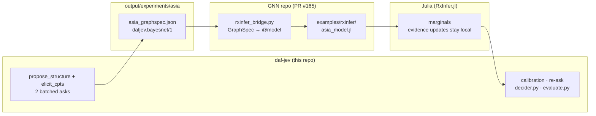

# daf-jev — Architecture Contract

Single source of truth for the package build. All workers MUST match these signatures
exactly. Wire facts below are verified against the local docs snapshot
(`docs/reference/`, snapshot `708902db9820d9d8`); per-module workers MUST also read
their listed snapshot pages for details and keep this contract accurate if they find
contradictions (report the delta; do not silently deviate).

## Wire facts (verified)

- Endpoint: `POST https://api.typesafe.ai/v1/systemone`
  - Headers: `Authorization: Bearer <API_KEY>`, `Content-Type: application/json`
  - Response header of record: `x-typesafe-request-id`
- Body: `{"state": <str|obj|arr>, "model": "jev-latest", "questions": {<id>: Question}}`
- Question (discriminated by `type`):
  - `noul`: `instructions` (required), optional `criteria: {"true": str?, "false": str?}`
  - `choice`: `instructions`, required `criteria: {option: str|null}`
  - `score`: `instructions`, required `criteria: [levels...]` (ordered, >= 2)
- Answer:
  - `noul`: `{type, noul: float}` (0=no, 1=yes)
  - `choice`: `{type, choice: str, probabilities: {option: float} (sum 1), confidence: float}`
  - `score`: `{type, score: float (probability-weighted, may be fractional),
    legend: {level_index_str: desc}, probabilities: {level_index_str: float}, confidence: float}`
- Top response: `{model, answers: {id: Answer}, usage: {input_tokens, output_tokens}}`
- Errors: 401 auth, 403 permission, 404 not found, 400 bad request, 422 validation,
  429 rate limit, 529 overloaded, 5xx internal. Retry 429/529 with exponential backoff,
  honoring `Retry-After` when present: the `Retry-After-ms` header wins when set, then
  the numeric `Retry-After` form — both clamped to [0, 300] seconds; the HTTP-date form
  is intentionally unsupported and falls back to exponential backoff.
  Status→exception mapping is centralized in `_errors.py`: each
  status-specific `_HTTPStatusError` subclass pins a `_STATUS` ClassVar
  (400/401/403/404/422/429/529) and `error_from_status()` resolves a
  status code to that class — unmapped 5xx become `InternalServerError`,
  statuses < 400 return `None`.
- Models listing exists in the official SDK (Models resource). Exact HTTP path/shape:
  read `docs/reference/sdk/python/api/clients/sync/models.md` and `.../client.md`
  before implementing; if the snapshot gives a path, use it. If no explicit path is
  documented, implement `models()` as `GET /v1/models` and note the assumption in code.

Wire strictness (pinned by `tests/unit/test_types.py:249-353`): answer
float fields (`noul`, `choice` `probabilities` values, `score`,
`confidence`) reject bools AND numeric strings — no `float()` coercion;
usage integer fields (`input_tokens`, `output_tokens`) reject `None`,
numeric strings, and bools, and deliberately accept integral floats
(`100.0` means 100 tokens; non-integral floats like `3.7` are rejected);
score `legend` parsing is strict (`legend` required, string level-index
keys → string descriptions; non-string values rejected). Nothing on the
wire path is silently coerced.

## Environment

- `JEV_API_KEY` preferred; fall back to `TYPESAFE_API_KEY` (official SDK's name).
- `JEV_BASE_URL` optional override (default `https://api.typesafe.ai`).
- Verified naming fact: the official TypeSafe SDK convention is
  `TYPESAFE_API_KEY` / `TYPESAFE_BASE_URL` / `TYPESAFE_DEFAULT_MODEL`;
  daf-jev keeps `JEV_*` as its own primary names with `TYPESAFE_*`
  fallbacks. The provider registry mirrors this: every provider's
  api-key / base-URL var tuples end with the `TYPESAFE_*` names (model
  fallback `TYPESAFE_DEFAULT_MODEL` on the `jev` provider only).
- `.env` in the working directory (`Path(".env")` default) is auto-loaded by a tiny
  built-in loader (NO python-dotenv dep). Values are stripped before use, so
  whitespace-only values count as unset at every layer (injected env > process env >
  `.env`). `.env` is gitignored and MUST never be read into tests; tests inject `env={...}`.

## Package layout (src/daf_jev/)

- `_types.py` — wire dataclasses. No I/O.
  - `JSONContent = Union[str, list, dict]` (values inside dicts may be None; state itself may not)
  - `NoulQuestion(instructions: JSONContent, criteria: Optional[dict] = None)`,
    `ChoiceQuestion(instructions, criteria: Mapping[str, str | None])`,
    `ScoreQuestion(instructions, criteria: Sequence[str])` — all frozen dataclasses,
    class attr `type`, method `to_wire() -> dict` producing exactly the documented shape
    (omit `criteria` when None for noul; score criteria MUST be a list of >= 2 strings —
    raise `ValueError` otherwise; choice criteria MUST be a non-empty `Mapping` whose
    values are `str | None` — `ValueError` otherwise).
  - `Question = Union[NoulQuestion, ChoiceQuestion, ScoreQuestion]`
  - Answers (frozen dataclasses): `NoulAnswer(noul: float)`,
    `ChoiceAnswer(choice: str, probabilities: dict[str, float], confidence: float)`,
    `ScoreAnswer(score: float, legend: dict[str, str], probabilities: dict[str, float],
    confidence: float)` — each with `type` attr; `answer_from_wire(payload) -> Answer`.
  - `Usage(input_tokens: int = 0, output_tokens: int = 0)`
  - `SystemOneResponse(model: str, answers: dict[str, Answer], usage: Usage,
    request_id: Optional[str] = None)` with cached `nouls` / `choices` / `scores`
    dict views filtered by answer type.
  - `parse_response(payload: dict, request_id: Optional[str] = None, *,
    probability_rounding_digits: int | None = 2) -> SystemOneResponse`
    (strict: unknown answer type or missing keys raise `ValueError`).
  - Strict parsing (hardened): numeric wire fields reject `bool` and numeric strings
    (int/float only); `choice`/`model` require an actual `str`; malformed
    `probabilities`/`legend`/`usage` shapes raise `ValueError`, never
    `TypeError`/`AttributeError`. `Usage` token counts follow the same numeric
    contract: an `int` passes as-is (`bool` never does), a float only when
    integral (`100.0` -> `100`), and numeric strings raise `ValueError`
    ("input_tokens must be an integer number"). `legend` values must already be
    strings (`ValueError` "legend values must be strings" — `None`/bool/int are
    never `str()`-coerced; level keys stay stringified). All probabilities,
    noul and confidence values must be finite in `[0,1]`; token counts must
    be nonnegative. `validate_probability_row(probabilities, *,
    rounding_digits=None, context="probabilities") -> None` checks positive
    mass within `1e-6`, adding half a decimal rounding quantum per entry only
    when all entries match an explicitly declared precision. Native parsing
    defaults to two digits; full-precision rows use `None`. Values are
    retained verbatim, never normalized; CPT and posterior-sidecar tolerances
    remain independent.
  - `validate_response(response, questions, *, probability_rounding_digits=2)
    -> None` binds a parsed response to exactly the requested IDs/types,
    complete choice vocabulary and score legend/range. Both clients invoke
    it before returning success. Malformed successful HTTP payloads raise
    `ValueError`; they do not become successful downstream observations.
- `_errors.py` — exception hierarchy (mirror the JS SDK classes):
  `TypeSafeError` base; `APIConnectionError`, `APITimeoutError`;
  `APIStatusError` (carries `status_code`, `body`, `request_id`) with subclasses
  `BadRequestError(400)`, `AuthenticationError(401)`, `PermissionDeniedError(403)`,
  `NotFoundError(404)`, `UnprocessableEntityError(422)`, `RateLimitError(429)`,
  `OverloadedError(529)`, `InternalServerError(5xx)`;
  `error_from_status(status_code, body=None, request_id=None) -> APIStatusError | None`.
  Read `docs/reference/sdk/python/api/exceptions.md` for messages/details.
- `_retry.py` — `RetryPolicy` frozen dataclass:
  `max_attempts=3, retryable_statuses=frozenset({429, 529}), backoff_base=0.5,
  backoff_max=8.0, jitter=0.1, respect_retry_after=True` and PURE method
  `next_delay(attempt: int, retry_after: Optional[float]) -> float`
  (exponential `backoff_base * 2**(attempt-1)` capped at `backoff_max`, plus uniform
  `±jitter/2`; `retry_after` wins when `respect_retry_after` and provided; >= 0).
  Sleep happens in the client (injectable clock/sleep for tests).
- `_http.py` — `Transport` protocol: `post_json(path: str, json_body: dict,
  headers: dict[str, str], *, timeout=None) -> httpx.Response` (+ `close()`).
  `HttpxTransport(base_url, timeout, headers)` implements it with `httpx`.
  Also `AsyncTransport` / `AsyncHttpxTransport` with `async` signature.
  Both httpx transports also expose `get_json(path, headers, *, timeout=None)`
  (models listing) under the same per-call timeout rule.
  `timeout=None` keeps the transport's configured default; a per-call value
  overrides it for that single request (explicit `None` is never forwarded to
  httpx, which would disable timeouts entirely). A transport constructed
  without a timeout passes `DEFAULT_TIMEOUT_SECONDS = 60.0` to httpx instead of
  httpx's own 5-second default; `_normalize_base_url` ensures a base URL with a
  path component ends with `/`.
- `client.py` —
  - Both clients preserve strict JSON decoder failures on successful HTTP
    responses, including duplicate keys, numeric overflow and malformed syntax.
    For unsuccessful HTTP responses, decoding failure falls back to raw text
    (or `None` for an empty body) so the status-specific exception still carries
    the original body and request ID.
  - `JevClient(api_key=None, *, base_url=None, model=None, transport=None,
    retry=None, sleep=time.sleep, timeout=None, env=None)`:
    resolves key via `config.resolve_api_key(env)`; `model=None` resolves via
    `config.resolve_model(env)` (`JEV_MODEL` / `TYPESAFE_DEFAULT_MODEL`, then
    `jev-latest`); empty/whitespace `api_key` or `model` raises `ValueError`;
    raises `TypeSafeError` when no key found and no transport injected. When
    `retry` / `timeout` are not passed they resolve from the environment via
    `config.resolve_retry(env)` / `config.resolve_timeout(env)` (that timeout
    may be None → the transport's 60.0 s default); explicit arguments always
    win.
  - `ask(state, questions: Mapping[str, Question], *, model=None,
    timeout=None, request_headers=None) -> SystemOneResponse`
    — single POST; retries per policy; maps errors. `timeout` overrides the
    client default for this call only; `request_headers` are merged over the
    default headers for this call only (per-call entries win, stored defaults
    never mutated).
  - `models(*, timeout=None, request_headers=None) -> list[ModelCard]` — a
    GET retried per the same policy as `ask` (shared send/retry path);
    per-call `timeout`/`request_headers` semantics identical to `ask`
    (explicit `None` never forwarded — constructor/env default applies;
    per-call header entries win, stored defaults never mutated).
    `ModelCard` is a dataclass per snapshot shape.
  - `close()`; context-manager support. `close()` sets the closed flag only
    after the transport close completes; `ask`/`models` after close raise
    `TypeSafeError("client is closed")`.
  - `AsyncJevClient` — same surface, `async def ask/models`, `async close`.
  - httpx exception mapping (checked in order): `httpx.TimeoutException` →
    `APITimeoutError` FIRST; then `httpx.HTTPError` (TransportError +
    RequestError, incl. `DecodingError`/`TooManyRedirects`) and
    `httpx.StreamError` → `APIConnectionError`.
  - Provider dispatch: keyword-only `provider=` on `_BaseClient.__init__`,
    `for_provider` classmethods on both clients, `open_client` /
    `open_async_client` module functions — full signatures in the Provider
    dispatch section below.
- `primitives.py` — ergonomic builders + composition container. No I/O.
  - `noul(instructions, *, true_desc=None, false_desc=None) -> NoulQuestion`
  - `choice(instructions, options: Mapping[str, str | None]) -> ChoiceQuestion`
  - `score(instructions, levels: Sequence[str]) -> ScoreQuestion`
    (every builder validates `instructions` is str/list/dict — `ValueError`
    otherwise)
  - `QuestionSet(Mapping[str, Question])` — `QuestionSet()`, `.add(id, q)`,
    `.merge(other)`, `to_wire()`, plus builder methods mirroring the free functions.
- `compose.py` — composable decision patterns (docs: /patterns/*). Pure logic
  over answers; no I/O and no client dependency.
  - `composite_score(answer: ScoreAnswer, weights: Optional[Sequence[float]] = None)
    -> float` — weighted (default uniform) expected value over level indices.
    Probabilities validated once on a shared canonical path: keys parsed via
    `int()` (`ValueError` "probability keys must be integer level indices"
    otherwise), values must be finite and non-negative (`ValueError` naming
    key/value); duplicate integer spellings of one level ('1', '01')
    accumulate onto that level, and both weighting paths iterate the canonical
    sorted indices. With weights: length must match the level count, weights
    finite, sum positive, weighted mass non-zero (each `ValueError`). The
    `[min index, max index]` range guarantee holds for non-negative weights;
    negative weights are accepted deliberately (scale-invariant reweighting)
    but void it.
  - `confidence_gate(answer, *, threshold: float, below: str = "review") -> str`
    — returns the primary value when confidence >= threshold else `below`;
    a Score answer's level maps via `round` (nearest, ties to even) clamped
    to the probable level range; a non-finite score raises `ValueError`.
    Thresholds must be finite nonboolean numbers in `[0,1]`; malformed
    confidence (bool, nonfinite or outside `[0,1]`) returns `below`.
  - `route(answer: ChoiceAnswer, handlers: Mapping[str, Callable[[], T]],
    *, min_confidence: float = 0.0, fallback: Callable[[], T] | None = None) -> T`
    — invalid numeric confidence routes to
    the fallback (fail-closed; `ValueError` when no fallback is provided).
  - `tiered_gate(answer, *, high=0.85, low=0.6, high_label="automate",
    middle_label="review", low_label="escalate") -> str` — two-threshold
    routing: confidence >= high → high_label, >= low → middle_label, else
    low_label; thresholds outside `[0,1]`, booleans, non-finite thresholds,
    `low > high`, or empty labels raise `ValueError`; malformed confidence
    escalates; answers without a `confidence` field raise `TypeError`.
  - `pick(actions: Mapping[str, Callable], choices: Mapping[str, ChoiceAnswer | Answer])`
    convenience wrapper; isinstance-narrows to `ChoiceAnswer` and silently
    skips other answers (unchanged).
- `models.py` — pure selection over the models listing; no I/O.
  - `pick_model(cards, *, contains=None, prefer="latest") -> ModelCard`
    — case-insensitive substring filter on `name` (`contains`); `prefer`
    `latest` = max `release_date` (None dates sort last, ties → first in
    input order), `first`/`last` = input order. `ValueError` on empty input,
    no match after filtering, or unknown `prefer`.
- `evaluate.py` — concurrent evaluation of a fixed question set over many
  states. `Evaluator(client, questions, *, concurrency=4, model=None)` with
  `client` typed `JevClient | AsyncJevClient` (a foreign client raises
  `TypeError` from `evaluate()`); thread pool for the sync client,
  `asyncio.Semaphore` for the async one. The public
  `async def evaluate_async(items)` is the ONE async path: it takes the
  normalized `(state_id, state)` items, requires an `AsyncJevClient`
  (`TypeError` otherwise), runs the semaphore path on the caller's event
  loop, and stores records so `summary()`/`to_json()` work exactly like
  after `evaluate()`; `evaluate()` normalizes raw states, then drives that
  same method on a private event loop (worker thread when called from
  inside a running loop) so it stays synchronous. Per-state failures are
  captured into `EvaluationRecord.error`, never aborting the batch. The
  async session is closed in a `finally`, so a cancelled gather still
  closes it (an `AsyncJevClient` is single-use through one evaluation).
  `summary()` latency mean/p95 span ALL records, failed included — a
  deliberate ops signal; token totals and per-question aggregates cover
  successful records only. Aggregation keys off the question's DECLARED
  type with per-type `isinstance` narrowing; an unknown declared type is
  skipped.
- `calibration.py` — pure confidence-calibration statistics over
  (confidence, correct) pairs: `bucket_index`, `reliability_table`,
  `expected_calibration_error`, `brier_score`. Every entry point validates
  each confidence in [0, 1] through the shared `_check_confidence` (NaN fails
  the chained comparison) — `ValueError` otherwise; `brier_score` also
  rejects empty `pairs`.
- `jaggedness.py` — model-jaggedness instrument: repeated asking of
  stochastic prompts (coin flips, dice rolls) across the provider registry,
  quantifying statistical deviation from the stated uniform distribution.
  `JaggednessFixture` plus the built-in fixtures `COIN` / `D6` /
  `COIN_NOUL`; pure statistics `chi2_sf`, `uniform_chi2`,
  `uniform_deviation`, `runs_test_z`, `max_streak`, `position_slope`;
  `noul_choice_delta` — the cross-instrument noul-vs-choice gap on the coin
  fixture; `run_battery` drives a fixture battery and returns a JSON-safe
  dict (choice counts, uniformity chi-square, degeneracy, prob mean/std,
  wobble, runs/streak, order-rotation and concurrent-batch metrics).
- `config.py` —
  - `load_dotenv(path: Path = Path(".env")) -> dict[str, str]` (KEY=VALUE, ignore
    comments/blank, no quoting gymnastics needed; never raise on missing file).
  - `resolve_api_key(env: Optional[Mapping[str, str]] = None) -> Optional[str]`
    — precedence: injected env mapping > process env > `.env` file
    (`JEV_API_KEY` then `TYPESAFE_API_KEY`).
  - `resolve_base_url(env=None) -> str` (JEV_BASE_URL or default).
  - `resolve_retry(env=None) -> RetryPolicy` — per-field overrides from
    `JEV_MAX_ATTEMPTS` (int >= 1), `JEV_BACKOFF_BASE` (float > 0),
    `JEV_BACKOFF_MAX`, `JEV_JITTER` (float >= 0); unset/invalid keeps the
    `RetryPolicy()` default for that field.
  - `resolve_timeout(env=None) -> float | None` — `JEV_TIMEOUT` seconds
    (positive float); unset/invalid → None.
  - `resolve_model(env=None) -> str` (`JEV_MODEL` / `TYPESAFE_DEFAULT_MODEL`
    or default `jev-latest`).
  - `Settings` frozen dataclass (`api_key, base_url, model, retry=RetryPolicy(),
    timeout=None`) + `load_settings(env=None)` — reads `.env` exactly once and
    shares the parsed mapping across the private resolvers (the public
    `resolve_*` signatures are unchanged).
  - Provider dispatch: `load_settings(env=None, provider=...)` and the
    `Settings.provider` field — full signatures in the Provider dispatch
    section below.
- `ledger.py` — thread-safe usage accounting across call loops (no I/O):
  `UsageLedger.record(Usage | SystemOneResponse | None) -> None` (None is a
  silent no-op for error paths; anything else raises `TypeError`);
  `snapshot()` / `reset()` (returns pre-reset
  totals, then zeroes) return a frozen `UsageSnapshot` (`requests`,
  `input_tokens`, `output_tokens`, `total_tokens` property, JSON-safe
  `to_dict()`). Complements `Evaluator.summary()`, which aggregates usage
  per evaluation batch.
- `providers.py` — provider registry (no I/O): frozen `ProviderSpec`,
  `register_provider` / `get_provider` / `list_providers`, and the three
  per-provider resolvers delegating to `config._lookup`; built-ins
  registered at import — full contract in the Provider dispatch section
  below.
- `resilience.py` — opt-in client-side failure isolation:
  `CircuitState` (closed / open / half_open), `CircuitOpenError(TypeSafeError)`
  (carries `remaining_seconds`), `CircuitBreaker(failure_threshold=5,
  cooldown_seconds=30.0, clock=time.monotonic)` with `call(fn, *args,
  **kwargs)`, `async call_async(fn, *args, **kwargs)`,
  `record_success()` / `record_failure()`, pure-read `state` /
  `consecutive_failures`, and a JSON-safe `to_dict()`. N consecutive
  failures open the circuit for the cooldown; a single probe is admitted
  after it (probe failure reopens with a fresh stamp). `call()` records a
  failure on any `BaseException` (KeyboardInterrupt, SystemExit,
  CancelledError included) and always re-raises, so a HALF_OPEN probe can
  never wedge the breaker; `CircuitOpenError.remaining_seconds` is always a
  float >= 0 (`0.0` for the probe-rejection race). The wrapped callable
  always runs outside the lock and the breaker never sleeps — the same
  pure-computation philosophy as `RetryPolicy`. Default OFF: `JevClient`
  is not wired to it. `call_async` awaits the callable before recording
  success; failure/cancellation records failure and re-raises, reopening a
  half-open probe. Returning a coroutine to synchronous `call` does not make
  it an async wrapper; use the awaited surface.
- `decider.py` — decision-point decider: the observe -> compose -> ask ->
  gate -> fail-open -> act loop as one reusable class. Pure orchestration
  over injected I/O; `decide()` never raises (the fallback hook is the
  floor and must not raise).
  - `DecisionEvent(source, reason, error, latency_s, usage, request_id)`
    frozen dataclass with a JSON-safe `to_dict()`; `source` is
    `"model"` / `"cache"` / `"fallback"`, `reason` follows the closed
    fallback taxonomy: `not_asked`, `no_key` (latched for the Decider's
    lifetime), `client_error` (latched), `latched`
    (`max_consecutive_failures` reached), `budget`, `breaker`,
    `compose_error`, `ask_error` (counts toward the latch), `gate`,
    `mapping_error` (counts toward the latch), `error` LAST (belt-and-suspenders:
    any unexpected exception inside `decide()` that no earlier guard catches —
    a raising `cache_key`, a raising cache mapping operation, or a raising
    `should_ask`/gate hook).
  - `ConfidenceGate(answer_id, threshold)` — frozen; threshold validated
    in [0, 1] else `ValueError`; booleans are rejected. Returns None to
    accept, a rejection reason otherwise. Confidence must be a finite
    nonboolean number in `[0,1]`; malformed confidence is rejected. Noul
    answers (no confidence attr) are not gated.
  - `Budget(max_calls=None, max_input_tokens=None, max_output_tokens=None,
    max_total_tokens=None, attempts=0)` — at least one threshold required, and
    every provided threshold must be >= 0 (`max_calls=0` stays valid — a
    deliberate "no calls" budget), else `ValueError`; `charge()` once per ask
    attempt (success or
    failure); `exceeded(usage: UsageSnapshot)` returns a human-readable
    reason when any limit is met/passed; JSON-safe `to_dict()`.
  - `Decider(Generic[S, T])(client=None, *, render_state, questions,
    map_answers, fallback, gate=None, should_ask=None, budget=None,
    cache=None, cache_key=None, ledger=None, breaker=None, timeout=None,
    max_consecutive_failures=3, client_factory=None, env=None,
    clock=time.monotonic, on_event=None)` — `client`/`client_factory`
    mutually exclusive, `cache`/`cache_key` together, latch >= 1,
    timeout > 0 (else `ValueError`). `decide()` order: cache hit (the
    `cache_key` is computed once per decide and reused by the final store) ->
    `should_ask` -> client resolution (latching: injected client;
    factory called once — an exception OR a None return latches
    `client_error`; default path
    resolves the key — None latches `no_key`, else
    `JevClient(env=env, retry=RetryPolicy(max_attempts=1))`, single
    attempt per ask so worst-case blocking is one timeout) -> budget gate
    -> compose (`compose_error`) -> one ask behind the optional breaker
    (`CircuitOpenError` -> `breaker`; other exceptions count toward the
    latch, reason `ask_error`) -> ledger record ->
    gate (`gate`) -> map (`mapping_error`, counts toward the latch) ->
    cache store -> failure-counter reset + `"model"` event. Transport success
    does not clear a mapping-failure latch. Gate/mapping/hook/cache fallbacks
    after a successful ask retain response usage and request ID in the event;
    the ledger records that response once. Extra surface: `last_event`,
    `usage_snapshot()`, `calibration_pairs()` (declared-confidence /
    gate-accepted pairs when the gate is a `ConfidenceGate` — a
    self-consistency proxy, NOT correctness), `dead` property.
- `cli.py` — argparse (stdlib), thin. `main(argv=None) -> int`. Common flags:
  `--base-url` (ask/models/evaluate), the global `--provider` flag (all
  commands; see Provider dispatch below), and `--json`/`--pretty` (mutually
  exclusive; compact is the default).
  - `daf-jev ask --state-file FILE | --state TEXT [--question ID=SPEC ...] [--model M]
    [--json | --pretty]` where SPEC is `noul:<instructions>` |
    `choice:<instructions>:opt1=desc,opt2=…` | `score:<instructions>:level1,level2,…`
    (option/level descriptions may be empty → None for choice; `\,` `\:` `\\`
    escape the delimiters inside a SPEC). Duplicate `--question` ids are
    rejected; `--state-file` content parses only as dict/list JSON (scalar
    JSON such as `123` stays raw text). Usage errors — malformed `--question`,
    unreadable `--state-file`, zero questions, duplicate ids — exit 2 with
    `{"error": "UsageError", ...}` on stderr; runtime errors exit 1 with the
    exception class name in the JSON.
  - `daf-jev models [--pick latest|first|last] [--contains STR]` — list or
    pick models.
  - `daf-jev evaluate --questions-file PATH --states-file PATH
    [--concurrency N] [--model M] [--include-records]` — YAML questions (SPEC
    strings or native `{type, instructions, criteria}` mappings; duplicate
    keys rejected, nested included), states one per line or a JSON array of
    strings; prints the summary JSON (`--include-records` adds per-state
    records).
  - `daf-jev docs-verify [--manifest PATH]` — delegates to
    `daf_jev.docs_verify.verify_manifest` (default: the absolute
    repo-root-anchored `docs/reference/MANIFEST.json`, independent of the
    CWD); prints `{manifest, pages, missing, drifted, added, ok}` where
    `added` lists extra `.md` files the manifest does not list; exit 1 when
    `ok` is False.
  - `daf-jev posteriors-load FILE [--graphspec FILE]` — loads and
    validates a `dafjev.bayesnet-posteriors/1` or `gnn.marginals/1`
    sidecar (same loader as the MCP `jev_posteriors_load` tool);
    `--graphspec` cross-checks variables/states against a
    `dafjev.bayesnet/1` document. Prints `{ok, format, evidence_count,
    variable_count, min_row_sum_deviation, max_row_sum_deviation}`; a
    failed validation exits 1 with `{"error": "ValueError", ...}`.
    Keyless — no API call.
  - `daf-jev posteriors-reask FILE [--graphspec FILE] [--asked VAR ...]` —
    max-entropy re-ask plan from a `dafjev.bayesnet-posteriors/1`
    sidecar (same policy as the MCP `jev_reask_plan` tool;
    `dafjev.bayesnet-posteriors/1` only — variant B is rejected, exit 1,
    message naming both format strings). `--graphspec` passes through to
    the loader for validation parity with `posteriors-load`; repeatable
    `--asked VAR` excludes already-asked variables. Prints
    `{next_question, entropy, queue, evidence}` (queue entries are
    `[variable, entropy_bits]` pairs, descending); a failed validation
    exits 1 with `{"error": "ValueError", ...}`. Keyless — no API call.
  - `daf-jev serve [--transport stdio]` — runs the MCP server (stdio only);
    a missing `mcp` extra prints a `uv sync --extra mcp` hint (exit 1).
  - `daf-jev providers` — prints the provider registry as a JSON array to
    stdout (one object per provider in registry order; keyless, exit 0, no
    network); the global `--provider` flag selects the backend for every
    command (invalid keys are usage errors, exit 2). Details in the
    Provider dispatch section.
  - All output JSON to stdout; exit 0 ok, 2 usage, 1 runtime error.
- `__init__.py` — eager imports only (no ImportError guards). Public exports
  (listed in `src/daf_jev/__init__.py`, including `__version__`): the wire/client/compose/evaluate/decider/
  provider-dispatch core plus the jaggedness fixtures and statistics
  (`COIN`, `COIN_NOUL`, `D6`, `JaggednessFixture`, `chi2_sf`, `max_streak`,
  `noul`, `noul_choice_delta`, `position_slope`, `run_battery`, `runs_test_z`,
  `uniform_chi2`, `uniform_deviation`), the graphical-model additions
  (`Variable`, `Edge`, `CPT`, `BayesNet`, `elicit_cpts`, `elicit_cpts_async`,
  `propose_structure`, `propose_structure_async`,
  `decompose_single_parent`), and the posteriors-ingest additions
  (`CalibrationPairing`, `PosteriorsSidecar`, `load_posteriors`,
  `pair_for_calibration`), and the re-ask policy additions
  (`ReAskPlan`, `entropy_bits`, `next_question`, `reask_plan`), plus
  `AsyncDecisionBackend`, `AsyncHTTPDecisionBackend`, `BackendCapabilities`,
  `CallReceipt`, `DecisionBackend`, `DecisionPrediction`, `DecisionRequest`,
  `DecisionResult`, `HTTPDecisionBackend`, `PriorBackend` and
  `ThreadedAsyncBackend`. The legacy exports remain:
  `COIN, COIN_NOUL, CPT, D6, APIConnectionError, APITimeoutError, Answer,
  AsyncJevClient, BayesNet, Budget, CalibrationPairing, ChoiceAnswer,
  ChoiceQuestion, CircuitBreaker, CircuitOpenError, CircuitState,
  ConfidenceGate, Decider, DecisionEvent, Edge, EvaluationRecord, Evaluator,
  JSONContent, JaggednessFixture, JevClient, ModelCard, NoulAnswer,
  NoulQuestion, OverloadedError, PosteriorsSidecar, ProviderSpec, Question,
  QuestionSet, RateLimitError, ReAskPlan, RetryPolicy, ScoreAnswer, ScoreQuestion,
  Settings, SystemOneResponse, TypeSafeError, Usage, UsageLedger,
  UsageSnapshot, Variable, __version__, answer_from_wire, chi2_sf, choice,
  composite_score, confidence_gate, decompose_single_parent, elicit_cpts,
  entropy_bits,
  get_provider, list_providers, load_posteriors, load_settings, max_streak,
  next_question,
  noul, noul_choice_delta, open_async_client, open_client,
  pair_for_calibration, parse_response, pick_model, position_slope,
  propose_structure, reask_plan, register_provider, resolve_retry, resolve_timeout,
  route, run_battery, runs_test_z, score, uniform_chi2, uniform_deviation`.
- `scripts/scrape_docs.py` — standalone (stdlib urllib) re-scraper: reads llms.txt,
  fetches every page into `docs/reference/` preserving `.md` paths, rewrites
  `MANIFEST.json` with per-page sha256 + `snapshot_id` (sha256 of concatenated page
  hashes, first 16 hex). CLI: `--check` mode exits 1 on drift, 0 on match (no
  writes); `--timeout` must be > 0; a derived page path containing `..` raises
  `ValueError` (a hostile index must not write outside the output dir);
  unrecognized llms.txt lines are skipped with a stderr warning.
- `scripts/generate_figures.py` — thin orchestrator over `figures.py` (needs
  the `figures` extra): renders the registry (or `--only NAME`, exit 2 on an
  unknown name), ALWAYS writes `figure_registry.json` — `--only` runs
  included — because template validation requires it, and always writes the
  sibling `architecture.mmd` (byte-deterministic mermaid source emitted by
  the pure `figures.architecture_mermaid()`; deliberately NOT a registry
  entry); exit 1 on unexpected error (missing benchmark data names the
  file), 0 on success. `--include-study` appends the six explicitly selected
  empirical figures from `study_figures.py`, with per-figure data JSON and
  deterministic vector PDF companions; default invocation renders eight core figures.
- `scripts/z_generate_manuscript_variables.py` — thin orchestrator over
  `manuscript_variables.py`: writes `output/data/manuscript_variables.json`
  and (inside a template checkout) injects `{{TOKEN}}`s; strict mode (default)
  exits 1 with a `FileNotFoundError` naming the missing analysis output —
  manuscript config, docs snapshot manifest, benchmark JSONs, or
  `output/figures/figure_registry.json` (the `FIGURES` token derives from
  that registry, never a raw PNG glob) — rather than fabricating values;
  `--allow-draft` emits `N/A` sentinels instead.
- `scripts/capture_verification.py` — `capture(root: Path, out_dir: Path) -> int`
  runs genuine unit pytest with branch coverage/JUnit and collects live tests
  without executing them. CLI: `--out-dir FRESH_INSIDE_ROOT`. It inventories
  verification inputs before/after, retains native exports and command logs in
  a fresh confined nonsymlink directory, and writes
  `dafjev.verification-evidence/1` even for a failed capture. Only its owned
  private raw coverage files are removed. Fresh captures record
  `environment.stdlib_directory` from the actual capturing interpreter's
  `sysconfig` alongside its version and platform; this is private original
  provenance, never inferred or backfilled into older receipts. Capture does not change the
  publication selection or publish results; live collection is not live acceptance.
- `scripts/project_verification.py` creates a fresh, hash-bound public derivative
  of successful original captures. It relocates project/interpreter display and
  removes JUnit hostname attributes. An explicitly captured canonical absolute
  POSIX `lib/pythonX.Y` or `lib64/pythonX.Y` standard-library prefix matching the
  recorded Python version may additionally become `<PYTHON_STDLIB>`; the
  transformation is declared in the derivative. Prefix siblings, traversal,
  backslash/control-character suffixes, relative prepends, third-party package
  directories in prefix ancestry or suffixes, and other private paths still
  fail before output creation. Captured interpreter display must name a
  canonical absolute narrow Python executable; every replacement checks both
  path boundaries. Coverage JSON is strictly decoded before recursive string
  key/value relocation, collision checking and declared JSON serialization, so
  escape spelling cannot conceal recognized private data. Parsed XML attribute,
  text and tail values are checked before serialization. Credential markers
  (Bearer/Basic schemes, recognized API-key and private-key prefixes) are
  rejected before path relocation; residual POSIX/Windows user-path markers
  are rejected afterward. A bounded scan also inspects HTML, URL and hexadecimal
  display encodings without editing the emitted text. These checks detect the
  documented markers, not arbitrary secrets; independent artifact review
  remains necessary. Missing stdlib provenance supplies no substitution. Native
  files, result values and before/after source inventories remain unchanged.
- `scripts/check_benchmark_runtime.py` — `check_runtime() -> dict` imports real
  SciPy sparse linear algebra and fits/predicts the public structured comparator
  on bounded owned toy data with a complete absent-class vocabulary. CLI has
  no arguments and prints `dafjev.benchmark-runtime-check/1` JSON, exit 0/1.
  Requires the benchmark extra; no provider calls or full-study acceptance.
- `scripts/render_pdf.py` — standalone saved-token substitution and
  Pandoc/XeLaTeX renderer. `--output FILE` requires a fresh PDF path;
  `--artifacts-dir DIR` optionally retains intermediate Markdown, TeX and logs
  in a fresh directory. `--install` separately replaces the root PDF.
  BibTeX must exit successfully with no warnings; a generated bibliography file
  does not excuse syntax or style errors. Bibliography misses, undefined
  references, unloadable images and overfull vertical boxes must all be zero.
  The bibliography uses entry types supported by `plainnat`.
  The preamble flushes pending pages before
  longtables. These gates complement section/prose completeness and page-layout
  review; they do not establish model execution or publication acceptance.
- `figures.py` — the manuscript figure registry (matplotlib imported at
  module level, headless `Agg`; NEVER import from core modules). One
  `generate_<name>()` per manuscript figure — `graphical_abstract`,
  `architecture`, `primitives`, `batching`, `latency`, `confidence`,
  `calibration`, `admission` (8 figures in `_REGISTRY`; `generate_one(name, out_dir, project_root=None, *, include_study=False)`
  raises `ValueError` naming the valid choices on an unknown name) —
  orchestrated by `generate_all(out_dir, project_root, *, include_study=False)`: renders in
  registry order and ALWAYS writes `figure_registry.json` after the
  PNGs via `write_figure_registry(out_dir, project_root, *, include_study=False)` (one entry per `fig:*` label:
  `figure_id` `figure_NNN`, filename, caption, section, width,
  `placement: "h"`, `metadata.alt_text` — static metadata, no measured
  statistics; template validation consumes it). Data-driven figures
  (`batching`, `latency`, `calibration`, `graphical_abstract`) read the
  exact benchmark JSONs selected by `manuscript/evidence.json` and verified
  through `evidence.selected_benchmark_bytes` in one verified consumption (the private compatibility helper
  keeps the name `_latest_benchmark`) and raise `FileNotFoundError` naming the missing
  file; `architecture`, `primitives`, `confidence`, and `admission` are data-free
  and always renderable. `architecture_mermaid() -> str` re-renders the
  architecture diagram as byte-deterministic mermaid from the same
  static `_ARCHITECTURE_NODES` / `_ARCHITECTURE_EDGES` tables the PNG
  drawer consumes (nodes sorted by id, edges by (src, dst), the
  duplicate `primitives -> client` arrow kept; `graph TD`; no trailing
  newline) — deliberately NOT a registry entry; `generate_figures.py`
  writes it as the sibling `architecture.mmd` on every run. Shared
  style surface: `_style()` (module-level rcParams constants — DPI 200,
  DejaVu Sans, palette, light gridlines; every generator calls it
  first) and `_ROLE_FACECOLORS` (`main` / `side` / `external` role ->
  facecolor; side modules draw dashed).
  Study mode replaces the cover with a modular workflow and separate retained
  evidence counts; the legacy default cover remains available. Registry caption
  and alt text follow the chosen cover. Both modes write vector PDF companions.
  `generate_admission(out_dir, project_root=None) -> Path` diagrams shared
  reservation before run intent/HTTP, run receipt before shared reconciliation,
  and conservative stops for unknown charges or incomplete journals. It is a
  schematic without measurements and preserves the cover as registry figure 1.
- `study_evidence.py` — pure selected aggregate consumption, no model execution
  or plotting. `load_studies(project_root) -> StudyEvidence` consumes SHA-bound
  `study_summaries.cpu`, `.hosted` and optional `.native_hosted` through
  `evidence.selected_study_bytes`.
  It rejects malformed formats, duplicate arm identities, invalid metrics,
  inconsistent status/attempt/gate denominators and non-finite currency.
  `arm(...)` requires a unique declared cohort; `limits(...)` consumes retained
  grouped percentile intervals without refitting. `tokens()` emits optional
  `STUDY_*` measured variables. It preserves null risk for ineligible gates.
  Native summaries use `dafjev.native-hosted-study-summary/1`. All five global
  statuses and each phase's status rows conserve the frozen plan. Physical
  attempts remain distinct from cells. Successful native completions require a
  final HTTP 200 receipt with response-body custody, usage, reported charge and
  matching dataset/phase identities. The initial capability cut explicitly
  excludes predictive-quality and maximum-boundary claims; its historical
  bounded UNKNOWN charge remains separate. Selecting this summary adds seven
  `NATIVE_HOSTED_*` variables without altering legacy measured tokens.
- `scripts/export_native_capabilities.py` — explicit offline export of an
  original executable manifest, immutable terminal capability journal prefix
  and report, each selected by expected SHA-256. It opens no live run/head,
  allocation or credential and performs no network calls. The journal prefix
  is retained byte for byte; manifest/report projections declare their exact
  original hashes and documentary substitutions and cannot resume execution.
  Decoded fields are checked for private paths and credentials before a fresh
  destination is created. Report, journal, receipt and status conservation must
  agree; the exported capability cut cannot acquire later quality outcomes.
- `figures.NATIVE_FIGURE_NAME` — optional `native_capabilities` figure from the
  selected native summary. It writes PNG, vector PDF and plotted-data JSON with
  exact manifest/journal/inference-source/Git/cut provenance in the registry.
  Requested vocabulary, observed HTTP latency and reported charges describe
  actual selected probes; these measurements establish neither accuracy nor
  maximum supported boundaries. Existing core and study figures remain
  unchanged when no native summary is selected.
- `study_figures.py` — optional headless matplotlib figures `cpu_quality`,
  `wine_ordinal`, `cohort_sensitivity`, `validation_folds`, `selective_validation`
  and `execution_coverage`. `generate(name, out_dir, project_root)` reads selected
  aggregates, writes PNG/PDF and `dafjev.study-figure-data/1` JSON with exact
  source hashes and plotted values. No bootstrap, fit, probability reconstruction,
  or inference occurs. Intervals describe fixed predictions; Wine error units
  are bin indices; changed-cohort sensitivities lack paired change intervals;
  adaptive validation bounds lack simultaneous or refit-transfer guarantees.
  A complete isolated rc context is applied before creating figures so full and
  standalone entry points render identically under the same runtime and inputs.
- `manuscript_variables.py` — the `{{TOKEN}}` map generator (no
  matplotlib): `generate_variables(project_root, *,
  require_analysis_outputs=True) -> dict[str, str]` returns the flat
  UPPERCASE_KEY token map (no braces) and `save_variables(variables,
  output_path)` persists it as JSON. Strict mode (default) raises
  `FileNotFoundError` naming the missing analysis output — manuscript
  config, docs snapshot manifest, benchmark JSONs, or
  `output/figures/figure_registry.json`; draft mode (`--allow-draft`)
  emits `"N/A"` sentinels. With an explicit verification selection, malformed,
  stale or incomplete verification fails in both modes. Without that selection,
  the legacy collection/raw-coverage path can return `"N/A"` for unavailable
  verification. FIGURES derivation: the registry JSON is consumed
  entry-by-entry — every entry must be a dict with a string `filename`
  (`ValueError` naming the label otherwise), and `FIGURES` is the
  sorted filenames joined with ", " (empty registry -> `"N/A"`). The
  registry path is the module-local `_FIGURE_REGISTRY` constant, a
  deliberate mirror of `figures.FIGURE_REGISTRY_FILENAME` — never a
  `daf_jev.figures` import, which would pull matplotlib into core;
  `_load_manifest` (docs snapshot `MANIFEST.json`) follows the same
  loader shape (strict-raise vs draft-empty). The 49-token set derives
  from manuscript/config.yaml (`CONFIG_*`; batch-width token NAMES
  derive from the configured widths, canonical 5/10/20 fallback),
  pyproject metadata, AST-derived code stats, selected verification (or legacy
  collection/coverage), benchmark JSONs, and provenance — no hardcoded results.
  A present `study_summaries` map adds 17 `STUDY_*` tokens from selected aggregate
  bytes; absent maps preserve the legacy token set. Malformed or changed selected
  studies fail in both strict and draft mode. These retained study values preserve
  their original execution/source identity rather than acquiring the current
  software-verification identity.
  An optional selected native hosted summary adds seven `NATIVE_HOSTED_*`
  variables from its conserved plan, phase counts and per-attempt accounting.
  Optional `manuscript/evidence.json` `verification={path,sha256}` selects a
  completed capture through `evidence.selected_verification`. Unit/live counts,
  coverage and Python/platform then derive from those retained outputs; variable
  regeneration runs no pytest collection and reads no raw coverage. Live count
  means tests collected, not executed. Source/test/script/config identity must
  equal both retained boundary inventories. Legacy coverage freshness:
  ``TEST_COVERAGE_PCT`` re-reports an existing
  ``.coverage`` only when it is not older than the newest source/test
  ``.py`` mtime (recursive, ``__pycache__`` skipped); stale data raises
  ``FileNotFoundError`` naming both timestamps and the fix
  (``uv run pytest tests/unit --cov=src``) in strict mode, and warns on
  stderr with an ``"N/A"`` token in draft mode. Provenance:
  ``GENERATION_TIMESTAMP`` honors ``SOURCE_DATE_EPOCH`` first;
  otherwise it derives from the repo's newest commit date (``git log -1
  --format=%cI``, UTC-normalized) so regens at the same HEAD are
  byte-stable, with wall-clock UTC only as the git-unavailable fallback.
- `scripts/bayes_experiment.py` — thin orchestrator over `graphical` +
  `graphical_elicitation` (+ `graphical_viz` for the rendered artifacts):
  CLI `--provider KEY` / `--model NAME` / `--edge-penalty FLOAT` /
  `--propose-structure` / `--out-dir PATH`; keyless SKIP. Full contract in
  the Graphical models section (Experiment runner block).
- `questions.py` — shared native question-mapping builder (no I/O):
  `question_from_mapping(value, *, context="question") -> Question` builds a
  `NoulQuestion`/`ChoiceQuestion`/`ScoreQuestion` from a
  `{type, instructions, criteria}` mapping with strict validation and
  actionable `ValueError` messages; the CLI (`evaluate --questions-file`) and
  the MCP server route native mappings through it so validation is defined
  exactly once.
- `docs_verify.py` — shared verifier for a docs snapshot manifest (read-only):
  `verify_manifest(manifest_path)` re-hashes every listed page (sha256 + byte
  length), flags `url`→path mismatches as `drifted`, and reports extra `.md`
  files as `added`; report schema `{manifest, pages, missing, drifted, added,
  ok}` with `ok` True only when all three finding lists are empty (the CLI
  treats `added` as failure, mirroring `scrape_docs.py --check`);
  `DEFAULT_MANIFEST` is anchored to the repo root this module is installed
  in, not the process CWD.
- `mcp_server.py` — FastMCP server (`build_server()`,
  `main(transport="stdio")`): 8 tools — `jev_ask` (state widened to
  str|dict|list; questions are SPEC strings or native dicts routed through
  `question_from_mapping`), `jev_evaluate` (async: `AsyncJevClient` +
  `Evaluator.evaluate_async()` on the serving loop; empty `states` →
  `ValueError`),
  `jev_models` (async; `pick` is a Literal schema; `contains=""` = no
  filter), `jev_composite_score` (finite/non-negative probability validation
  via `composite_score`), `jev_confidence_gate`, `jev_tiered_gate`,
  `jev_docs_verify` (error shape `{"error", "message", "ok": False}`),
  `jev_posteriors_load` (async sidecar ingest: `path` plus optional
  `graphspec_path` cross-checked against a `dafjev.bayesnet/1` document;
  same loader as the CLI `posteriors-load` command; makes no API call —
  the only tool that needs no provider/key; error shape
  `{error, message, ok: False}`) — plus
  the `jev://docs/snapshot` resource via `docs_verify` (CWD-independent).
  Every return is JSON-safe (`dataclasses.asdict`); stdio transport only;
  `mcp` imports at module level (optional extra — never from core modules);
  client/compose/evaluate import lazily inside the tools; the posteriors
  helpers import at module level (pure stdlib, no client).
  Every tool except `jev_posteriors_load` (sidecar ingest, no API call)
  additionally accepts an optional string `provider` argument
  (default `"jev"`; validated via `get_provider` — unknown providers return
  a JSON-safe error result listing the available keys, no traceback); MCP
  stays stdio-only. Details in the Provider dispatch section.
- `graphical.py` — discrete Bayes nets as frozen dataclasses (`Variable`,
  `Edge`, `CPT`, `BayesNet`): graph helpers (`variable`, `parents_of`,
  `children_of`, deterministic `topological_order`), `validate()`, exact
  inference (`posterior` / `query` — pure-stdlib variable elimination, no
  numpy), and the GraphSpec `dafjev.bayesnet/1` JSON round-trip. Full
  contract in the Graphical models section below.
- `graphical_elicitation.py` — Jev as a factor source: `elicit_cpts`
  (every CPT row of a net as one batched `choice` ask; deterministic ids,
  chunking via `max_questions_per_request`) and `propose_structure` (one
  batched ask over all variable pairs -> DAG proposal, edges only). Both
  take any object with `.ask(state, questions)`. Full contract in the
  Graphical models section below.
- `graphical_viz.py` — rendering over the public `BayesNet` API:
  `to_mermaid` (zero-dependency mermaid source; `direction="TD"` and
  `description_limit=40` kwargs), `plot_network` (deterministic layered
  PNG; matplotlib imported inside the function; `dpi=200`/`figsize=None`
  kwargs), and `plot_posterior_trajectory` (grouped P(true) bars over
  cumulative evidence steps; `dpi`/`figsize` kwargs). Full contract in the
  Visualization part of the Graphical models section below.
- `graphical_animation.py` — GIF animations over the public `BayesNet`
  API (optional `figures` extra): `animate_posterior` (grouped P(true)
  bars growing one cumulative evidence step per frame; `labels`/`fps`/
  `dpi` kwargs) and `animate_network` (the layered DAG layout with node
  fills set to P(true) per step; `fps`/`dpi` kwargs). matplotlib and
  Pillow import lazily INSIDE the call — without the `figures` extra
  the ImportError names `uv sync --extra figures`. Fail-closed
  validation precedes any figure; deterministic byte-identical output.
  Full contract in the Animation part of the Graphical models section
  below.
- `bayesnet_posteriors.py` — posteriors/marginals sidecar ingest (pure
  stdlib; the only I/O is reading the sidecar and optional GraphSpec JSON
  documents — no client, no matplotlib). Accepts both
  `dafjev.bayesnet-posteriors/1` (variant A) and `gnn.marginals/1`
  (variant B) documents fail-closed and pairs Jev assignments against
  sidecar rows for calibration. Full contract in the Posteriors sidecar
  ingest section below.
- `reask.py` — max-entropy re-ask policy over posterior sidecars (pure
  compute: no I/O, no client, no matplotlib, no network). `entropy_bits`
  (Shannon entropy in BITS, log2; empty rows 0.0; negative/non-finite
  probabilities raise; drifting rows are never renormalized — the
  deviation is raised with the `ROW_SUM_TOLERANCE` budget in the
  message), `reask_plan` / `next_question` (max-entropy
  not-yet-asked variable over a `dafjev.bayesnet-posteriors/1`
  sidecar's posterior rows, ties broken by the sidecar's insertion
  order; variant B `gnn.marginals/1` is rejected with a message naming
  both format strings — it carries no `evidence` to replay). The plan
  is a frozen dataclass with an `evidence` field verbatim from the
  sidecar; the plan never constructs Jev calls — the ask wiring lives
  in `examples/reask_policy.py` (pipeline step 5 as a decision-policy
  input). Surfaced as `daf-jev posteriors-reask` and MCP
  `jev_reask_plan`.

Shared figures theme: `figures.py` owns the single visual identity — the
named `COLOR_*` / `FONT_*` / `SIZE_*` constants, `DPI`, `ARROW_STYLE` /
`ARROW_LW`, the `_style()` rcParams including the 4-color
`axes.prop_cycle` (`COLOR_LAYER_MAIN` -> `COLOR_ACCENT` ->
`COLOR_LAYER_SIDE` -> `COLOR_EXTERNAL`), and `_ROLE_FACECOLORS` over the
shared `_ARCHITECTURE_NODES` / `_ARCHITECTURE_EDGES` spec consumed by
both the PNG drawer and `architecture_mermaid()` (the shared style
surface is noted in the `figures.py` bullet above). The figures-adjacent
plotters (`graphical_viz`, `graphical_animation`) import those constants
lazily per call, together with matplotlib — a module-level import would
break `to_mermaid`'s zero-dependency contract, pinned by
`test_plotters_without_matplotlib_name_figures_extra` (the
missing-matplotlib `ImportError` names `uv sync --extra figures`). The
def-time `dpi` signature defaults are the one accepted literal pair
(module-local, not resolved from the theme): `graphical_viz._DPI ==
figures.DPI` is sync-pinned by `test_dpi_default_matches_shared_theme`,
while the animation plotters keep their own `dpi: int = 110` GIF-frame
defaults, outside that pin. Documented viz-local exceptions (NOT theme
API): the node face `#EAF2FA`, the bar-grid alpha, the coolwarm posterior
fills, and the arrow curvature / mutation-scale geometry constants. Bar
series in `plot_posterior_trajectory` and `animate_posterior` follow the
`_style()` prop_cycle order (cycling per query-variable series); registry
PNGs never route through the viz modules — every `generate_<name>()`
draws inside `figures.py`. The posteriors-ingest module
`bayesnet_posteriors.py` is likewise outside the theme: pure stdlib with
no figure surface — it never imports `figures`, matplotlib, or the viz
modules.

## Provider dispatch

The legacy provider registry parameterizes configuration, client construction
and CLI/MCP dispatch for the shared System One client contract
(`POST /v1/systemone`, TypeSafe-shaped `GET /v1/models`). Unknown response fields
(kev's `latency_ms`, OpenRouter's `id` / `provider` / `usage.cost` extras)
are ignored by the legacy dataclasses. Explicit cross-provider benchmark
adapters below retain those accounting/model fields and use full endpoint URLs;
they do not silently alter the stable registry keys or defaults. Compose and
calibration are pure; evaluator/decider orchestrate injected I/O. Both kinds
of layer remain provider-agnostic.

Registry (`providers.py`):

- `ProviderSpec` — frozen dataclass: `key` (unique, lowercase,
  `[a-z][a-z0-9_-]*`), `display_name`, `default_base_url`, `api_key_vars`
  (primary first; `TYPESAFE_API_KEY` last for all — official-SDK compat),
  `base_url_vars` (provider var first, `TYPESAFE_BASE_URL` last),
  `default_model`, `model_vars`, `docs_url: str | None = None`,
  `notes: str | None = None` (behavioral caveats, one paragraph max).
- `register_provider(spec) -> None` — validates key pattern + non-empty
  required fields + duplicate key (`ValueError` naming the problem);
  appends to the registry (registration order kept, built-ins first).
- `get_provider(key) -> ProviderSpec` — case-insensitive; `ValueError`
  "unknown provider 'x': available: jev, jeff, kev, localjev,
  openthai-systemone, openrouter" (join of current registry keys in order).
- `list_providers() -> tuple[ProviderSpec, ...]`.
- `resolve_provider_api_key(spec, env: Mapping[str, str] | None = None) ->
  str | None`; `resolve_provider_base_url(spec, env=None) -> str` (falls
  back to `spec.default_base_url`); `resolve_provider_model(spec, env=None)
  -> str` — all three delegate to `config._lookup` (same truthiness
  semantics: falsy env values are skipped; explicit env mapping beats
  `.env` file beats None).
- Built-ins registered at import, in this order:
  - `jev` — "TypeSafe Jev (System One)"; base `https://api.typesafe.ai`;
    model `jev-latest`; key vars `JEV_API_KEY`, `TYPESAFE_API_KEY`;
    base-URL vars `JEV_BASE_URL`, `TYPESAFE_BASE_URL`; model vars
    `JEV_MODEL`, `TYPESAFE_DEFAULT_MODEL`; `docs_url` =
    `https://docs.typesafe.ai/concepts/system-one.md` (the official docs
    URL cited in `docs/models.md`).
  - `jeff` — "Jeff (self-hosted System One)"; base `http://localhost:8000`;
    model `jev-latest`; vars `JEFF_API_KEY` / `JEFF_BASE_URL` /
    `JEFF_MODEL`; notes: GLiFormer, drop-in wire compatibility,
    temperature-scaled probabilities, nominal output tokens;
    https://github.com/logan-markewich/jeff.
  - `kev` — "Kev (self-hosted System One)"; base `http://localhost:8009`;
    model `kev-latest`; vars `KEV_API_KEY` / `KEV_BASE_URL` / `KEV_MODEL`;
    notes: Qwen3.5 family 0.8B/4B/9B, drop-in wire compatibility, extra
    top-level `latency_ms` field; https://github.com/jaredpalmer/kev.
  - `localjev` — "LocalJev (GitHub Next)"; base
    `http://127.0.0.1:8080`; model `localjev-latest`; vars
    `LOCALJEV_API_KEY` / `LOCALJEV_BASE_URL` / `LOCALJEV_MODEL`; notes:
    GitHub Next GLiFormer proxy — TS/Bun server over any OpenAI-compatible
    chat endpoint; MIT.
  - `openthai-systemone` — "OpenThai System One"; base
    `http://localhost:8077`; model `openthai-latest`; vars
    `OPENTHAI_API_KEY` / `OPENTHAI_BASE_URL` / `OPENTHAI_MODEL`; notes:
    Thai/English Qwen3.5-0.8B slot-softmax; no server auth; no `/v1/models`
    (the `models` command is unsupported); Apache-2.0.
  - `openrouter` — "OpenRouter (hosted System One proxy)"; base
    `https://openrouter.ai/api`; model `jev-latest`; vars
    `OPENROUTER_API_KEY` / `OPENROUTER_BASE_URL` / `OPENROUTER_MODEL`;
    notes: responses add `id` / `provider` / `usage.cost` extras (parse
    fine and are ignored); `/v1/models` returns the OpenRouter shape, so
    the `models` command is unsupported there.

Config (`config.py`):

- `load_settings(env=None, provider: str | ProviderSpec | None = None)` —
  default None behaves exactly as today (jev); when given, per-provider
  resolution for api_key / base_url / model.
- `Settings` gains trailing field `provider: str = "jev"` (defaulted — no
  positional breakage).
- Existing `resolve_api_key` / `resolve_base_url` / `resolve_model` stay as
  the jev compatibility surface (delegate to the jev spec) — signatures
  unchanged. `_lookup` semantics unchanged.

Clients (`client.py`):

- `_BaseClient.__init__` gains keyword-only `provider: str | ProviderSpec |
  None = None` (after `env`). When `provider` is not None: api_key /
  base_url / model DEFAULTS come from that provider's resolvers (explicit
  args still win). The no-key `TypeSafeError` message names the provider's
  primary api_key var: "No API key found: pass api_key, set JEFF_API_KEY
  (or TYPESAFE_API_KEY), or inject a transport."
- Classmethods on both clients: `JevClient.for_provider(provider, *,
  api_key=None, base_url=None, model=None, retry=None, timeout=None,
  transport=None, env=None)` and `AsyncJevClient.for_provider(...)` — same
  signature, built via the normal `__init__` path with provider wired
  through.
- Module functions `open_client(provider="jev", **kwargs) -> JevClient`
  and `open_async_client(provider="jev", **kwargs) -> AsyncJevClient`
  (thin forwarding; kwargs go to `for_provider`).
- `_types.parse_response` stays untouched: unknown top-level response
  fields (kev `latency_ms`) already parse fine; add one docstring line
  documenting that extra top-level fields are tolerated and ignored.

CLI + MCP (`cli.py` / `mcp_server.py`):

- Global flag `--provider` on the MAIN parser (so `daf-jev --provider kev
  ask ...` works): value validated via `get_provider`; invalid => argparse
  usage error (exit 2 semantics preserved). Precedence: `--provider` flag >
  `DAF_JEV_PROVIDER` env var (read through the same .env-merged mapping as
  other settings) > "jev".
- New subcommand `providers`: prints a JSON array to stdout, one object per
  registered provider in registry order with keys `key`, `display_name`,
  `default_base_url`, `default_model`, `api_key_env` (first var),
  `base_url_env` (first var), `model_env` (first var), `docs_url`, `notes`.
  Keyless, exit 0, no network.
- ask/evaluate/models keep their current flags; the selected provider
  flows into client construction (`open_client` / `open_async_client`).
  The keyless error JSON for `--provider kev models` mentions
  `KEV_API_KEY`.
- `mcp_server.py`: every tool except `jev_posteriors_load` gains optional
  string arg `provider`
  (default "jev"), validated via `get_provider`; unknown provider => error
  result listing available keys (JSON-safe, no traceback). MCP stays
  stdio-only.

## Graphical models

Jev as a factor source for graphical models (per Dellaert's Jev+GTSAM
experiments): one batched request elicits every CPT of a Bayes net; a
second proposes the net's topology via pairwise 3-way choices; a
pure-Python engine turns those factors into exact inference. Jev sits
UPSTREAM (structure + CPTs), WITHIN (the factors are Jev probabilities),
and DOWNSTREAM (evidence queries / re-asking). Engines such as GTSAM or
RxInfer.jl consume the same factors through the GraphSpec interchange
below. Python >= 3.10, stdlib only — no numpy.

Core (`src/daf_jev/graphical.py` — frozen dataclasses, no I/O):

- `Variable`: `key: str` (unique, `[A-Za-z_][A-Za-z0-9_-]*`, e.g.
  `"tub"`), `description: str` (natural-language meaning; drives
  elicitation), `states: tuple[str, ...]` (ordered outcome labels, >= 2,
  e.g. `("false", "true")`).
- `Edge`: `parent: str`, `child: str`.
- `CPT`: `child: str`, `parents: tuple[str, ...]` (ordered; empty tuple =
  prior), `table: tuple[tuple[tuple[str, ...], tuple[float, ...]], ...]` —
  (assignment-tuple, probability-tuple) rows; assignment labels follow
  each parent's states order; every parent assignment present exactly
  once.
- `BayesNet`: `variables: tuple[Variable, ...]`, `edges: tuple[Edge, ...]`,
  `cpts: Mapping[str, CPT]` (child key -> CPT):
  - `variable(key) -> Variable` — `KeyError` with a message naming the
    key; `parents_of(key) -> tuple[str, ...]`; `children_of(key) ->
    tuple[str, ...]`.
  - `topological_order() -> tuple[str, ...]` — deterministic: Kahn with
    insertion-order tiebreak; `ValueError` on a cycle.
  - `validate() -> None` — rejects: unknown edge endpoints, duplicate
    edges, self-loops, missing/duplicate CPT, CPT parents not equal to
    the graph parents (same set; order asserted), CPT child states not
    equal to `Variable.states`, parent assignments not present exactly
    once, non-finite or negative probabilities, and any row not summing
    to 1 within 1e-6 (rows stored as given; renormalization is the
    caller's choice).
  - `to_json() -> dict` / `from_json(data) -> BayesNet` — GraphSpec
    interchange (below); `format` must be `"dafjev.bayesnet/1"` exactly;
    the round-trip is lossless (`==` after both directions).
  - `posterior(evidence: Mapping[str, str]) ->
    dict[str, tuple[float, ...]]` — exact inference: variable elimination
    over discrete factors; evidence reduces factors; returns the marginal
    distribution per variable in each `Variable.states` order; unknown
    evidence key/state => `ValueError` (empty evidence = priors). Factors
    are `dict[tuple[str, ...], float]` keyed by variable-key tuples (pure
    stdlib float math). Implementation freedom: factors multiply
    row-wise, eliminated variables are summed out in a deterministic
    elimination order (topological or min-degree; deterministic tiebreak
    REQUIRED — same input => same float result ordering); one elimination
    pass answers ALL marginals in `posterior` (or VE per hidden var — the
    RESULT must be exact and deterministic either way). Float discipline:
    factors never introduce negatives; sums normalize only by division at
    the final marginal.
  - `query(variable: str, evidence: Mapping[str, str] | None = None) ->
    tuple[float, ...]` — one marginal.
  - `most_probable_explanation(evidence: Mapping[str, str]) ->
    dict[str, str]` — most probable explanation: the single joint
    assignment over ALL variables with the highest probability
    consistent with `evidence` (evidence variables pinned to their
    observed states in the result). Consistent assignments are
    enumerated exhaustively and scored as the product of their CPT
    entries (exponential in the state counts — 2**n for binary nets;
    targets small nets), which makes the tiebreak exact: among
    maxima, the lexicographically smallest state tuple in
    variable-declaration order wins. Unknown evidence keys/states
    raise `ValueError` as in `posterior`; zero-probability evidence
    raises `ValueError` (no consistent assignment has positive
    probability, so the MPE is undefined).
  - `sample(n: int, rng: random.Random | None = None) ->
    list[dict[str, str]]` — `n` joint assignments by ancestral
    sampling: variables in `topological_order()` order, each state a
    categorical draw over its CPT row given the already-drawn parent
    states (`rng.random()` against the row's cumulative distribution).
    `rng` defaults to a fresh `random.Random` — pass a seeded instance
    for reproducible draws; `n` must be an integer >= 1 (`bool`
    rejected, `ValueError`); rows are used as stored with a
    float-rounding fallback to the last state of positive probability.
    No evidence handling — rejection sampling is caller-composed.
  - `conditional_scenarios(variable: str,
    evidence: Mapping[str, str] | None = None,
    targets: Sequence[str] | None = None) ->
    dict[str, dict[str, tuple[float, ...]]]` — "what-if" enumeration
    over one variable: for each state of `variable`, the posterior
    marginal of every target under `evidence` plus
    `{variable: state}` (one `posterior` call per state; the scenario
    state overrides the same key in `evidence`), returned as
    `{state: {target: distribution}}`. `targets` defaults to all
    other variables in declaration order. Unknown `variable` or
    target keys raise `ValueError` naming the offender (`targets`
    must be a sequence, not a string); evidence keys, states, and
    zero-probability scenarios surface from `posterior` unchanged.
  - `decompose_single_parent(net: BayesNet) -> BayesNet` — returns a copy
    in which every ORIGINAL variable has at most one parent: each
    multi-parent CPT `P(X|B1..Bk)` (k >= 2) is replaced by a chain of
    deterministic auxiliary variables (`X__aux1` conditioned on `B1`;
    `X__auxi` on `X__aux{i-1}`, `Bi`; `X` on `X__auxk`), aux states
    enumerating the joint parent-state indices in `itertools.product`
    order with every aux CPT row an exact point mass, so `X`'s rewritten
    CPT re-indexes the original rows. The joint distribution over the
    original variables is preserved exactly — posteriors/queries over
    originals (evidence still propagates) are unchanged; aux marginals
    are deterministic bookkeeping, not elicited beliefs; aux `i >= 2`
    nodes carry two deterministic parents (the minimal joint-preserving
    merge). Mitigation seam for the RxInfer 5.5.x multi-parent
    `DiscreteTransition` stall (single-parent nets run end-to-end; the
    multi-parent stall is upstream ReactiveMP) — a bridge can lower the
    degenerate deterministic aux CPTs outside the graphical model.

Elicitation (`src/daf_jev/graphical_elicitation.py` — orchestration over an
injected client, including its network I/O):

- `elicit_cpts(variables, edges, *, client, instructions: str | None = None,
  max_questions_per_request: int | None = None,
  state: JSONContent | None = None) -> BayesNet` —
  `variables: Sequence[Variable]`; `edges` define the DAG (validated
  acyclic). For every child and EVERY parent assignment: one `choice()`
  question whose options are the child's states IN ORDER. Question id
  scheme: `f"cpt::{child}|{'|'.join(f'{p}={v}' for p,v in assignment)}"`
  (deterministic). Shared base instructions (default text provided; the
  caller may prepend context like population/unknown-treatment — the
  Asia experiment's framing). ONE batched ask when total rows <=
  `max_questions_per_request` (None = one request regardless); otherwise
  chunk deterministically in order, one ask per chunk (network
  round-trips stay O(ceil(rows/chunk))). Probabilities come from the
  answer's choice distribution mapped by state label; rows assemble into
  CPTs; returns a validated `BayesNet`. Errors: a missing answer for a
  row raises `ValueError` naming the question id; non-finite
  /out-of-order probabilities follow the repo's fail-closed rules.
- `propose_structure(variables, *, client, instructions: str | None = None,
  edge_penalty: float = 1.0, exact_limit: int = 8,
  state: JSONContent | None = None) -> BayesNet` — one
  batched ask over ALL unordered variable pairs (n(n-1)/2 questions); per
  pair `(a, b)` the options IN ORDER are `f"{a}->{b}"`, `f"{b}->{a}"`,
  `"no-edge"`; shared base instructions say to judge DIRECT dependency
  accounting for mediation through the other variables (the experiment's
  framing). Candidate edge gain = `log(p_edge) - log(p_no_edge)` for a
  pair whose chosen option is a direction. DAG
  assembly: enumerate topological orderings (exact when n <=
  `exact_limit`; an n! search like the experiment — documented
  complexity; n > `exact_limit` uses the greedy fallback: start empty,
  add positive penalized-gain candidates ordered by chosen-edge log
  probability while keeping the graph acyclic). Exact search score for
  an ordering = sum of gains over chosen edges consistent with the ordering
  MINUS `edge_penalty` * number of those edges; the best ordering wins
  (deterministic tiebreak: lexicographic ordering tuple). This is an ordering
  search: every compatible candidate is included for a scored ordering,
  rather than independently searching all edge subsets. The greedy branch
  has a different search space. Returns a
  `BayesNet` with edges only (the `cpts` mapping is EMPTY; `validate()`
  is NOT yet satisfied) — the two-step flow is explicit:
  `propose_structure`, then `elicit_cpts` fills the CPTs.
- `async elicit_cpts_async(variables, edges, *, client,
  instructions: str | None = None, max_questions_per_request: int | None = None,
  state: JSONContent | None = None) -> BayesNet` and
  `async propose_structure_async(variables, *, client,
  instructions: str | None = None, edge_penalty: float = 1.0,
  exact_limit: int = 8, state: JSONContent | None = None) -> BayesNet` have the
  same construction/search semantics, await sequential requests on the caller's
  loop, and never close the client. The caller owns its async context/lifecycle.
- Sync functions preserve sync-client ownership. A fresh async client can be
  used through a single-use compatibility bridge; the bridge closes it on its
  own loop after success or failure and rejects use inside a running event
  loop. Reusable async workflows use the explicit async functions.
- Both families accept `client` as any object with `.ask(state,
  questions)` / `.ask(state, questions_dict) -> SystemOneResponse` (the
  real `JevClient` / `AsyncJevClient` or a test stand-in) — the PUBLIC
  client API only; provider choice happened upstream (`open_client`
  etc.). The `state` default is a composed description of the variable
  meanings (deterministic text), overridable.

Visualization (`src/daf_jev/graphical_viz.py` — pure over the public
`BayesNet` API; the only I/O is the file write the caller asks for, plus
creating the output's parent directory when missing):

- `to_mermaid(net: BayesNet, *, direction: str = "TD",
  description_limit: int = 40) -> str` — zero-dependency mermaid source
  with header `graph {direction}`: one node per variable
  (`key["key<br/>description"]`, the description truncated to
  `description_limit` chars at a word boundary and `[<>"]` stripped from
  the label text), one `parent --> child` line per edge; deterministic
  node/edge order = `BayesNet.variables` / `.edges` order. Fail closed:
  `direction` must be one of TD/TB/BT/RL/LR and `description_limit` >= 1
  (`ValueError` otherwise).
- `plot_network(net: BayesNet, path: str | Path, *, dpi: int = 200,
  figsize: tuple[float, float] | None = None) -> Path` — matplotlib PNG
  (import inside the function; the ImportError names the `figures` extra:
  `uv sync --extra figures`). Layered layout: topological generations
  top-to-bottom, deterministic coordinates within a generation by
  variable index; FancyArrowPatch parent->child arcs with slight
  curvature; node boxes labeled key (+ description truncated to two
  lines); no title by default (the caller adds one). An empty net raises
  `ValueError` before any figure; `dpi` must be > 0 and `figsize`, when
  given, a (width, height) pair of positive finite numbers — both
  validated fail-closed (`figsize=None` keeps the computed default size).
- `plot_posterior_trajectory(net: BayesNet, query_keys: Sequence[str],
  steps: Sequence[Mapping[str, str]], path: str | Path, *,
  labels: Sequence[str] | None = None, dpi: int = 200,
  figsize: tuple[float, float] | None = None) -> Path` — one grouped bar
  chart: x = step index (labels, default the index as a string), one bar
  per query variable showing P(state=true), where "true" is the LAST
  state of the variable's states tuple (binary convention) and values
  come from `net.posterior(evidence)` per step; legend = query keys;
  default matplotlib color cycle; `figsize=None` keeps the fixed default
  size. Fail closed before any figure is drawn: empty
  `steps`/`query_keys`, a label-count mismatch, unknown query keys
  (`KeyError` naming the key), invalid evidence (`ValueError`), a
  non-positive `dpi`, or a malformed `figsize`.

Animation (`src/daf_jev/graphical_animation.py` — GIF writers over the
public `BayesNet` API; matplotlib and Pillow import lazily INSIDE the
call — without the optional `figures` extra both raise `ImportError`
naming `uv sync --extra figures`; the layered-layout geometry stays
local while style constants come from the shared figures theme (see
the Shared figures theme paragraph in Package layout); the lazy
per-call import keeps the two renderers decoupled at import time;
deterministic — identical inputs give
byte-identical GIFs; every frame's posteriors are computed before any
figure exists):

- `animate_posterior(net: BayesNet, query_keys: Sequence[str],
  evidence_steps: Sequence[Mapping[str, str]], path: str | Path, *,
  labels: Sequence[str] | None = None, fps: float = 1,
  dpi: int = 110) -> Path` — one frame per evidence step (applied
  cumulatively, the same contract as
  `graphical_viz.plot_posterior_trajectory`): frame `k` draws grouped
  bars for steps `0..k` (growing left-to-right), one bar per query
  variable showing P(state=true) with the same LAST-state binary
  convention; the frame title names the evidence ADDED at that step;
  the legend lists the query keys and the x tick labels come from
  `labels` (step indices as strings when omitted). Fail closed before
  any figure: empty `evidence_steps` / `query_keys`, a labels-count
  mismatch, unknown query keys, unknown/zero-probability evidence
  (`ValueError` from `posterior`), or non-positive `fps`/`dpi` — no
  file is written in any of those cases; the output parent directory
  is created when missing.
- `animate_network(net: BayesNet,
  evidence_steps: Sequence[Mapping[str, str]], path: str | Path, *,
  fps: float = 1, dpi: int = 110) -> Path` — the layered DAG of
  `plot_network`'s coordinate scheme (private `_layered_layout`:
  longest-path levels over the topological order, deterministic
  coordinates within a generation; FancyArrowPatch parent->child arcs
  drawn below the node boxes), each node's fill color set to P(true)
  per step (coolwarm, 0..1; LAST state) and the frame title carrying
  the FULL evidence mapping (`priors` when the first step is empty).
  The empty-net guard is hoisted before any figure (`ValueError`
  "cannot animate an empty Bayes net: no variables"); otherwise the
  same fail-closed-before-figure rules as `animate_posterior` (no
  query keys or labels here). GIF encoding via
  `matplotlib.animation.PillowWriter` at the given `fps`/`dpi`.

Experiment runner (`scripts/bayes_experiment.py` — thin orchestrator; ALL
logic lives in src):

- Flags: `--provider KEY` (default `jev`, resolved via
  `load_settings(provider=...)`), `--model NAME`, `--edge-penalty FLOAT`
  (default 1.0; only used with `--propose-structure`),
  `--propose-structure` (default OFF — the reference Asia edges; when
  ON, run `propose_structure`, print the proposal vs the reference
  edges, then continue with the REFERENCE edges for CPTs — the
  reproducible choice), `--out-dir PATH` (default
  `output/experiments/asia`).
- Behavior: build the eight Asia variables (canonical binary fixture
  text); structure step + mermaid diagram of the resulting structure to
  stdout; `elicit_cpts` over the reference edges (one batched ask);
  posterior walkthrough `[]` -> `asia=false` -> `+xray=true` ->
  `+dysp=true` printed as a P(true) table for tub/lung/bronc ("true" =
  last state); artifacts into `--out-dir`: `asia_graphspec.json`
  (GraphSpec `dafjev.bayesnet/1`), `network.png`,
  `posterior_trajectory.png`, `mermaid.txt` (the source of the net the
  experiment actually used — the reference edges), and `receipts.json`
  (the live receipt: provider, model, proposed edges, posterior
  trajectory). Keyless: prints `SKIP: JEV_API_KEY not set` and exits 0
  BEFORE any network use.

GraphSpec interchange JSON (cross-repo contract with GNN / RxInfer — see
the AGENTS.md invariant):

```json
{
  "format": "dafjev.bayesnet/1",
  "variables": [{"key": "asia", "description": "Recent visit to Asia?",
                 "states": ["false", "true"]}],
  "edges": [{"parent": "asia", "child": "tub"}],
  "cpts": {"tub": {"child": "tub", "parents": ["asia"],
                   "rows": [{"assignment": {"asia": "false"},
                             "probabilities": [0.97, 0.03]},
                            {"assignment": {"asia": "true"},
                             "probabilities": [0.68, 0.32]}]}}
}
```

- `to_json` / `from_json` validate `format` == `"dafjev.bayesnet/1"`
  exactly; the rows list order is parent-assignment lexicographic by each
  parent's states order (canonical, deterministic); the round-trip must
  be lossless (`==` after both directions).
- This JSON is what GNN's bridge consumes/produces and what the
  RxInfer.jl example reads. The schema lives here; GNN docs reference it.

### End-to-end pipeline

The pipeline crosses two repos: Jev factors become a Bayes net in this
repo, and the net becomes an RxInfer.jl model in the GNN checkout
(branch `feat/rxinfer-bridge` —
[GNN PR #165](https://github.com/ActiveInferenceInstitute/Generalized_Notation_Notation/pull/165)).
Commands are signature-exact; step 1 runs from this repo, steps 2-3 from
the GNN repo root — relative links cannot cross repos, so GNN-side
paths are named, not linked.

```mermaid
flowchart LR
    subgraph jev["daf-jev (this repo)"]
        A["propose_structure + elicit_cpts<br/>2 batched asks"]
        G["calibration · re-ask<br/>decider.py · evaluate.py"]
    end
    subgraph art["output/experiments/asia"]
        C["asia_graphspec.json<br/>dafjev.bayesnet/1"]
    end
    subgraph gnn["GNN repo (PR #165)"]
        D["rxinfer_bridge.py<br/>GraphSpec → @model"]
        E["examples/rxinfer/<br/>asia_model.jl"]
    end
    subgraph jl["Julia (RxInfer.jl)"]
        F["marginals<br/>evidence updates stay local"]
    end
    A --> C
    C --> D
    D --> E
    E --> F
    F --> G
```

```bash
# 1. this repo — propose the structure (printed vs the reference edges),
#    elicit every CPT in one batched ask, write the artifacts
uv sync --extra figures
uv run python scripts/bayes_experiment.py --provider openrouter \
    --propose-structure --out-dir output/experiments/asia

# 2. GNN repo — emit the RxInfer.jl @model from the GraphSpec of step 1
#    (or a .gnn source); gnn.rxinfer_bridge.emit_rxinfer_jl parses the
#    subsets and writes the @model. The committed
#    examples/rxinfer/asia_model.jl is the golden output, pinned
#    byte-identical by
#    tests/gnn/test_rxinfer_bridge.py::test_emit_golden_matches_example_file
python -m gnn.rxinfer_bridge emit asia_graphspec.json

# 3. GNN repo root — exact marginals from the emitted model
julia --project=examples/rxinfer examples/rxinfer/asia_model.jl \
    examples/rxinfer/asia_graphspec.json   # [--evidence key=state ...] [--out FILE] [--learn]
```

The Julia script prints marginal posteriors in topological order;
`--evidence xray=true` clamps GraphSpec evidence, and `--out` writes
a `dafjev.bayesnet-posteriors/1` sidecar (evidence + marginals) that
re-feeds daf-jev for calibration / re-asking — the downstream seam:
`load_posteriors` ingests and validates it (CLI `daf-jev posteriors-load`,
MCP `jev_posteriors_load`), and `pair_for_calibration` pairs Jev
assignments against the sidecar rows (Posteriors sidecar ingest section
below).

Artifacts (step 1; `--out-dir`, default `output/experiments/asia`):

| Artifact | Producer | Holds |
| --- | --- | --- |
| [`asia_graphspec.json`](../output/experiments/asia/asia_graphspec.json) | `BayesNet.to_json()` | the net as GraphSpec `dafjev.bayesnet/1` — the bridge's input |
| [`network.png`](../output/experiments/asia/network.png) | `plot_network` | layered PNG of the elicited net |
| [`posterior_trajectory.png`](../output/experiments/asia/posterior_trajectory.png) | `plot_posterior_trajectory` | grouped P(true) bars over the evidence walkthrough |
| [`mermaid.txt`](../output/experiments/asia/mermaid.txt) | `to_mermaid` | mermaid source of the net actually used (reference edges) |
| [`receipts.json`](../output/experiments/asia/receipts.json) | the runner | live receipt: provider, model, proposed edges, posterior trajectory |

Live receipt ([receipts.json](../output/experiments/asia/receipts.json)):
provider `openrouter`, model `jev-latest`, two batched asks (one
`propose_structure` + one `elicit_cpts`); tub P(true) walks 0.120 →
0.371 → 0.434 under the cumulative evidence `asia=false` →
`+xray=true` → `+dysp=true`.

Verified gap matrix: single-parent networks run end-to-end with exact
posteriors on RxInfer 5.5.0 and 5.5.2; the full Asia net (multi-parent
`DiscreteTransition` nodes) stalls variational message passing — an
upstream ReactiveMP limitation, reproduced independently of the
bridge.

## Posteriors sidecar ingest (src/daf_jev/bayesnet_posteriors.py)

Pure-stdlib ingest of posterior/marginals sidecar documents — the
downstream seam of the cross-repo pipeline above (the Julia `--out`
sidecar re-enters daf-jev here). No client, no numpy; the only I/O is
reading the sidecar and optional GraphSpec JSON documents.
Line receipts against current source: formats/tolerances
`src/daf_jev/bayesnet_posteriors.py:60-65`, dataclasses `:68-95`,
`load_posteriors` `:119-155`, `row_sum_deviations` `:399-404`,
`pair_for_calibration` `:407-521`; CLI `src/daf_jev/cli.py:495-513`
(posteriors-load handler; `:515-531` posteriors-reask) and `:700-714`
(parser; `:716-738` posteriors-reask); MCP
`src/daf_jev/mcp_server.py:385-411` (jev_posteriors_load tool;
`:413-440` jev_reask_plan) and `:481-482` (registrations). Pinned by
`tests/unit/test_bayesnet_posteriors.py`.

- Formats: `FORMAT_POSTERIORS = "dafjev.bayesnet-posteriors/1"` (variant
  A: exactly `{format, evidence, posteriors}`) and `FORMAT_MARGINALS =
  "gnn.marginals/1"` (variant B: exactly `{format, marginals,
  source_model}`) — the top-level key sets are enforced (`ValueError`
  otherwise).
- Tolerances: `ROW_SUM_TOLERANCE = 1e-6` (variant A flat per-row
  budget), `ROUNDED_STATE_BUDGET = 5e-7` (variant B per-state budget —
  a row's budget is `1e-6 + len(row) * 5e-7`, length-widened for
  6-digit rounding), `ONE_HOT_TOLERANCE = 1e-6` (evidence rule),
  `ASSIGNMENT_ROW_SUM_TOLERANCE = 1e-6` (assignment distributions in
  `pair_for_calibration`).
- `PosteriorsSidecar` — frozen dataclass: `format: str`,
  `posteriors: Mapping[str, Mapping[str, float]]` (var -> state -> p;
  "posteriors" rows for variant A, "marginals" rows for variant B),
  `evidence: Mapping[str, str] | None` (variant A only),
  `source_model: str | None` (variant B only). Insertion order is
  preserved everywhere (plain dicts).
- `CalibrationPairing` — frozen dataclass: `brier_scores:
  Mapping[str, float]` (var -> soft multiclass Brier score of the
  assignment against the sidecar row, summed over the union of both
  key sets), `pairs: tuple[tuple[float, bool], ...]` —
  `(confidence, correct)` tuples in the same order and length,
  matching the `daf_jev.calibration` pair convention.
- `load_posteriors(path: str | Path, graphspec: str | Path | None =
  None) -> PosteriorsSidecar` — fail-closed parse and validation:
  invalid JSON, unknown/missing/non-string `format`, unexpected or
  missing top-level keys, non-mapping rows, bool/non-numeric/
  NaN/infinite/negative probabilities, a row-sum budget breach, and the
  variant-A one-hot evidence rule (observed state carries >=
  `1 - ONE_HOT_TOLERANCE`; every other state in the row carries <=
  `ONE_HOT_TOLERANCE`) all raise `ValueError` naming the offending
  var/state/key/path; missing files raise `FileNotFoundError`
  naturally. When `graphspec` is given, every sidecar variable and
  state is cross-checked against that `dafjev.bayesnet/1` document —
  sidecar -> spec direction only (extra spec detail is ignored); a
  GraphSpec whose `format` is not exactly `dafjev.bayesnet/1`, or that
  does not define a sidecar variable or state, is rejected.
- `row_sum_deviations(sidecar) -> dict[str, float]` — per-variable
  absolute row-sum deviation `|sum(row) - 1|`, in the insertion order
  of `sidecar.posteriors`.
- `pair_for_calibration(sidecar, assignments: Mapping[str, str |
  Mapping[str, float]]) -> CalibrationPairing` — pairs Jev assignments
  against the sidecar as the calibration target: per assigned variable,
  `confidence` is the exact posterior support for the chosen state and
  `correct` whether the chosen state matches the sidecar's modal state
  (ties break to the first maximum in insertion order on both sides);
  distribution assignments reduce to their argmax for the pair while
  the full distribution feeds only the Brier term. Partial pairing is
  by design (sidecar variables without an assignment are skipped). Like
  `bench_calibration.py`, this is a self-consistency proxy against the
  sidecar — NOT ground-truth calibration.
- CLI/MCP surface (the same loader both ways): `daf-jev posteriors-load
  FILE [--graphspec FILE]` and MCP `jev_posteriors_load(path,
  graphspec_path=None)` both return `{ok, format, evidence_count,
  variable_count, min_row_sum_deviation, max_row_sum_deviation}` and
  need no API key — no client is constructed.

## Tests (tests/) — template "no-mock" convention

- NEVER patch internal functions or monkeypatch client internals. The network
  stand-in is a REAL local HTTP server (`http.server` on 127.0.0.1, ephemeral port,
  fixture in `tests/conftest.py`) serving canned `/v1/systemone` and `/v1/models`
  responses; tests drive the real `HttpxTransport`/`JevClient` through it, including
  retry (server returns 429 once with `Retry-After: 0`, then 200 — assert 2 hits),
  error mapping (401/422/529), and timeout (client timeout < 0.05s against a slow
  handler).
- `tests/unit/` — per module: types round-trip + validation errors, retry `next_delay`
  math (deterministic via injected jitter seed or jitter=0), errors from status,
  client ask/models/response parsing + views, primitives builders, compose functions,
  config precedence (injected env > os.environ > .env fixture file), CLI via capsys
  (exit codes, JSON out, `docs-verify` against a temp fixture manifest),
  decider loop end-to-end over the stub server (`tests/unit/test_decider.py`:
  happy path, cache, budget, breaker, consecutive-failure latch, gate,
  mapping/compose errors, no-key/client-error latching, event receipts).
  Provider-dispatch additions (`tests/unit/test_providers.py`): registry
  order + case-insensitive `get_provider` + unknown/duplicate/invalid-key
  errors; per-provider resolution precedence (explicit arg > provider env
  var > TYPESAFE_* fallback > default; falsy env skipped); `for_provider` /
  `open_client` / `open_async_client` wiring (jeff default base URL, kev
  default model, injected transport removes the key requirement); CLI
  `providers` shape/order/exit codes, `--provider` / `DAF_JEV_PROVIDER`
  precedence; MCP provider arg; wire tolerance (valid payload plus extra
  top-level `latency_ms` parses with answers intact); `Settings.provider`
  default and `load_settings(provider="kev")`.
- `tests/live/test_live_api.py` — `@pytest.mark.live` +
  `pytest.mark.skipif(not os.environ.get("JEV_API_KEY"), reason="JEV_API_KEY not set")`.
  Real API: mixed noul/choice/score call over a small state, assert shape and
  probability sums; models listing. MUST read the key from env only.
- Deterministic, isolated, full-suite-safe: live tests skipped without the key;
  no test reads the real `.env` (unit config tests pass explicit env mappings).

## Benchmarks (benchmarks/) — live API, graceful skip without key

- `bench_batching.py` — reproduce docs' parallel-questions claim: 1 call with N
  questions vs N calls with 1 question (N in {5, 10, 20}); report wall time, tokens,
  and speedup to stdout and `output/benchmarks/batching_<date>.json`.
- `bench_patterns.py` — latency of composite-score pipeline and confidence routing
  decisions end-to-end (1 call each); report p50/p95 with the actual run count
  (default 10; historical committed receipt used fewer).
- `bench_calibration.py` — self-consistency confidence calibration: for N
  short states, the same three-option choice question is asked R times
  (modal choice across repeats = self-consistency proxy, NOT ground
  truth); report ECE, Brier, reliability table, and mean pairwise |Δnoul|
  stability to stdout and `output/benchmarks/calibration_<date>.json`;
  flags `--states N` / `--repeats N` / `--model NAME`, exit 0 with
  "SKIP: JEV_API_KEY not set" when key absent.
- The first two: argparse `--runs`, exit 0 with "SKIP: JEV_API_KEY not set" when key absent.
- `bench_jaggedness.py` — model-jaggedness battery: repeated asking of
  stochastic prompts per provider; report uniformity deviation
  (chi-square/total variation), choice degeneracy, runs/streak, order
  rotation, concurrent wobble, and the noul-vs-choice delta to stdout and
  `output/benchmarks/jaggedness_<date>.json`.
  Multi-provider: `--providers 'jeff,kev,jev'`; a provider without its key
  prints `SKIP[<provider>]` and the run continues.

## Decision backends and benchmark contracts

The following additive modules preserve the legacy client/provider/Evaluator
surface. User documentation lives in [providers.md](providers.md),
[decision_benchmarking.md](decision_benchmarking.md), [datasets.md](datasets.md)
and [reproducibility.md](reproducibility.md).

### `decision_backends.py`

- Frozen `BackendCapabilities(primitives=("noul", "choice", "score"),
  modalities=("text", "json"), max_options=None, max_questions=None,
  max_context_chars=None, batching=True, authentication="none", probability_source="native",
  confidence_semantics="provider_defined", probability_rounding_digits=2,
  evidence="declared_unverified", probability_semantics=None,
  max_score_levels=None)` declares eligibility and provenance;
  capability declarations do not establish runtime acceptance.
  The appended optional `max_score_levels` independently limits Score criteria;
  it accepts an integer >= 2 or `None`. An over-limit Score fails before
  reservation/transport without shortening levels. Existing `max_options`
  behavior and default unlimited Score capability remain unchanged.
  HTTP adapters bind effective authentication to `bearer` for hosted requests
  and `none` for loopback; frozen HTTP profiles record that effective mode.
- Frozen `DecisionRequest(state, questions, model=None, timeout=60.0,
  settings={}, observer=None)` carries semantic inputs, explicit effective
  settings and a per-request observer (avoids shared observer races).
  Frozen `DecisionPrediction(type, value, probabilities=None, confidence=None,
  probability_source=None, confidence_semantics=None,
  probability_rounding_digits=None, probability_semantics=None)` does not require fake
  distributions for generated labels. `DecisionResult(predictions,
  receipts=(), workflow=None)` retains predictions, transport receipts and
  executed workflow metadata separately. A native noul scalar supplies its
  binary complement distribution while keeping absent confidence as `None`.
  `probability_source` identifies origin; `probability_semantics` separately
  declares a supported meaning. Generic native rows default to unknown meaning.
  Numerical validity, normalization and native transport do not establish
  calibrated class probabilities or conditional factors.
- Frozen `CallReceipt(attempt_id, timestamp, endpoint, requested_model,
  resolved_model, provider, response_id, request_hash, elapsed_s, status_code,
  input_tokens, output_tokens, cost_usd, cost_status, error=None,
  response_diagnostics=None)` has JSON-safe
  `to_dict()`. USD is a validated decimal string or unknown, never an implicit
  zero. `request_hash` is the semantic canonical JSON SHA-256, not captured
  transport bytes or standalone wire-order attestation. Native canonical hashes
  alone do not distinguish option permutations; ordered corpus/question hashes,
  cell/example identity and held source custody bind that presentation.
  A receipt is retained before semantic decoding, including paid malformed
  successful responses. Transport/accounting evidence is not model correctness.
- Frozen `HTTPResponseDiagnostics(body_sha256, body_bytes_observed,
  body_complete, digest_scope, media_type, classification,
  body_limit_bytes=1048576)` records only bounded decoded-response observations.
  It contains no raw response body, arbitrary header, error excerpt or URL.
  `digest_scope` is `complete_decoded_body` after normal EOF and
  `observed_decoded_prefix` otherwise. `classification` is one of `json_object`,
  `json_other`, `invalid_json`, `empty`, `incomplete`, or `body_limit_exceeded`.
  Media types are fixed allowlisted values, `other`, or absent; content-type
  parameters are discarded. Response model/provider/ID fields are bounded ASCII
  identifiers with reflected supplied credentials and request strings rejected;
  these untrusted labels do not establish provider identity. The only retained
  header-derived identifier is the similarly checked `x-typesafe-request-id`.
  Credentials and request strings themselves are never copied into diagnostics.
- `DecisionBackend` protocol: `capabilities`, `model`,
  `predict(request: DecisionRequest) -> DecisionResult`, `close() -> None`.
  `AsyncDecisionBackend` has awaited `predict` and `close`; the caller owns the
  lifecycle. `AttemptObserver.before(request_hash, model, endpoint) -> str`
  records durable intent and `after(receipt) -> None` records the outcome.
- `HTTPDecisionBackend` / `AsyncHTTPDecisionBackend` accept keyword
  `endpoint`, `model`, `api_key=None`, `hosted=False`, `mode="systemone"`,
  `capabilities=None`, `observer=None`, `options=None`. One predict performs one
  HTTP attempt; retry policy belongs to the orchestrator. Modes are native
  System One, generated JSON values through chat, and choice-only letters
  through chat (at most 24 options). Chat defaults to a per-request strict JSON
  schema generated from the typed questions: required complete answer IDs and
  value fields, no additional properties, full choice enum and bounded numeric
  noul/score values. Explicit `response_format` overrides remain frozen in
  execution settings. Chat user content preserves question and choice insertion
  order with an unsorted JSON serializer; canonical request hashing still sorts
  mapping keys. Order-sensitive presentation evidence therefore needs its own
  digest. Full vocabulary/IDs/types are validated;
  unknown labels, incomplete completions and unsupported capacity fail.
  Responses are read as decoded bytes in 16 KiB chunks, retaining at most
  `MAX_RESPONSE_BODY_BYTES = 1048576` bytes. The digest/count includes the
  first chunk crossing that cap (at most 16 KiB extra observed bytes), then
  reading stops and no prefix is parsed for answers or billing. The cap applies
  after HTTP content decoding; it is not a bound on compressed wire bytes,
  HTTPX decompression/intermediate allocations or process RSS. A complete digest
  includes every decoded byte at EOF; a partial digest/count includes only
  chunks delivered to the adapter, excluding undelivered decoder/chunker buffers.
  Complete JSON
  within the cap uses the strict decoder. Partial, oversized or ambiguous outer
  JSON cannot establish reported billing. A valid exact cost remains available
  independently of malformed token counts or answer decoding. If cancellation
  or interruption occurs, the original exception propagates even when receipt
  finalization also fails; failed persistence does not manufacture an outcome
  or authorize retry. Durable financial stop/reservation behavior remains the
  `SpendLedger` observer's responsibility.
- `validate_endpoint(endpoint, *, hosted)` rejects URL credentials/query/fragment,
  restricts local endpoints to loopback and hosted endpoints to HTTPS OpenRouter.
  Adapters disable redirects and environment proxies. Local adapters reject
  supplied credentials. Hosted adapter options admit only the supported frozen
  provider/token/temperature/top-p/seed/response-format/stop controls; unbounded
  plugin/alternate routing settings fail. Request settings cannot override
  state/questions/model/messages/stream semantic fields.
- `PriorBackend(priors=None)` supplies uniform or declared training-prior
  distributions. `ThreadedAsyncBackend(backend)` explicitly adapts sync predict
  through `asyncio.to_thread`; task cancellation does not stop the worker
  thread. Native, generated, training-prior and classifier probability sources
  and confidence semantics remain distinct throughout scoring. Uniform,
  training-prior, fitted-classifier and analytical controls declare their
  respective meanings; this metadata is not an empirical calibration result.

### `_cancellation.py`

Private `mark_cancellation(error: asyncio.CancelledError) -> None` binds the
exception caught by the current HTTP or workflow boundary, even when it has no
partial work. `original_cancellation(error: asyncio.CancelledError) ->
asyncio.CancelledError` returns the nearest marked origin through supported
cancellation/timeout normalization nodes, or the supplied error when none is
found. `cancellation_workflow(error: BaseException) -> dict[str, Any] | None`
reads direct ordinary-failure workflow metadata or the marked cancellation's
metadata. Traversal is cycle-safe, stops at that origin and does not search
arbitrary exception causes/contexts. A current origin without work cannot borrow
a previously handled request's evidence. Receipts and billing remain observer
owned; these helpers neither infer transport arrival nor change cancellation
state, financial admission or retry policy.

Python 3.10 task boundaries may raise a fresh cancellation exception while
retaining the original in standard exception chaining. Direct custom attributes
and cause identity on the outer wrapper are therefore not the contract. The
real-task and HTTP regression checks retain the workflow and original
finalization cause through this private reader. See Python's
[task cancellation and timeout semantics](https://docs.python.org/3.10/library/asyncio-task.html)
and the pinned [3.10.20 cancellation implementation](https://github.com/python/cpython/blob/v3.10.20/Lib/asyncio/futures.py).

### `_json.py`

`strict_json_loads(value: str | bytes | bytearray, *, parse_float=float) -> Any`
preserves insertion order while rejecting duplicate object keys at every depth,
nonstandard NaN/Infinity constants and nonfinite float/Decimal callback results.
Decimal precision/overflow failures become `ValueError`; finite Decimal values
retain their exact digits even when they exceed floating-point range, while
consumer schemas still enforce their own numeric bounds. Decoder `RecursionError` becomes
`ValueError` so recursion failures follow the malformed-response receipt path;
there is no fixed depth limit and accepted nesting depends on the interpreter.
Decimal parsing is
available for charges; schema-specific bounds remain with the consuming parser.
Native response, generated answer and prepared benchmark ingestion use this
decoder. A malformed paid response retains its attempt receipt before semantic
failure; ambiguous answers or charges never select the last duplicate value.

### `_yaml.py`

`strict_yaml_loads(value: str | bytes) -> Any` uses a private `SafeLoader` for
benchmark configuration and manuscript experiment knobs. It preserves literal
mapping order and rejects duplicate keys, including collisions after merge
expansion, aliases, unsafe tags, nonfinite numbers and malformed input. Global
PyYAML constructors and `safe_load` behavior are unchanged. Configuration-specific
types, bounds and supported keys remain the consumer's responsibility; errors
do not echo input keys or values. The runner and manuscript generator use this
loader before freezing or using configuration.

### `benchmark_datasets.py`

- Frozen `DatasetManifest`, `BenchmarkExample` and `BenchmarkDataset` validate
  inline `dafjev.benchmark-dataset/1` and opt-in packed
  `dafjev.benchmark-dataset/2`, unique example IDs, complete labels, typed
  questions/targets and finite JSON. Group/split separation is strict except
  explicitly declared overlap identities in canonical BANKING77/CLINC150
  manifests. `to_dict()` is JSON-safe. A source hash and canonical example hash
  identify different stages.
- `make_synthetic_dataset(kind="binary", *, seed=0, n=120,
  matched_option_permutations=False) -> BenchmarkDataset`
  supports binary, categorical, ordinal and analytical Bayesian controls.
  New ordinary examples use generator version three, preserving the seeded
  rules and recording an order-sensitive example digest. With
  `matched_option_permutations=True`, categorical and Bayes Choice fixtures
  expand into complete cyclic rotations, retaining each base state, truth,
  instructions, meanings, group and deterministic split. `n` counts base
  fixtures, not evaluation rows; training members remain training members.
  Matched metadata declares `control_design="matched_cyclic_choice_order"`,
  `control_role="quality_control"` and `timing_eligible=False`. Loading verifies
  actual option order, ordered-question and semantic fixture hashes, complete
  permutation indices and unchanged group semantics. All version-three
  synthetic cohorts verify `order_sensitive_examples_sha256` in addition to
  the canonical example digest. Historical version-two files remain unchanged.
  `save_dataset(dataset, path, *, packed=False) -> Path` exclusively creates
  prepared files; default format-one bytes are unchanged. Format two shares
  ordered native `question_sets` definitions and requires each example's
  nonboolean integer `questions_ref` in range, with no mixed inline questions.
  Every definition validates even if unused. Its required
  `expanded_examples_sha256` and `order_sensitive_examples_sha256` bind the
  canonical and insertion-order-preserving expanded examples. The public
  `load_prepared_dataset(path) -> BenchmarkDataset` validates and expands either
  encoding; `to_dict()` still returns format one and native request bytes are
  identical. Dataset CLI `prepare`, `synthetic` and `view` expose `--packed`.
- `fetch_dataset(kind, destination, *, timeout=30.0) -> Path` is an explicit
  network action over pinned BANKING77, CLINC150/OOS and Wine official sources.
  Exact upstream hashes/license/revision are retained, and different existing
  bytes fail rather than being replaced.
- `load_dataset(path, *, kind, seed=0, expected_sha256=None) -> BenchmarkDataset`
  prepares local source files and records normalized duplicate/overlap/conflict
  identities. Canonical intent cohorts retain official rows and declare leakage;
  sensitivity flags identify separate filtered cohorts. Wine Quality uses red
  and white files, 11 features/type, five explicit ordinal bins and grouped
  folds; original grades remain audit metadata. Official acquisition and
  fixture/unverified data are marked separately. `pilot_samples(dataset, *,
  per_class=5, oos=100, wine_per_type=100, seed=0)` retains the full vocabulary,
  caps intent classes/OOS per split, and caps Wine per split/type with proportional
  bin allocation.
- Real preparation additionally preserves `official_split` per row and
  `fold_index` for BANKING official training and all Wine rows, plus split seed,
  algorithm/version/dependency metadata. Default roles remain unchanged.
  `dataset_fold_pack(dataset) -> dict[str, Any]` binds the complete original
  assignment inventory, canonical/ordered example digests and source identity;
  it never reconstructs missing folds from sample IDs. Legacy prepared files
  remain loadable but require fresh original-byte preparation before rotation.
- `dataset_view(dataset, *, view="evaluation", validation_fold=None,
  test_fold=0, cohort="canonical") -> BenchmarkDataset` accepts complete
  freshly prepared real sources only. `selection` omits designated test;
  `evaluation` retains it; `final_train` merges all non-test training/validation
  rows into train, retaining test for scoring and no validation policy fitting.
  BANKING defaults validation fold 0; Wine defaults validation 1/test 0 and
  requires distinct roles; CLINC retains its published partitions. Each view
  has a new projection/source hash and rejects re-projection of derived views.
  Optional `leakage_clean` excludes view-specific cross-split/conflicting-target
  groups from all splits before fitting, preserving full vocabularies and
  canonical companion evidence. Metadata discloses input/target participation,
  exclusions and parent custody; this is not test-blind model selection.
  Dataset CLI `folds --source --output` and `view --source --view
  --validation-fold --test-fold --cohort --output` are offline exclusive writes.

### `benchmark_sampling.py`

`timing_sample_pack(cohorts: Sequence[Sequence[BenchmarkExample]], *, seed: int,
samples: int, scope: str="cohort") -> dict[str, Any]` is target-free and performs
no fitting, model calls or capability filtering. This describes the timing
selector conditional on its supplied cohorts: upstream pilot preparation can
use class/OOS counts and Wine bins for declared stratified sampling.
It considers only test rows
whose `timing_eligible` metadata is not false. The default `cohort` scope chooses
exactly `samples` physical examples overall, one deterministic representative
per `(dataset index, input group)`. Groups crossing native task types fail.
Seeded hash ranking and balanced round-robin selection over dataset/task strata
redistribute exhausted capacity; insufficient eligible groups raise before a
run is created. Explicit `per_dataset` retains the legacy capped hash-ranked
selection within each dataset.

The returned `dafjev.benchmark-timing-sample/1` pack records scope, seed,
requested/selected example and base-group counts, sampling unit/method,
`selection_labels_used=False`, excluded test quality-control count and ordered
`examples` entries `{dataset, example_id, group_id, task_types}`. `sha256` hashes
the pack without that field. Dataset indices bind to the exact ordered prepared
input inventory in the run manifest; they are not interchangeable across a
reordered inventory. Matched controls remain a separate quality cohort and do
not inflate timing counts. The exclusion count considers test members only;
it is not the total validation/test quality-control physical row count.

### `benchmark_models.py`

- `RuleDecisionBackend(kind: str)` accepts `binary`, `categorical`, `ordinal`
  or `bayes`. `predict(request: DecisionRequest) -> DecisionResult` evaluates
  the exact synthetic grammar using authoritative state fields and the frozen
  question contract; neither the constructor nor predict receives targets.
  Text records are anchored before explicitly untrusted/context suffixes;
  Bayes JSON rejects duplicate, missing, unknown and invalid fields. Negation,
  quoted distractors, context padding and choice rotation preserve semantics.
  Hard rule labels/levels have no probability vector or confidence; Bayes emits
  a genuine formula distribution with `analytical_bayes_rule` provenance and
  no correctness confidence. `close()` does no work. The runner's `kind: rule`
  derives kind from a declared legacy `dafjev.synthetic/1`, current
  `dafjev.synthetic/3` or matched `dafjev.synthetic-matched-options/3` manifest and rejects real
  datasets. No model loading or network call occurs.
- `fit_prior(dataset) -> PriorBackend` uses training labels only with additive
  smoothing; soft-target prior fitting requires a separately specified method.
- `SklearnDecisionBackend(dataset, *, structured=False, seed=20261007)` fits a
  fixed TF-IDF/logistic text pipeline or dictionary-vectorized histogram gradient
  boosting. Optional scikit-learn imports occur on fit. Predict returns complete
  fitted-vocabulary classifier distributions; train time/seed/settings are
  recorded separately. Test rows never fit or tune the estimator.

### `benchmark_metrics.py` and `benchmark_policies.py`

- `nearest_rank_percentile(values, pct)`, `validate_probabilities(values, *,
  labels=None, rounding_digits=None)` and
  `grouped_bootstrap(values, *, samples=2000, seed=0)` are pure.
  `score_predictions(rows, *, labels=None, label_kind=None, n_buckets=10,
  wall_s=None, bootstrap_samples=2000, seed=0, planned_rows=None) -> dict` retains attempted,
  successful, error and abstention denominators. Hard labels support accuracy,
  macro-F1/confusion/selective risk; ordinal values support MAE/RMSE; proper
  distributions support Brier/natural-log loss/reliability/ECE. Soft targets do
  not invent hard correctness. Zero target probability yields explicit infinite
  loss status; missing cost remains unknown. Throughput needs measured `wall_s`.
  Currency aggregates and ratios are decimal strings, calculated in a fresh
  precision-50, round-half-even context independent of caller traps/precision.
  They describe supplied request billing; local compute expense is separate.
  `usd` validates individual admission/receipt amounts below `1E10` USD;
  `usd_total` validates derived allocations/replay totals below `1E20` USD.
  Both require finite nonnegative decimals with at most 18 fractional digits.
  The reduction domain does not alter admission limits.
- `repeatability(rows, *, labels=None, label_kind=None) -> dict` compares planned
  quality and warm-repeat predictions by example/question, without using targets.
  It retains planned/completed/failed denominators, pairwise label agreement,
  modal share and pairwise half-L1 variation of supplied valid distributions.
  Missing/invalid beliefs are counted; rows are neither imputed nor normalized.
  Primary-only or fewer than two valid observations yields unavailable estimates.
  Scoring retains `probability_meaning_summary` with declared meanings and
  unknown-distribution count; repeatability also reports declared meanings and
  unknown meaning counts. Proper losses and half-L1 distances over supplied
  numerical rows remain descriptive when their probabilistic meaning is unknown.
- `audit_dataset(dataset, *, selected_example_ids=None) -> dict` retains full
  and frozen selected source/split counts, independent input groups, duplicate
  rows, overlap/conflict counts and leakage-clean counts. Wine audits include
  original-grade histograms by bin/type and empirical conditional grade entropy
  lost by binning, distinct from prediction error. Selection is independent of
  execution completion.
- Frozen `GateCalibration` and `calibrate_gate(rows, *, max_risk=.05)` consume
  hard validation labels only. Threshold search maximizes admitted group
  coverage subject to a grouped Wilson upper error bound. This is a descriptive
  selected-validation rule, not an independent risk guarantee.
- `replay_policy(rows, *, policy="direct", threshold=None, gate=None,
  strong_rows=None) -> list[dict]` supports direct/gate/cascade, validates aligned
  target/group identities and marks offline replay. Summed observed latency is
  not measured end-to-end policy execution.
- `entropy_reask(posteriors, oracle, *, asked=(), max_reveals=3) -> dict` is a
  bounded independent-variable synthetic oracle simulation. It does no model
  I/O or coupled posterior propagation. Existing sidecar `reask_plan` remains
  the pure planner for evidence-bearing posterior ingestion.

### `benchmark_comparisons.py`

- `comparison_cohort_hash(rows: Sequence[Mapping[str, Any]]) -> str` hashes
  complete planned input/target/group identities in canonical example/question
  order and rejects duplicate identities. Each row's `input_sha256` must bind
  the full state and ordered question material; custody of that external input
  remains the caller's responsibility.
- `compare_predictions(left_rows: Sequence[Mapping[str, Any]],
  right_rows: Sequence[Mapping[str, Any]], *, left_binding: Mapping[str, Any],
  right_binding: Mapping[str, Any], labels: Sequence[str], label_kind: str,
  bootstrap_samples: int = 2000, seed: int = 0) -> dict[str, Any]` is pure,
  offline paired reduction. Bindings retain separate backend/inference-source
  identities and require identical dataset ID/index, prepared input hash,
  split, primary quality phase and complete cohort hash. Complete planned rows
  carry example/question/group/input identity, target, status, frozen boolean
  applicability and primary repeat zero; missing, duplicate, mismatched or
  malformed rows fail closed. Noncompleted partial values do not enter scoring.
- Every planned status and independent-group denominator remains visible.
  Accuracy, macro-F1, sum-form Brier and raw ordinal MAE use joint measurements
  with separate conditional denominators. Differences are right minus left.
  Shared group draws preserve matched controls; additive metrics use paired
  row-weighted differences, and macro-F1 recomputes full-vocabulary confusion
  totals on every draw, retaining absent classes. Empty measurements are
  unavailable; one group has no interval. Missing beliefs stay absent, soft
  targets receive no hard accuracy and native rounded rows are not normalized.
- Declared hard prediction rules must match for accuracy/F1 comparisons; native
  ordinal probability argmax and generated exact scalar accuracy are distinct.
  Argmax ties preserve the consumed probability key order of existing metrics;
  canonical cohort hashes do not reorder outcome distributions before scoring.
  Raw scalar MAE retains declared bin coordinates. Unknown probability meaning
  remains descriptive. Percentile intervals over fixed predictions do not
  establish refit uncertainty, sequential validity, multiple-comparison control
  or selected-gate risk guarantees. No costs/latency frontier is inferred.
  Detailed row/binding contracts live in [benchmark comparisons](benchmark_comparisons.md).

### `benchmark_allocation.py`, `benchmark_store.py` and `benchmark_runner.py`

- `LegacyRunBinding(directory: Path, manifest_hash, manifest_sha256,
  journal_sha256, head_sha256, journal_tip)` binds exact retained accounting
  inputs. `capture(directory)` validates and captures existing bytes;
  `from_dict` / `to_dict` use strict
  `dafjev.shared-allocation-legacy-binding/1` serialization. An import never
  edits original receipts or supplies a missing charge.
- `AllocationLedger.create(directory, *, allocation_id, limit="25",
  required_imports: tuple[LegacyRunBinding, ...]=())` explicitly creates one
  shared authorization directory. `AllocationLedger(directory, *,
  read_only=False)` validates its immutable manifest and complete linked
  journal/head. `identity()` returns exactly `directory`, `allocation_id` and
  `manifest_hash`; `limit` is Decimal. `snapshot()` is a read-only reduction
  with journal sequence/tip, imported evidence, pending/unknown liability and
  import completeness. `import_run(binding)` appends verified legacy accounting
  only while inactive; every declared required import must be satisfied before
  execution. Unknown or abandoned imported work stops shared admission even
  for zero-bound requests unless a separately reviewed finished-attempt upper
  bound has been explicitly accepted. Abandoned transport is never eligible. These are cooperating local POSIX filesystem
  controls, not account-wide billing completeness or cross-machine authority.
- `AllocationLedger.execution(store)` takes the exclusive allocation lease
  before the run lease. `bind_run(store)` is execution-only. Separate runs are
  serialized under that allocation; within-run concurrency is unchanged.
  Every shared reservation precedes the per-run admission intent; per-run
  receipt precedes shared reconciliation. Partial bookkeeping conservatively
  retains liability. Physical lock identities and journal/head consistency are
  checked; OS lease release after process exit cannot authorize uncertain replay.
  A shared finished event must match the durable per-run event/receipt hashes
  and exact cost/status before reduction releases liability for any next
  admission. Contradictory hash-linked data fails before another reservation.
- `reconciliation_target(manifest_hash, attempt_id)` reads an exact imported
  finished UNKNOWN attempt cut. `preview_reconciliation(*, evidence: Path,
  evidence_sha256, review: Path, review_sha256)` validates offline without
  changing accounting; `reconcile` accepts the same keyword arguments and
  explicitly appends one `allocation_legacy_billing_reconciled` event under an
  inactive allocation's exclusive execution lease and journal transaction.
  Original run files, UNKNOWN receipts and import events remain unchanged.
  Strict evidence/review schemas are `dafjev.external-billing-evidence/1` and
  `dafjev.external-billing-review/1`. Generation metadata requires an already
  retained original response ID; a `dafjev.exact-provider-charge-statement/1`
  binds the entire immutable attempt mapping instead. Both require a distinct
  independently recorded operator review of provider origin, unique attribution
  and exact USD charge. Actor strings, checksums and review flags validate local
  bookkeeping, not provider authentication or independent authority. Aggregate
  usage, missing activity and advertised free tariffs are not exact proof.
  Each of the three retained JSON files is bounded to 1 MiB, strictly decoded
  with Decimal costs, and bound by SHA256 plus physical file identity. Reopen,
  repeated requests and subsequent admission revalidate those references.
  Authority/reference pairs and document digests cannot reconcile two attempts.
  Identical retained proof is an idempotent no-op; conflicting or stale proof
  fails closed. `snapshot()` preserves original `reported_cost_usd` and adds
  `externally_verified_cost_usd`, `effective_cost_usd`,
  `historical_unknown_attempts` and `externally_reconciled_attempts`.
  Effective charges debit the same allocation and respect the frozen original
  run limit. Costs above the original bound,
  unresolved/open work, structural rejection and durability stops remain
  admission stops; this operation is not an administrative blanket unlock.
  Older readers reject the new event rather than overlook an effective charge.
  See [shared allocations](shared_allocations.md#external-evidence-for-a-finished-unknown-attempt).

- `bounded_unknown_target(manifest_hash, attempt_id)` reads the exact finished
  imported UNKNOWN target. `preview_bounded_unknown(*, evidence: Path,
  evidence_sha256, review: Path, review_sha256)` validates without writing;
  `accept_bounded_unknown` accepts the same arguments and appends one
  `allocation_legacy_unknown_bounded` event under the inactive allocation lease.
  Strict schemas are `dafjev.bounded-unknown-evidence/1`,
  `dafjev.bounded-unknown-review/1` and `dafjev.exact-request-tariff-bound/1`.
  The reviewed bound is held against the same allocation and original run cap,
  distinct from known effective charges. `unknown_attempts` and historical
  receipts retain UNKNOWN; `bounded_unknown_attempts` identifies accepted
  exceptions and `held_upper_bound_usd` records their liability. A finished
  reviewed exception can permit new admission; unfinished requests and
  structural/durability/overcharge stops remain ineligible. Reopen and admission
  revalidate exact proof bytes, physical identities, original attempt custody,
  reviewer separation and target binding. Conflicting/reused proof is rejected;
  an identical acceptance is an idempotent no-op. Later exact reconciliation
  releases the hold and debits the independently verified charge; a breach of
  the reviewed bound remains stopped. Operator review binds local evidence,
  not provider-origin authentication or a guarantee of invoice correctness.

- `RunStore.create(root, manifest) -> RunStore` creates a UUID run;
  `RunStore.create_at(directory, manifest) -> RunStore` is explicit exclusive
  creation at a caller-selected path, used by allocation initialization. Both
  refuse existing directories and preserve the same durable serialization.
  `RunStore(path, *, read_only=False)`
  verifies immutable manifest bytes and a complete hash-linked journal/head.
  `lease()` exclusively admits one Unix executor; `append(event)` fsyncs an
  event and atomically advances the independently saved head. Mutation,
  truncation, symlinks and identity changes fail closed. Execution freezes
  original lock device/inode identities; copied artifacts are inspectable with
  `read_only=True`, not executable/resumable under substituted locks.
- `SpendLedger(store, *, limit="25", allocation: AllocationLedger | None=None)`
  retains the historical per-run API; runner-hosted execution requires the
  shared allocation. It reserves each hosted attempt before I/O,
  reconciles reported charges after it, retains unresolved liability on unknown
  cost and stops admission on uncertainty/overage. `snapshot()` is JSON-safe.
  The default pilot ceiling is an admission limit, not a provider billing
  guarantee; configuration can lower it. Hosted profiles freeze actual sent
  `provider.max_price` ceilings in USD per million tokens, disable provider
  fallback and require supported parameters. For chat, the reservation uses
  advertised context and the frozen output-token limit, conditional on those
  limits and tariffs being enforced. A catalog context window does not establish
  an aggregate billable-token bound for a native request's state, questions and
  options. Paid native input ordinarily has unavailable liability with
  `admission_reason="native_aggregate_billing_unverified"`; nonzero native output
  tariffs remain unbounded. The explicit supported contract
  `pricing.native_billing_contract="openrouter-typesafe-jev-1.13-input32000/1"`
  admits only pinned `typesafe/jev-1.13` at
  `https://openrouter.ai/api/alpha/decisions` through TypeSafe-only routing.
  Its code-owned input ceiling is 32,000 tokens across state and all questions,
  independently of the catalog context length. Output, request, image and
  auxiliary charges must be zero; only provider execution settings are allowed.
  The derived `native_billing_contract` descriptor freezes the primary source
  URLs, identity and input scope. Execution recomputes and checks the descriptor
  and actual sent settings. Receipt input usage above the ceiling is retained
  before a durable `native_input_contract_breach` stop. Caller numeric bounds,
  mutable latest aliases, other providers and other native models cannot enable
  this contract. Its reservation is conditional on the documented contract and
  enforced tariffs, not a measured charge.
  A separate explicit contract
  `pricing.native_billing_contract="openrouter-perplexity-pplx-decider-v1.1-27b-input262143/1"`
  admits only `perplexity/pplx-decider-v1.1-27b` at the same Decisions endpoint,
  with Perplexity-only routing, no fallback, required parameters and no
  auxiliary/generative controls. The [primary request/pricing documentation](https://docs.perplexity.ai/docs/decisions/quickstart)
  bounds input **under 262,144** tokens across state, images and all questions.
  Its code-owned maximum is 262,143; catalog context cannot widen it. This
  contract requires exact `max_questions=128`, `max_options=255`,
  `max_score_levels=10` and `probability_rounding_digits=None` declarations.
  Strict `1e-6` mass validation is an adapter protocol; hosted precision and
  calibration remain unknown. The exact nominal input tariff is USD 0.02 per
  million, with the same sent prompt ceiling and zero completion/request/image,
  cache premium and auxiliary tariffs. Its conditional reservation is
  USD 0.00524286 per physical attempt. The frozen descriptor carries tariff,
  scope, limits and exact acceptable resolution identities: the namespace
  model, documented short model `pplx-decider-v1.1-27b`, or the exact discovered
  canonical ID `perplexity/pplx-decider-v1.1-27b-20261006`, and provider name
  `Perplexity` or tag `perplexity`. `resolution_evidence` binds the retained
  catalog and provider endpoint SHA-256 values and public URLs. Accepting that
  discovered literal does not establish physically served weights. Other
  suffixes, aliases and revisions are not guessed.
  Successful receipts with missing/different resolution identities stop
  admission; reported cost must not exceed `usage.input_tokens` times the
  pinned tariff. Missing billed input usage also stops. Failed HTTP responses
  may lack resolution identity; unknown billing still remains unresolved.
  After receipt retention/reconciliation, all these violations latch the
  existing durable `native_input_contract_breach` reason, with per-run
  `breach_dimension` identifying `input_tokens`, `reported_cost`,
  `missing_billed_input_usage` or `resolved_identity`. Reconciliation and stop
  share the admission lock; cancellation/finalization preserve receipts.
  This contract does not modify the global allocation policy or Jev descriptor.
  See [Perplexity preparation](perplexity_native.md); actual hosted acceptance
  is **UNATTEMPTED** until independent review and admitted probes.
  All-zero admitted native tariffs and surcharge ceilings
  still yield zero liability. Execution rechecks these contracts and refuses
  older stored numeric reservations that no longer have a supported bound,
  preserving their immutable manifests. Every hosted HTTP mode additionally
  requires recomputed liability to equal its frozen value and the recomputed
  provider settings to equal the settings actually sent. Defaults added only
  to a working copy cannot establish a route bound. Such mismatches refuse
  direct and strong-cascade admission before backend creation/weak work, with
  `frozen_liability_mismatch` or `frozen_execution_settings_unbounded`.
  Missing/unsupported charge bounds
  prevent admission; actual reported charges remain evidence rather than a
  prediction of provider billing. Local compute price remains unknown.
- `snapshot_catalog(path) -> dict` performs an explicit public model GET and
  saves `dafjev.model-catalog/1`; `catalog_profiles(path) -> list[dict]` derives
  unverified candidates. `plan_run(config_path, output_root) -> RunStore` freezes
  explicit prepared datasets, source/config/catalog identities, cohort and
  randomized cell order without inference. Format: `dafjev.benchmark-run/1`.
  Optional frozen `execution_selection` selects `all`, `quality`, `warm_repeat`
  with one positive `repeat` bounded by `timing_repetitions`, or `graphical`.
  Passes retain their validation probes and exact logical cell/sample IDs.
  Configuration defaults `timing_sampling_scope="cohort"`,
  `timing_samples=100` and `timing_repetitions=5`; the manifest protocol freezes
  the complete `timing_sample_pack`. `sampling` must be `pilot` (default) or
  `all`; unknown values fail before creating a run. Quality-only and
  graphical-only plans without an explicit timing pack freeze an empty pack
  and `timing_enabled=False`: validation selection needs no held-out timing
  examples. All/warm plans and quality plans with an explicit shared pack retain
  the exact timing cohort requirements. Optional configuration
  `timing_sample_pack` must exactly match deterministic recomputation. The pack
  is selected before model execution and shared by every backend. Quality cells
  can include separately declared controls and validation fixtures; they are
  not additional timing examples. Legacy read-only reports interpret an absent
  sampling scope as `per_dataset` and retain the saved cells.
  `study_id`, `pass_id` and `prior_quality` are evidence metadata, never an
  authorization or automatic prior-run verification mechanism.
- `execute_run(directory, *, through_phase=None) -> dict` takes the lease and runs/resumes bounded
  local/hosted arms, closing its adapters. Complete cells are not repeated;
  every hosted or cascade manifest must freeze `shared_allocation` with
  `directory`, `allocation_id` and `manifest_hash`. Planning may inspect an
  existing allocation read-only and freezes its absolute identity; it cannot
  initialize, import or bind execution. Unbound hosted proposals remain
  inspectable. Execution refuses them before backend construction, credential
  lookup or transport. The run limit cannot exceed the shared limit.
  unresolved starts are not automatically replayed. Unsupported/unattempted
  cells and exceptions remain visible. Refused budget admission before any
  per-cell `attempt_started` intent leaves the cell unattempted. If an earlier
  request was admitted, such as a charged transient error before a refused
  retry, the cell is failed with
  `BudgetStopped`; its original attempt receipts and accounting remain intact.
  An intent does not prove provider receipt, but cannot establish that no work
  was attempted. A `cell_started` event alone is not an admitted request.
  Source/input hashes are rechecked after consumption.
  `report_run(store_or_path) -> dict` reduces the exact journal
  offline into `dafjev.benchmark-report/1`; `save_report(report, path)` refuses
  overwrite. Quality and timing-repeat phases are separate cohorts.
  Shared accounting is a separately labeled read-only current snapshot;
  missing/changed allocation evidence is unavailable and does not rewrite
  historical per-run charges or prevent their offline reduction.
  Optional `through_phase` is `capability_probe`, `quality`, `warm_repeat` or
  `graphical`; unknown values fail before opening the run. This runtime boundary
  is journaled on every execution and filters only pending cells. The immutable
  manifest, original denominators and spend ledger remain the same. Later cells
  remain unattempted with `execution_phase_boundary` as their report reason when
  no prior refusal explains them. Reporting retains the most recent boundary;
  legacy executions without it mean all phases. Resume with a later boundary or
  no boundary continues demonstrably unattempted work without repeating probes,
  completed cells or unresolved starts. Warm boundary includes all frozen rounds.
  Probes can therefore be inspected for capability and billing before quality
  admission without opening another allocation.
  Local resident-profile execution and hosted batches await barriers in order:
  probes, primary quality, warm rounds one through five, then graphical work.
  Unresolved primaries block warm admission; known primary failures retain their
  planned denominator. Separate warm passes require an external coordinator to
  verify primary custody, rotate resident profiles and account for all startup
  time against the cumulative limit. Their reports defer repeatability until
  primary and warm observations are reduced together.
  `repeatability`, `dataset_audits`, `resources`, `capability_probes` and
  `graphical_experiments` retain their own evidence/denominators. CLINC OOS
  detection is a separate binary reduction over unchanged official labels;
  planned OOS failures remain visible alongside valid-outcome precision/recall.
  Cohort, gate, policy, probe, repeatability and audit records retain `dataset`
  as the family name, `dataset_id` as the frozen configuration ID,
  `dataset_index` as its inventory position and `prepared_dataset_sha256` as
  exact input identity. New plans reject empty or duplicate dataset IDs; legacy
  reports remain disambiguated by index. Metrics retain `planned_cells`,
  `planned_decisions`, `planned_cell_status_counts`, `planned_status_counts`
  and `planned_coverage` over every frozen decision. Existing `coverage` uses
  attempted outcomes. Entirely unsupported, unresolved or unattempted arms
  remain present with empty outcome rows and unavailable accuracy, proper loss
  and throughput rather than disappearing from comparisons.
- CLI: `benchmark dataset synthetic|fetch|prepare`, `benchmark catalog`,
  `benchmark allocation init DIRECTORY --allocation-id ID [--limit-usd USD]
  [--required-import BINDING_JSON ...]`, `benchmark allocation inspect DIRECTORY`,
  `benchmark allocation import-legacy DIRECTORY --binding BINDING_JSON`,
  `benchmark plan --config YAML --out-dir ROOT`, `benchmark run RUN_DIRECTORY`,
  `benchmark resume RUN_DIRECTORY` (both execution commands accept
  `--through-phase capability_probe|quality|warm_repeat|graphical`), and
  `benchmark report RUN_DIRECTORY [--output FILE] [--markdown FILE]
  [--pdf FILE] [--gates-output FILE]`. Dataset fetch and catalog
  are explicit network operations. Planning/reporting are inference-free.
  Exact argument recipes and config files are in the user protocol.
  Allocation initialization/import are explicit accounting mutations without
  inference; inspect, plan and report do not mutate the shared allocation.
- `graphical_experiments: true` or a selected profile-ID list adds dedicated
  graphical cells. The manifest freezes the reference graph, CPT chunk/search
  parameters, seed and bounded observation costs. The report retains separate
  graphical status/workflow records and excludes them from dataset quality
  cohorts. Graphical summary status uses the same journal-derived status as the
  main cell table: a started cell without a terminal cell outcome is
  `unresolved`; a cell that never started is `unattempted`. An attempt receipt
  alone does not establish a terminal prediction or graphical outcome. Missing
  genuine beliefs or a declared Choice primitive are explicitly unsupported
  before any graphical cell start or HTTP request.
- Capability probes use one selected validation fixture per profile/dataset,
  report primitive/question/option counts and retained success, and gate related
  quality cells. They do not establish maximum context/options/batch boundary
  support. Resource observations retain scoped memory/time availability instead
  of assigning local monetary cost.

### `benchmark_workflows.py`, `benchmark_publication.py`, `benchmark_cli.py`

- `CascadeDecisionBackend(weak, strong, *, gate: GateCalibration, observers)`
  exposes async `predict` and `close`. It validates complete child predictions,
  accepts weak only when every confidence clears the frozen gate, otherwise
  invokes strong with its own observer. Strong retries preserve the weak result.
  Supplied backends remain caller-owned. `DecisionResult.workflow` marks actual
  execution and selected child; enclosing cells measure end-to-end latency.
  Original `BudgetStopped` or cancellation exceptions re-raise. If a child
  attempt was admitted or weak prediction completed, the exception carries
  `dafjev_workflow` with child statuses, attempt IDs, observed receipts and any
  completed weak predictions. A refusal before any child work carries no
  fabricated partial result. Strong API invocation and actual transport admission
  are distinguished by the retained attempt IDs/receipts. Cancellation metadata
  is recovered through `_cancellation.cancellation_workflow`; a task wrapper
  need not expose those attributes directly. Durable attempt admission can
  precede TCP arrival: interrupted admitted work remains accounted for even
  when a loopback server observed no request.
- Executed `kind: cascade` profiles name `weak`, `strong` and `gate_file`.
  `dafjev.policy-gates/1` evidence contains source manifest hash and validation
  identity binding exact prepared bytes/weak profile/source files/training seed.
  The runner requires a local weak arm, hosted HTTP strong arm and one resident
  local weak profile per run. `gate_from_dict(value) -> GateCalibration` restores
  the frozen calibration record. Selected-validation risk remains descriptive.
  The runner charges cascades to the weak profile's cumulative local window,
  sharing consumed time with its direct-local work and previous runs. That
  window includes hosted interleaving and is not isolated weak-model latency.
  A stop before any child work leaves the cell unattempted; a strong admission
  stop after weak work records a failed partial workflow. Local deadline
  cancellation retains child evidence and cannot implicitly retry paid work.
- `markdown_report(report) -> str` accepts `dafjev.benchmark-report/1` and retains
  identities, denominators, accounting, uncertainty and evidence limits.
  `write_publication(report, path)` exclusively emits `.md` or optional
  matplotlib `.pdf` offline. Fixed PDF metadata avoids generation-time drift;
  the report remains distinct from historical manuscript tokens and release.
- `register_benchmark_parser(parser) -> None` defines the thin argparse surface;
  `main(args) -> int` delegates to datasets, runner and publication. Run/resume
  may save `--output FILE`; report may additionally export Markdown/PDF/gates.
  Partial run/resume returns exit 1 while offline partial-report export succeeds
  with its explicit partial status. No automatic catalog/data fetch occurs.

### `evidence.py`

`selected_benchmark(project_root: Path, prefix: str) -> Path` reads the explicit
`manuscript/evidence.json` selection (`dafjev.publication-evidence/1`), verifies
the named input's SHA-256, confinement and absence of symlinks, and fails on
missing/changed data. `selected_benchmark_bytes(project_root: Path, prefix: str)
-> bytes` performs a single read and returns the same bytes whose hash it
verifies. Figures and manuscript variables consume these verified bytes;
the compatibility helper name `_latest_benchmark` no longer means date-based
discovery. Historical environment gaps remain unknown. Model/date/protocol
compatibility across selected receipts still needs review; hashing alone does
not make unrelated arms comparable.

`bound_input(project_root: Path, item) -> Path` validates relative confined
nonsymlink paths and SHA-256 identities for path-based compatibility callers;
subsequent caller reads have their own consumption boundary. `bound_bytes(project_root: Path, item) ->
bytes` returns the verified bytes used by benchmark and retained-verification
parsers, without a second read.
Publication selection JSON uses the shared strict decoder; duplicate keys and
nonstandard constants fail.
`verification_inputs(project_root: Path) -> dict[str, dict[str, str | int]]`
inventories every `.py` file under `src/daf_jev`, `tests`, `scripts`, `benchmarks`
and `examples`, excluding `__pycache__`; static `.md`, `.json`, `.yaml`, `.yml`,
`.bib` and `.tex` files under `docs`, `skills` and `manuscript`; and
`pyproject.toml`, `uv.lock`, `AGENTS.md`, `.github/workflows/ci.yml`, `README.md`,
`CITATION.cff`, `.zenodo.json` and the package `py.typed` marker when present.
This binds consumed documentation, the reference snapshot manifest, benchmark
and example code, and render inputs alongside the SDK. Their additions/removals
affect identity. `manuscript/evidence.json` is explicitly excluded so selecting
a capture does not invalidate its tested inputs. Generated output and private
run evidence are not static verification inputs.

Frozen `VerificationStatistics(unit_count: int, live_count: int,
coverage_percent: float, python_version: str, platform: str)` records unit
execution and live collection. `selected_verification(project_root: Path) ->
VerificationStatistics | None` reads an optional selected
`dafjev.verification-evidence/1` record and its hash-bound native coverage JSON,
JUnit and live collection output. It requires successful command statuses,
passing/unskipped unit outcomes and count agreement, valid branch-coverage totals,
environment metadata and exact `before == after == current` input inventories.
Missing/stale/malformed explicit selections fail even in draft mode; `None`
means no verification selection and preserves the legacy generator path.
These are retained offline check results, not new test execution, continuous
file-access attestation, hosted/model acceptance or publication permission.

### `benchmark_resources.py`

- `hardware_identity() -> dict[str, Any]` reads machine/OS identity and, on
  macOS, CPU/model/physical memory through argument-array `sysctl` commands.
- `ResourceSampler(process: dict | None = None)` samples the runner and its
  descendants plus an explicitly identified server PID/create-time when
  supplied. `sample()` observes RSS; `await monitor()` samples every 0.1 seconds;
  `finish() -> dict` stops monitoring and reports wall time, observed peak RSS,
  sample count and root PIDs. Optional `psutil` imports occur at construction.
  Reused serving PIDs fail before sampling. It never starts/signals a process.
  Aggregate RSS includes runner overhead; Metal allocations may exceed RSS.
  `local_expense_usd` remains unknown.

### `benchmark_graphical.py`

- `reference_graph() -> BayesNet` builds a fixed three-node cloudy → rain → wet
  binary network with five strictly positive analytical CPT rows.
- `acquire_evidence(net, oracle, *, max_reveals=3, observation_costs=None) -> dict`
  selects the unobserved variable with highest current entropy, reveals its
  supplied assignment and recomputes the full coupled posterior. Ties follow
  variable order; reveal count is bounded to `[0,3]`. Fixed costs default to one
  synthetic observation unit per variable, never USD or inference cost.
- `await run_graphical_experiment(backend: AsyncDecisionBackend, *,
  seed=20261007, max_reveals=3, observation_costs=None, observer=None,
  timeout=60.0, model_reask=True) -> dict` adapts the supplied backend to async elicitation,
  using CPT chunk size 32 and structure exact limit 8/edge penalty 1.
  The prompt discloses the generative graph/probabilities, while the independent
  seeded reference sample remains hidden from model requests. It reports soft
  CPT Brier rows/mean, proposed edges, revealed assignments, coupled/reference
  trajectories and exact call receipts under `dafjev.graphical-experiment/1`.
  With default `model_reask=True`, each reveal triggers an actual posterior
  question for the highest-entropy remaining variable, with updated observed
  evidence; returned beliefs are compared to analytical posterior truth. Full
  exhaustion triggers no extra question. `model_reask=False` retains the pure
  coupled observation control.
  The experiment measures reconstruction and synthetic evidence propagation,
  not undisclosed causal discovery or real-world accuracy.
  It records the declared `probability_semantics` and
  `factor_interpretation="normalized_surrogate_factor_under_disclosed_reference_protocol"`.
  Graph inference is conditional on the supplied factors; native provenance
  does not attest posterior meaning, calibration or CPT truth.
- Conversion requires genuine complete choice probabilities and actual finite
  confidence for the existing `ChoiceAnswer` contract. Generated labels,
  incomplete vocabulary and rows outside the strict CPT mass tolerance fail
  without one-hot construction or renormalization. Structure/posterior re-ask
  rows honor only matching declared adapter precision; CPTs remain strict.
  Accounting uses original receipts; a private answers-only factor response
  invents no usage fields. A recording observer delegates caller admission and
  retains receipts even when result parsing or an after-hook fails. Backend
  lifecycle is caller-owned. `BudgetStopped` before any call/intent/receipt
  propagates as unattempted; after prior work, `GraphicalExperimentError.record`
  retains failed phase, beliefs, calls and original transport evidence.
  Cancellation propagates without closing the backend.

## Conventions (template_code_project)

- uv-managed; thin scripts; logic in src; >= 90% coverage gate on src.
- Python >= 3.10, httpx + pyyaml core, with tomli on Python 3.10 and standard-library
  tomllib on newer Python; optional benchmark classifiers
  and grouped splits use scikit-learn, and figures use matplotlib/Pillow.
- Every source dir carries README.md/AGENTS.md accurate to disk (docs pass later).
- Verification follows the active task's ownership and repository checks;
  do not overwrite or broadly stage concurrent work.
