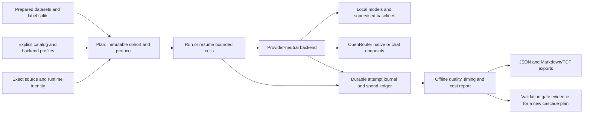

# Decision-model benchmarking

The benchmark pipeline freezes a question/task/model cohort, executes bounded
attempts with durable receipts, and reduces those receipts offline. It compares
decision quality, failure behavior, timing and cost without treating generated
labels as probability distributions. [Providers](providers.md),
[datasets](datasets.md) and [reproducibility](reproducibility.md) define the
corresponding evidence boundaries.

## Workflow

Prepare data, discover candidates, plan, execute and report are separate
operations. Only explicit data fetch/catalog operations and execution contact
the network. Planning cannot spend inference credits. Reports do not re-query a
model. Existing application `evaluate` and the older four benchmark scripts
remain available with their original credential and output behavior.



```bash
uv sync --extra benchmark
mkdir -p .benchmarks/data .benchmarks/catalogs .benchmarks/runs
uv run daf-jev benchmark dataset synthetic --kind binary --samples 120 \
  --seed 20261007 --output .benchmarks/data/binary.json
cat > .benchmarks/synthetic.yaml <<'YAML'
format: dafjev.benchmark-run/1
seed: 20261007
budget_usd: '0'
timing_sampling_scope: cohort
timing_samples: 20  # declared small walkthrough; 120 fixtures contain 24 test groups
datasets:
  - {id: binary, path: data/binary.json}
backends:
  - {id: uniform-control, kind: uniform, hosted: false}
  - {id: exact-rule, kind: rule, hosted: false}
YAML
uv run daf-jev benchmark plan --config .benchmarks/synthetic.yaml \
  --out-dir .benchmarks/runs
uv run daf-jev benchmark run .benchmarks/runs/RUN_UUID
uv run daf-jev benchmark report .benchmarks/runs/RUN_UUID \
  --output .benchmarks/report.json
```

An offline report can also export Markdown, a standalone PDF and frozen
validation gate evidence:

```bash
uv run daf-jev benchmark report .benchmarks/runs/RUN_UUID \
  --markdown .benchmarks/report.md --pdf .benchmarks/report.pdf \
  --gates-output .benchmarks/gates.json
```

For hosted admission, execute capability probes first and inspect the retained
receipts before continuing quality and timing work:

```bash
uv run daf-jev benchmark run .benchmarks/runs/RUN_UUID \
  --through-phase capability_probe --output .benchmarks/probe-report.json
uv run daf-jev benchmark resume .benchmarks/runs/RUN_UUID \
  --through-phase quality --output .benchmarks/quality-report.json
uv run daf-jev benchmark resume .benchmarks/runs/RUN_UUID \
  --output .benchmarks/final-report.json
```

Every stage uses the same frozen manifest and spend ledger. A runtime boundary
leaves later cells unattempted and preserves the full denominator; partial
execution returns exit 1. Resume never repeats completed or unresolved attempts.
The journal and offline report record the latest boundary. `warm_repeat`
includes all frozen repetition rounds; `graphical` or an omitted boundary
includes every phase. Inspect actual billing and capability evidence before
continuing: an unknown charge keeps its reservation and stops hosted admission.
Starting a new run does not grant another spending allocation.

PDF output uses the optional figures environment. All exports bind the manifest
and journal hashes and preserve partial outcomes; rendering a report does not
publish it or improve the underlying evidence. The report is independent of the
historical paper's result-token schema.

Use the UUID directory returned by `plan` in place of `RUN_UUID`. Output files
are exclusive creations; choose a new report filename for a subsequent journal
state. An offline comparator run establishes the harness and labeled
metrics. It is not a local language-model or hosted decision-model run.

Real dataset acquisition is explicit:

```bash
uv run daf-jev benchmark dataset fetch --kind banking77 \
  --out-dir .benchmarks/raw/banking77
uv run daf-jev benchmark dataset prepare --kind banking77 \
  --source .benchmarks/raw/banking77 --output .benchmarks/data/banking77-canonical.json
```

Repeat with `clinc150` and `wine`, producing `clinc150-canonical.json` and
`wine-canonical.json`, before planning `benchmarks/configs/offline.yaml`. That
configuration adds train-only priors, text and structured classifiers on the
prepared real tasks. Generate the other synthetic controls by replacing `binary`
with `categorical`, `ordinal` or `bayes`, retaining the corresponding filenames,
then plan `benchmarks/configs/synthetic.yaml` to compare uniform and exact-rule
references across all four tasks. Hard rule outputs have no fabricated beliefs;
the Bayes rule supplies an explicitly analytical distribution. Consult
[dataset licenses, generator variants and splits](datasets.md)
before using the data. Model discovery is a public catalog GET:

```bash
uv run daf-jev benchmark catalog --output .benchmarks/catalogs/decisions.json \
  --profiles-output .benchmarks/catalogs/profiles.json
```

Review the saved cohort before planning. `local-mac.yaml` describes local arms;
`pilot.yaml` describes a bounded local/hosted pilot. File paths in configuration
resolve relative to that configuration file. Supply prepared data and an exact
catalog path before planning; examples are recipes, not existing model results.

## Frozen plan

Configuration declares `format: dafjev.benchmark-run/1`, explicit datasets and
backend profiles. Each profile has a stable arm ID and kind: `http`, `uniform`,
synthetic-only `rule`, `prior`, `sklearn_text`, `sklearn_structured` or executed `cascade`. HTTP profiles additionally
declare the complete endpoint, model, mode, hosted flag, credential environment
name, effective options, capability metadata and pricing provenance. Profiles
cannot contain key values, authorization headers or custom credential headers.
Chat mode derives a strict per-request JSON schema from the frozen typed
questions by default, including every required ID, complete choice enum and
numeric bounds. An optional explicit `response_format` override is a frozen
profile setting; changing it requires a new run. Generated values still have
no fabricated confidence or probability vector. The hosted Qwen recipe uses
this default; local Ollama reasoning settings are documented in the provider
guide.

An explicit `backends_from_catalog` path can derive candidates from a saved
catalog; the resulting profiles and catalog identity are frozen into the plan.
Discovery never implies inference acceptance. Do not compare an alias to its
target as if they were independent models.

The plan records source file hashes, git HEAD, Python/platform/dependency
versions, configuration hash, dataset hashes, selected IDs, requested model
profiles and every planned cell. Source hashes bind dirty source bytes as well
as a commit ID. A seed determines sample selection and cell order. Changing
source, inputs, settings or cohort requires a new run; execution verifies these
identities before and after consumption.

Protocol defaults are explicit in the frozen manifest: hosted concurrency,
local concurrency, timeout, local profile time limit, timing sample count and
repetition count, retry cap, percentile method and bootstrap seed/count. Read
the manifest to determine a particular run's protocol. Initial quality cells
and repeated timing cells are labeled separately. A repeat phase name does not
prove controlled thermal state, resident weights, caches or server warm-up.

Use `sampling: all` for every validation/test row in the prepared view and
`sampling: pilot` for the declared pilot selector. Other values are rejected.
An `execution_selection: {phase: quality}` plan needs no test timing examples:
unless an explicit shared `timing_sample_pack` is supplied, it freezes an empty
pack with `timing_enabled: false`. This permits training-fold validation without
exposing official test rows. All-phase and warm-repeat plans still require the
exact declared timing sample. To bind a quality pass to subsequent coordinated
warm passes, explicitly supply and verify the shared pack in its configuration.

### Shared timing cohort and the retained scope deviation

The requested comparison uses **100 shared physical test examples overall**,
with five additional repetitions of each example. The same frozen pack must be
used across every model. Capability probes, retries and graphical experiments
are separate cells: 100 examples does not imply 100 total HTTP requests.

The source retained for the expanded Mac study interpreted `timing_samples: 100`
inside each dataset loop. Across its seven task cohorts this produced 368 timing
IDs per profile, an expanded scope rather than the requested global count.
Execution stopped at a clean boundary after primary quality and one additional
round. Those original manifests, presentations, measurements and all remaining
unattempted denominators remain unchanged. They do not establish five-repeat
acceptance or the requested 100-example protocol. A retrospective subset is a
separate analysis, not a repaired prospective experiment.

The corrected local execution subsequently closed all four new primaries and
four complete warm rounds on its global pack. Kev's fifth warm pass closed;
Qwen 4B's fifth pass was interrupted at the frozen storage boundary, leaving a
started cell without a terminal prediction outcome. The coordinator withheld
Jeff and Qwen 0.8B's fifth passes. Keep this partial comparison separate from the
expanded study and from a complete five-round acceptance claim. A canceled
attempt receipt does not turn that unresolved cell into either a prediction or
a demonstrably unattempted cell. Independent custody, clock and final report
acceptance remain distinct from the captured process cleanup.

Corrected global selection requires a newly accepted source and manifest, an
explicit scope and physical-example unit, and an exact selected-ID pack.
The implemented default is `timing_sampling_scope: cohort`: select exactly
`timing_samples` ordinary physical test examples overall, with one seeded
representative per dataset/input group. Deterministic round-robin selection
balances dataset/native-task strata and redistributes exhausted capacity.
Dataset index, example ID, group and task types appear in the ordered pack;
the frozen ordered dataset inventory binds each index to exact prepared bytes.
Choose from the prepared test pool before backend capability
or success filtering. Test targets, observed accuracy, confidence and model
success intersections must not determine the mixture. Small quotas do not
promise coverage of every intent class. Every unsupported or failed selected ID
retains its denominator rather than being replaced.

Matched permutation controls enter as complete validated quality-only groups.
Their physical row count, base-group count, split and request budget remain
explicit; `timing_eligible: false` excludes them from the timing treatment.
Probes, graphical work and validation fixtures also have separate denominators.
Require exactly 100 ordinary test examples for the strict timing protocol;
an insufficient eligible group pool fails before a run is created. Freeze any
separately named smaller study as a different protocol. Reuse the identical
selected pack and request presentation
for all five additional rounds. A changed prompt, source or input cannot borrow
an old primary as its first identical-prompt repetition. Missing sampling scope
in an old manifest retains its original cells and legacy interpretation.

`benchmark_sampling.timing_sample_pack` performs this selection without reading
targets, conditional on the frozen supplied pools. Existing pilot preparation
uses declared class/OOS counts and Wine bins for stratification; the timing
flag `selection_labels_used: false` does not describe that upstream selection.
The run protocol retains `dafjev.benchmark-timing-sample/1`, its SHA-256,
requested/selected counts, sampling method and ordered IDs. An optional config
`timing_sample_pack` must equal the recomputed pack. Explicit
`timing_sampling_scope: per_dataset` retains capped legacy selection; it must
not be described as the global protocol. For a single generated binary dataset
with 120 base fixtures, only 24 test groups exist: choose a declared smaller
timing sample or prepare a sufficiently large cohort.

Execution awaits capability probes, primary quality, each numbered warm round,
then graphical work. A frozen configuration can select one pass:

```yaml
execution_selection:
  phase: warm_repeat  # all, quality, warm_repeat, or graphical
  repeat: 2          # only for warm_repeat; within timing_repetitions
  study_id: mac-pilot
  pass_id: kev-warm-2
```

Selected passes keep the same sample and logical cell IDs as the full plan,
with their validation probes. A caller-owned study coordinator must verify the
primary manifest, complete journal/head, report, model/source/input identities
and terminal outcomes before a separate warm pass. `prior_quality` metadata does
not perform that verification or grant admission. Unresolved attempts and an
unclosed timing window hold the profile; primary unsupported IDs remain
unsupported. Known failures retain the declared repeat denominator.

For four local models, freeze a seeded profile permutation and cyclically shift
it for rounds one through five. Load one profile, perform its declared probe,
execute that pass and retain owned shutdown evidence before loading the next.
Measure every reload/startup and deduct it, preflight and execution from the
profile's shared two-hour allowance. Independent pass limits cannot multiply
that allowance. Warm-only reports defer repeatability: combine the retained
primary and all five rounds by sample/question ID before computing stability.
An isolated phase report does not establish the entire counterbalanced study.

The local profile limit is cumulative across resume. Prediction, retry backoff
and every call in a graphical workflow share the remaining time. Cancellation
retains the attempt receipt and any completed graphical work. Retained resource
windows deduct previously consumed wall time; an unclosed window makes that
time unknown and stops further local admission. Synchronous classifier fitting
is not preemptible by the asynchronous prediction deadline. Its measured setup
time is retained, and this limitation must accompany time-limit claims.

## Attempt lifecycle and spend

Each run has a unique directory, immutable manifest and copied inputs, an
append-only hash-linked `events.jsonl`, and an independently saved journal head.
Execution takes an exclusive local lease. Before each HTTP call, a durable
`attempt_started` reserves a conservative liability; afterward an
`attempt_finished` retains the receipt. Parsing failures keep the paid transport
receipt. Retries are distinct attempts with distinct reservations, cost and
latency. The runner permits a bounded second attempt only for the declared
transient HTTP statuses; arbitrary malformed responses are not retried into a
successful statistic.

HTTP adapter receipts include optional `response_diagnostics` for future
attempts: decoded byte count, SHA-256, complete-body or observed-prefix scope,
allowlisted media type and a fixed body classification. Raw provider bodies,
error excerpts, content-type parameters and arbitrary headers are not retained.
Response model/provider/ID labels must pass bounded ASCII and request/credential
reflection checks; retained labels are still untrusted. The adapter reads decoded
16 KiB chunks and retains at most 1 MiB. The digest/count can include the first
chunk crossing that cap, after which reading stops. HTTPX decoding and its
intermediate memory are outside this retained-buffer bound; it is not an RSS or
compressed-wire limit.
For partial reads, count and digest cover only decoded chunks delivered to the
adapter; undelivered HTTPX decoder/chunker buffers are outside that observation.

Only complete, strictly parsed JSON within the cap can supply reported billing.
An error status, an all-zero tariff, a parseable prefix or a missing cost does
not establish a zero invoice. Valid exact cost is retained independently of
invalid token metadata or answer decoding. Oversized, partial or ambiguous
outer bodies keep billing unknown and retain the original reservation. A known
HTTP status is retained even if reading later times out or is canceled. The
original cancellation propagates; a failed finalization keeps the durable
start uncertain rather than silently producing an outcome. These observations
do not backfill the unretained historical Mercury 404 body or reconcile its
unknown charge. New adapter bytes require fresh run/source admission.

The default pilot admission ceiling is USD 25 and configuration may lower it.
This is a pre-call admission bound, not a guarantee about third-party billing.
Pricing requires source and snapshot date. Chat liability uses advertised
context and the frozen output-token limit with actual sent provider `max_price`
ceilings (USD per million tokens), conditional on their enforcement. The runner
requests `allow_fallbacks: false` and `require_parameters: true`; request/image
ceilings are zero. A catalog context window does not prove an aggregate native
prompt-billing bound across state, questions and options. Paid native input is
therefore unavailable for admission with `native_aggregate_billing_unverified`;
charged native output remains unbounded too. The current implementation supports
no independently verified native aggregate guarantee, so adding a numeric bound
to a profile cannot bypass this refusal. All-zero admitted native tariffs and
surcharge ceilings still reserve zero. Execution checks the supported bound
again and refuses older numeric native reservations without rewriting their
manifests. Missing rates, unsupported nonzero surcharge fields or cache-write
premiums also make hosted admission unavailable. This is an unverified-bound
finding, not evidence of an actual historical undercharge. Reported charges
remain authoritative even if they exceed the reservation, and any such overage
stops new admission.

Execution recomputes the liability for every hosted HTTP profile from its
frozen pricing and actual settings. It refuses a stale saved bound or settings
that would need new provider caps/fallback constraints, before backend creation
or transport. Defaults added to a working copy cannot constrain the original
request. An executed cascade also refuses these known strong-arm mismatches
before weak work. Replanning is required; the old manifest is preserved. This
guards manually supplied or stale manifests and does not establish any
historical undercharge.

Unknown cost retains the reservation and stops hosted admission. A missing cost
field is not zero. Local attempts reserve no hosted USD, but local hardware,
electricity and amortization remain unknown unless supplied separately. The
report exposes observed reported spend, outstanding reservations, unresolved
attempt IDs and admission status. Keep input/output tokens separate from USD.

## Resume without blind replay

```bash
uv run daf-jev benchmark resume .benchmarks/runs/RUN_UUID
```

Resume verifies the existing manifest, copied inputs and complete journal. It
does not start a new experimental identity. Completed cells are not repeated.
Cells never attempted can be admitted after missing external setup is resolved.
An interrupted cell or attempt without a terminal receipt is unresolved and is
not automatically reissued or refunded. This prevents an uncertain prior paid
request from being duplicated. Journal truncation, mutation, symlinks and broken
hash linkage fail closed. Original executor lock inode/filesystem identities are
frozen: a copied run can be inspected with `RunStore(..., read_only=True)`, but
execution/resume requires the original run directory and lock identities.
Resolving an unknown hosted charge needs independent
billing evidence and a separately reviewed reconciliation procedure; this
implementation does not silently repair the record.

## Quality and uncertainty

Hard targets support accuracy, macro-F1, confusion, coverage, failure/abstention
rate and selective risk. Accuracy describes successful predictions; failures
retain their attempted denominator and coverage. Always report both. Macro-F1
uses the complete declared vocabulary, including classes absent from a small
sample. Ordinal predictions additionally support MAE/RMSE; fractional expected
scores are retained as such rather than forced into integer classes.

Probability outputs support multiclass Brier (sum across classes), natural-log
loss, reliability tables and ECE with declared equal-width bins. Binary Brier
is reported separately using P(true). Soft targets support proper distribution
scores without a fabricated hard accuracy. Rows must cover the full vocabulary
and satisfy their declared mass/rounding contract; scoring never renormalizes
them. Zero probability on a true target produces an explicitly infinite-loss
status and count, not clipped probabilities or nonfinite JSON.

Confidence calibration depends on what the confidence field means. Raw entropy
and distribution concentration can inform a policy but do not automatically
mean P(correct). Generated-label arms have no probability/ECE/Brier estimate
unless a separately justified estimator is supplied. Missing metrics stay
missing; they do not become zeros.

Probability provenance and probability meaning are also separate. `native`
identifies an output path; a finite, complete, unit-mass row establishes numeric
validity. Neither establishes a conditional posterior, an empirically calibrated
class probability or a CPT about a population. The pinned Jeff decoder produces
normalized compatibility scores; a classifier supplies estimated class
probabilities, a prior supplies training frequencies, and the analytical Bayes
control supplies a formula-derived conditional distribution. Retain their
declared meanings and unknowns alongside source and rounding. Proper scores and
half-L1 comparisons describe the supplied values under the stated task; they do
not upgrade their interpretation. See [provider semantics](providers.md#probability-meaning-and-confidence).

The retained synthetic variants are not matched causal controls. Native request
criteria preserve insertion order; the original chat prompt sorts criteria while
its schema enum retains dataset order. Different wire hashes therefore do not
prove different model-visible option positions. These observations support no
chat prompt-position sensitivity or zero-effect claim. A new matched cohort
must verify identical state, instructions, descriptions, truth, split and group,
complete cyclic permutations, actual option order and recomputed semantic/order
hashes. Default chat schema rotation is a joint prompt/grammar treatment after
ordered presentation is implemented; an explicit fixed schema can define a
different treatment.

Grouped bootstrap uncertainty resamples independent example groups, retaining
all repetitions in each selected group. The default is a seeded percentile
interval with 2,000 resamples. Fewer than two groups gives an explicit
insufficient-data result. Only metrics implemented with an interval receive one;
the report does not imply confidence intervals for every statistic. The pilot
is descriptive evidence, not a general model ranking or distribution-free
guarantee.

The report's `dataset_audits` distinguishes full prepared data from the frozen
planned quality/timing selection, independently of which cells completed. It
records source/split counts, independent input groups, duplicate/overlap/conflict
counts and leakage-clean cohorts. Intent canonical metrics retain official
rows; separate leakage-filtered metrics disclose sensitivity. Wine Quality
audits original grades, five ordinal bins and information lost through binning;
the ordinal prediction metrics use bin indices. CLINC's `out_of_scope_detection`
uses OOS as a positive class while retaining official labels, planned OOS counts
and failures alongside valid-outcome precision, recall, F1 and specificity.

`repeatability` groups primary quality observations and warm repeats by
example/question. Pairwise label agreement and modal share measure stability,
not accuracy. Supplied valid probability rows also support pairwise half-L1
distance; missing/invalid rows remain counted and are never replaced or
normalized. Primary-only groups and fewer than two usable observations yield
unavailable estimates. Repetitions do not create new independent test examples.

## Timing and costs

Latency rows retain transport, retries, parsing and local work. Report mean,
nearest-rank p50/p95/p99 and the observation count, with failed attempted calls
visible. A p99 from a very small sample is a sample extreme with substantial
uncertainty. Throughput requires an actual measured wall interval; summing
per-request durations is not an elapsed concurrent interval. Report setup and
training time separately from prediction latency, plus precision, hardware,
resident-model behavior, warm-up and concurrency when measured.

`resources` retains scoped wall time and sampled aggregate RSS for the runner,
its descendants and a serving process only when an explicit PID/create-time
identity was supplied. Sampling every 0.1 seconds can miss brief peaks; RSS
includes runner overhead and can underrepresent Metal allocations. The sampler
does not launch or control models. A resource observation is neither a GPU
allocator bound nor a local electricity/hardware cost estimate.

USD per decision and per correct decision require complete cost observations.
Partial known spend can be reported alongside unknown-cost counts, while total
cost and derived cost ratios remain unknown. A locally executed supervised
baseline does not receive a zero-dollar quality/cost claim just because it has
no remote charge receipt.

Currency sums, cascade addition and per-decision ratios use decimal arithmetic.
Reports serialize currency values as decimal strings, with precision 50 and
round-half-even for recurring ratios. These fields describe supplied request
billing only. Local rows can have zero hosted billing while their hardware and
energy expense remains unknown; neither field implies that local computation
is free. Individual admission bounds and reported request charges are finite,
nonnegative, below `1E10` USD and have at most 18 fractional digits. Derived
allocations and replay totals use a separate reduction domain below `1E20` USD,
so a retained overage aggregate is not discarded by reapplying the individual
ceiling. This broader reporting domain never grants admission or increases the
authorized pilot budget.

When one request answers multiple questions, the report allocates its exact
retained charge in `1E-18` USD units: divide integer units evenly and assign one
extra unit to the earliest questions until the remainder is exhausted. The
retained target order, billing-group identity and allocation scope are recorded;
allocations sum exactly to the call charge. They are reporting allocations,
not separately observed provider charges. Offline cascade costs replay these
allocations and do not establish the billing of an executed batched workflow.

## Policies

`calibrate_gate` consumes validation rows only, searches confidence thresholds,
and records a grouped Wilson upper error bound. A group counts as erroneous if
any accepted repeat is wrong. This is a descriptive validation admission rule;
threshold search on the same data does not provide an independent risk
guarantee. Freeze the selected threshold before test evaluation. Insufficient
validation evidence yields an unadmitted gate, not an arbitrary default.

`replay_policy` supports direct, gate and weak-to-strong cascade reduction of
saved aligned rows. Target/group/question identities must match; missing strong
receipts remain errors. Replayed costs and latencies are summed only when both
required observations exist. Replay is marked `policy_replay`; it is not
executed end-to-end policy timing. The offline report explicitly leaves replay
latency unavailable, fits gates using validation quality rows and scores those
fixed policies on test quality rows.

For actual policy execution, `CascadeDecisionBackend` uses caller-owned async
weak/strong backends. It accepts a weak batch only when every required confidence
clears its frozen gate; missing confidence, weak failure or an unadmitted gate
invokes strong. Each child receives separate durable admission/accounting.
Retries of a transient strong failure reuse the same weak result. The enclosing
cell measures actual end-to-end latency, and workflow metadata marks
`executed=True`, selected child and whether strong was invoked.

A `kind: cascade` profile declares `weak` and `strong` profile IDs and a
`gate_file` emitted by `report --gates-output`. Current execution requires a
local weak profile, hosted HTTP strong profile and one resident local weak
profile per run. The frozen `validation_identity` binds exact prepared bytes,
weak profile, source files and training seed; changed inputs/model/settings or
code cannot reuse a different fitted gate. This establishes evidence linkage,
not an independent error-risk guarantee.

`entropy_reask` is a bounded synthetic oracle simulation over independent
posterior rows, with at most three reveals. It selects the unasked variable with
maximum entropy, reveals its oracle value and makes that row one-hot. It neither
calls a model nor propagates coupled Bayesian evidence. Coupled inference uses
`BayesNet`; provider re-asking must actually execute and retain new receipts.

For the coupled control, `benchmark_graphical.run_graphical_experiment` takes an
already configured async backend and observer. It discloses a fixed three-node
generative network in the prompt, elicits five CPT rows with chunk limit 32,
proposes edges with exact limit 8/penalty 1, and compares distributions to the
analytical soft truth. A separately seeded reference sample supplies hidden
observations. After each entropy-selected reveal, full Bayesian conditioning
updates the other variables; the receipt records both elicited and reference
posterior trajectories. At most three reveals have declared synthetic cost
units. With `model_reask=True` (default), after each reveal the model is asked for
the highest-entropy remaining variable's posterior using the updated evidence.
Those genuine beliefs are scored against analytical posterior truth and retain
new attempt receipts. Exhausting all variables makes no further request. The
observation cost units and actual model request costs remain separate. This is factor reconstruction and synthetic
policy execution, not latent causal discovery or real-data accuracy.

Only genuine complete choice beliefs can form CPTs. A backend without the
Choice primitive is explicitly unsupported before any graphical request.
Generated labels, absent
confidence and rounded rows outside the strict CPT mass tolerance produce an
explicit failed experiment with retained receipts. Structure and posterior
re-ask rows honor matching declared adapter precision without normalization.
An admission refusal before any child attempt remains unattempted; a later
budget stop retains partial experiment and transport evidence. The API
creates/closes no backend and makes no implicit hosted call. A caller must separately freeze its
profile/source identity and persist the resulting `dafjev.graphical-experiment/1`
record before using it as benchmark evidence. Set `model_reask=False` for the
pure coupled observation control, whose trajectory adds no model calls.

A run configuration enables this control with `graphical_experiments: true`
for the declared cohort or a list of selected profile IDs. The run manifest
freezes the reference network, chunk/search settings, seed, reveal bound and
observation costs. Graphical cells retain their own status/records under the
report's `graphical_experiments`; they are excluded from dataset quality cohorts.
Its status agrees with the main cell table: a started graphical cell without a
terminal cell outcome is `unresolved`, while a never-started cell is
`unattempted`. A canceled or otherwise closed transport attempt does not supply
the missing graphical outcome. A reporting correction changes this summary;
it does not rerun an experiment or upgrade historical inference evidence.
Use the JSON report for full posterior trajectories and per-call evidence.
Generated-label profiles are explicitly unsupported for this control; a
completed dataset classifier arm does not imply it can reconstruct arbitrary
Bayesian factors.

## Reading acceptance

A report preserves planned, completed, failed, unsupported, unattempted and
unresolved cells. Read these denominators before comparing cohort metrics. A
technical `complete` status excludes failed, unattempted and unresolved cells;
inspect unsupported counts before claiming cohort coverage. Publication requires
adequate independent test groups, fixed prompts/policies, verified real model
execution, cost reconciliation and an exact evidence selection. Historical
September receipts remain historical; the new machinery does not retroactively
supply missing environment, labels, cost or answer-equivalence evidence.
