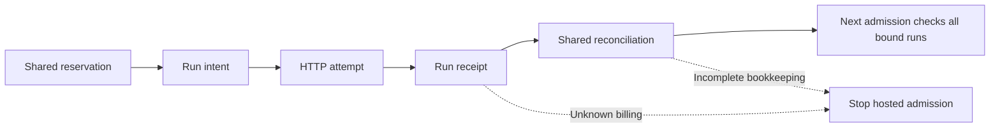

# Shared hosted allocations

A run budget is subordinate to one declared hosted allocation. Starting a new
run, retrying a failed call, changing models or selecting a nominally free
tariff does not create another authorization. New hosted execution requires an
existing allocation bound into its immutable manifest. Local-only execution
retains the run ledger and does not require hosted accounting.

The first research allocation remains **USD 25 total**, including probes,
failures and retries. Its original failed hosted probe has unknown billing.
Importing that evidence retains the uncertainty and stops further hosted
admission by default. An explicitly accepted, independently reviewed upper-bound
exception for a finished attempt can permit continuation without reconciling its
charge or enlarging the allowance. Account aggregate usage, a free catalog price or an absent activity
row does not establish the charge of that individual attempt.

## Explicit operations

Accounting administration performs no inference. Initialization creates an
exclusive directory; it must describe an existing human authorization, rather
than grant one. When prior runs consumed that authorization, declare their exact
bindings as required imports before execution. Preserve the original run files.

```bash
uv run daf-jev benchmark allocation init .benchmarks/allocations/FIRST_ALLOCATION \
  --allocation-id first-authorized-hosted-usd25 --limit-usd 25 \
  --required-import .benchmarks/legacy-binding.json
uv run daf-jev benchmark allocation import-legacy \
  .benchmarks/allocations/FIRST_ALLOCATION --binding .benchmarks/legacy-binding.json
uv run daf-jev benchmark allocation inspect .benchmarks/allocations/FIRST_ALLOCATION
```

These are recipes. Do not initialize a second directory to bypass a stop in the
first. Import must verify the declared immutable run manifest, complete journal
and saved head; it cannot backfill unknown costs or repair original receipts.
Required imports must be satisfied before hosted execution. Duplicate imports
cannot spend or release the same attempt twice.

The binding format is `dafjev.shared-allocation-legacy-binding/1`. Its fields
are `directory`, `manifest_hash`, `manifest_sha256`, `journal_sha256`,
`head_sha256` and `journal_tip`. Capture the existing bytes rather than typing
checksums from memory:

```python
import json
from pathlib import Path
from daf_jev.benchmark_allocation import LegacyRunBinding

binding = LegacyRunBinding.capture(Path(".benchmarks/runs/ORIGINAL_RUN_UUID"))
with Path(".benchmarks/legacy-binding.json").open("x") as output:
    json.dump(binding.to_dict(), output, sort_keys=True, indent=2)
```

This reads and validates retained accounting evidence. It does not initialize
an allocation, modify the original run or establish its unknown provider charge.

`inspect` returns the immutable allocation identity and its current accounting
snapshot. Use the returned allocation ID and manifest hash in the plan
configuration, together with the existing directory:

```yaml
budget_usd: '25'
shared_allocation:
  directory: allocations/FIRST_ALLOCATION
  allocation_id: first-authorized-hosted-usd25
  manifest_hash: EXACT_HASH_FROM_INSPECT
```

The directory resolves relative to the configuration file during planning;
the resulting manifest freezes its executable binding. Parent traversal and
changed identities are refused. The run ceiling cannot exceed the shared
allocation ceiling. Planning reads this existing evidence and never initializes
an allocation, imports old runs or binds execution automatically. An unbound
hosted research proposal can still be frozen for inspection; it cannot execute.

## Admission and reconciliation

An exclusive allocation execution lease coordinates separate run executors.
Within-run hosted concurrency retains its frozen setting. OS lease release on
process exit does not erase admitted requests: abandoned durable intents stop
the next executor. The runner also takes its per-run lease and verifies its
immutable allocation identity before hosted work.

Every actual transport attempt, including declared retries and cascade children,
first reserves bounded liability in the shared journal, then records the run
intent. Only then can transport begin. Completion saves the run receipt before
shared reconciliation. A crash or inconsistent second write cannot silently
release a shared reservation. Unknown billing retains liability and stops new
hosted requests, including attempts with zero nominal reservation, unless the
exact finished historical attempt receives the reviewed exception below.
Shared completion must match the exact durable per-run receipt, including its
cost and billing provenance, before releasing liability for another admission.
A valid journal hash chain alone cannot authorize a contradictory charge.



The allocation manifest, linked journal, saved head and physical locks are
separate custody inputs. Mutation, replaced locks, symlinks, malformed events
and incomplete journal/head writes fail closed. Currency uses decimal
arithmetic. Reported billing, tariff estimates and unknown charges remain
different categories. The reservation ceiling is an admission rule conditional
on the frozen tariff/token-bound contracts, not a promise about provider billing.
Accounting and journal verification contribute execution overhead. The current
binding checks include full manifest hashing during attempt accounting; scaling
that work to the expanded cohort is unmeasured. Include that overhead in actual
workflow timing and profile it before claiming high-throughput acceptance.

## Historical evidence and recovery

Reports reduce original per-run receipts offline. A separately labeled shared
snapshot describes the currently inspected allocation; it is not an
inference-time receipt or a reconstruction of past billing. Missing allocation
files can make that snapshot unavailable while historical per-run results
remain readable. Reporting does not mutate the allocation or contact a model.

Unbound historical hosted manifests are refused before backend construction,
credential lookup or transport. Do not edit them to add a new binding. After
accounting closure and independent acceptance of revised software, freeze a new
manifest with explicitly selected datasets, model cohort and the existing
allocation. Preserve earlier plans and every unfinished denominator. A source
change or new manifest cannot reset historical local execution allowances.

No automatic process-liveness inference, uncertain-attempt replay or
account-aggregate reconciliation closes a stop. Retain original evidence and
obtain exact charge evidence or accept a reviewed request-specific upper bound
for the finished attempted call before additional hosted execution. Administrative evidence cannot fabricate a reported provider cost.

## External evidence for a finished UNKNOWN attempt

The offline reconciliation interface can add a separately verified charge for
one **finished, imported legacy attempt**. It does not replay that request,
change its original receipt, remove the original import, or create another
allowance. The first research allocation still has no accepted exact-attempt
proof and remains blocked. The commands below are preparation recipes, not a
claim that its billing has been resolved.

```bash
uv run daf-jev benchmark allocation reconciliation-target \
  .benchmarks/allocations/FIRST_ALLOCATION \
  --legacy-manifest-hash ORIGINAL_MANIFEST_HASH --attempt-id ORIGINAL_ATTEMPT_ID
uv run daf-jev benchmark allocation preview-reconciliation \
  .benchmarks/allocations/FIRST_ALLOCATION \
  --evidence evidence.json --evidence-sha256 EXACT_EVIDENCE_SHA256 \
  --review review.json --review-sha256 EXACT_REVIEW_SHA256
uv run daf-jev benchmark allocation reconcile \
  .benchmarks/allocations/FIRST_ALLOCATION \
  --evidence evidence.json --evidence-sha256 EXACT_EVIDENCE_SHA256 \
  --review review.json --review-sha256 EXACT_REVIEW_SHA256
```

The target freezes the canonical allocation directory, ID, manifest hash and
journal tip; the complete legacy binding and original import event hash; and
the attempt's UUID, cell, request hash, model, endpoint, original liability,
timestamp, nullable original provider/response ID, start and finish event hashes,
and receipt hash. A modern same-model/day record cannot supply an original
missing response ID. A copied directory cannot reuse an approved target,
including when its lock files are hardlinked to the original.

Retain three immutable local JSON files, each at most 1 MiB. They can contain
private provider evidence and should not be published as generic logs:

- `dafjev.external-billing-evidence/1` has exactly `format`, `scope`, `target`,
  `source_kind`, `document`, `authority`, `reference`, `collected_by`, `currency`
  and `cost_usd`. Scope is `exact_attempt_account_charge`; currency is `USD`;
  cost is a nonnegative exact decimal string. `document` binds its absolute
  local path, SHA256 and byte count. `target` is the exact target above.
- `generation_metadata` evidence uses a document containing `data`. Its ID
  must match the already-retained original response ID and evidence reference;
  model and `total_cost` must match the exact claim. JSON numbers are parsed as
  Decimal. Without that original ID, obtain uniquely attributed provider
  evidence instead of guessing a generation.
- `provider_statement` uses `dafjev.exact-provider-charge-statement/1` with
  exactly `format`, `scope`, `authority`, `reference`, `request`, `currency`
  and `cost_usd`. `request` must equal the complete immutable attempt mapping,
  including UUID and receipt/event hashes. This is a structured exact-attempt
  attribution record whose provider origin and mapping require independent
  review; generic activity exports or support statements lacking that
  attribution are insufficient.
- `dafjev.external-billing-review/1` has exactly `format`, `decision`,
  `reviewer`, `evidence_sha256`, `document_sha256`, `allocation_tip`,
  `provider_origin_verified`, `unique_exact_attempt_verified` and
  `usd_account_charge_verified`. Decision is `approve_exact_attempt_charge`;
  the three verified fields must be true; reviewer differs from collector.
  The review binds both input digests and the expected allocation cut.

These schemas express a **trusted, independently reviewed local operator
attestation**. Different actor names and true flags do not establish real
independence, and SHA256 proves byte custody rather than provider origin. The
operator must verify the actual source and unique call attribution before
invoking reconciliation. The API neither authenticates OpenRouter nor prevents
a malicious caller from manufacturing a different attestation for a different
ledger. A cooperative, human-owned canonical ledger remains required.

Preview validates the retained bytes and cut without writing allocation events.
Application requires an inactive exclusive lease and adds one linked event;
it does not rewrite the run. The authority/reference pair and provider-document
digest can be used for only one attempt. An identical repeat is a no-op only
after revalidating the original files and recorded event. Conflicting proof,
changed file identity, missing proof, stale cut, malformed JSON, partial writes
or changed original evidence fail closed. Keep all three proof files available
at their bound paths for later inspection and admission.

Shared snapshots keep `reported_cost_usd` as the original receipt total and
retain every original UNKNOWN in `historical_unknown_attempts`. Separately,
`externally_verified_cost_usd` and `externally_reconciled_attempts` describe
accepted external evidence; `effective_cost_usd` is the sum charged against
the same allowance and the original frozen run limit. Original per-run
reporting still shows UNKNOWN. Resolving
one exact charge cannot clear another UNKNOWN, unfinished admission, rejected
receipt, structural stop or durability failure. A positive exact charge above
an original zero reservation is fully debited **and remains stopped for a bound
breach**; it is never clamped to zero. Older software refuses the new event
rather than reporting a misleading reduced total.

These controls coordinate cooperating POSIX processes on the same local
filesystem. They do not enforce account-wide authorization across unrelated
directories or machines, establish complete provider invoices, or attest all
unrecorded historical calls. The declared allocation and import inventory need
human ownership and independent review. The frozen expanded hosted proposal
remains a research obligation until a newly accepted executable cohort has
actual receipts and reconciled accounting.

## Reviewed continuation with a bounded UNKNOWN

A bounded exception is different from billing reconciliation. It preserves the
original UNKNOWN receipt and import, holds the reviewed maximum against the
same allowance, and permits continuation only for the exact finished imported
attempt accepted by the operator. The default unknown-billing rule stays strict.
An unfinished request, a conflicting receipt, durability rejection, structural
stop or known overcharge cannot receive this exception. It does not create a
new allowance or claim that a nominally free failed call was charged zero.

```bash
uv run daf-jev benchmark allocation bounded-unknown-target \
  .benchmarks/allocations/FIRST_ALLOCATION \
  --legacy-manifest-hash ORIGINAL_MANIFEST_HASH --attempt-id ORIGINAL_ATTEMPT_ID
uv run daf-jev benchmark allocation preview-bounded-unknown \
  .benchmarks/allocations/FIRST_ALLOCATION \
  --evidence bound.json --evidence-sha256 EXACT_BOUND_SHA256 \
  --review review.json --review-sha256 EXACT_REVIEW_SHA256
uv run daf-jev benchmark allocation accept-bounded-unknown \
  .benchmarks/allocations/FIRST_ALLOCATION \
  --evidence bound.json --evidence-sha256 EXACT_BOUND_SHA256 \
  --review review.json --review-sha256 EXACT_REVIEW_SHA256
```

Evidence `dafjev.bounded-unknown-evidence/1` binds the allocation journal tip,
exact imported run and attempt, an exact-request tariff document, USD bound,
source authority/reference and collector. The document
`dafjev.exact-request-tariff-bound/1` binds the complete attempt and explains
how the request, routing, tariff and billing contract establish that bound.
A reconstructed semantic request must match the retained request hash; it is
not evidence that raw wire bytes or the omitted response have been recovered.

A distinct reviewer records `dafjev.bounded-unknown-review/1`, approving
`approve_bounded_unknown_continuation`, binding evidence/document/target hashes
and the exact allocation tip, and verifying contract origin, unique attempt
attribution and the upper bound. Reducing the original reservation additionally
requires explicit independent verification. Hashes and review flags preserve
local custody; they do not authenticate a provider or prove its enforcement.

Snapshots retain `unknown_attempts` and `historical_unknown_attempts` and add
`bounded_unknown_attempts` and `held_upper_bound_usd`. Known effective charges
remain reported plus externally verified charges. Admission uses those charges,
pending reservations and held bounds together; the original USD 25 cap applies
to the whole total. A later exact-charge reconciliation releases that hold and
debits the actual charge. Any reviewed-bound breach remains a stop.

## Jev native input contract

The supported Jev contract pins `typesafe/jev-1.13`, the Decisions endpoint and
TypeSafe-only routing. The [official Jev guide](https://openrouter.ai/docs/guides/community/jev)
defines the input window as state plus questions; the
[endpoint declaration](https://openrouter.ai/api/v1/models/typesafe/jev-1.13/endpoints)
declares a 32,000-token maximum prompt and zero output tariff. The larger
catalog context is not substituted for that input limit. At the captured input
rate USD 0.000000042 per token, the conditional single-attempt reservation is
USD 0.001344. Each retry reserves separately. Actual `usage.cost` remains the
billing observation, and a usage/charge breach stops the runner.

Use the [native recipe](../benchmarks/configs/native-jev-pilot.yaml) with an
explicit existing allocation binding and newly frozen source snapshots. The
recipe admits no auxiliary paid service, alternate provider, silent vocabulary
reduction or substitution of a chat model. Other native models require their
own supported billing contracts; Jev's guarantee cannot be transferred to them.
