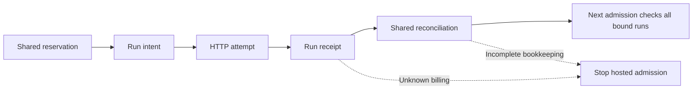

# Shared hosted allocations

A run budget is subordinate to one declared hosted allocation. Starting a new
run, retrying a failed call, changing models or selecting a nominally free
tariff does not create another authorization. New hosted execution requires an
existing allocation bound into its immutable manifest. Local-only execution
retains the run ledger and does not require hosted accounting.

The first research allocation remains **USD 25 total**, including probes,
failures and retries. Its original failed hosted probe has unknown billing.
Importing that evidence must retain the uncertainty and stop further hosted
admission. Account aggregate usage, a free catalog price or an absent activity
row does not establish the charge of that individual attempt.

## Explicit operations

Accounting administration performs no inference. Initialization creates an
exclusive directory; it must describe an existing human authorization, rather
than grant one. When prior runs consumed that authorization, declare their exact
bindings as required imports before execution. Preserve the original run files.

```bash
uv run daf-jev benchmark allocation init .benchmarks/allocations/FIRST_ALLOCATION \
  --allocation-id first-authorized-hosted-usd25 --limit-usd 25 \
  --required-import .benchmarks/legacy-binding.json
uv run daf-jev benchmark allocation import-legacy \
  .benchmarks/allocations/FIRST_ALLOCATION --binding .benchmarks/legacy-binding.json
uv run daf-jev benchmark allocation inspect .benchmarks/allocations/FIRST_ALLOCATION
```

These are recipes. Do not initialize a second directory to bypass a stop in the
first. Import must verify the declared immutable run manifest, complete journal
and saved head; it cannot backfill unknown costs or repair original receipts.
Required imports must be satisfied before hosted execution. Duplicate imports
cannot spend or release the same attempt twice.

The binding format is `dafjev.shared-allocation-legacy-binding/1`. Its fields
are `directory`, `manifest_hash`, `manifest_sha256`, `journal_sha256`,
`head_sha256` and `journal_tip`. Capture the existing bytes rather than typing
checksums from memory:

```python
import json
from pathlib import Path
from daf_jev.benchmark_allocation import LegacyRunBinding

binding = LegacyRunBinding.capture(Path(".benchmarks/runs/ORIGINAL_RUN_UUID"))
with Path(".benchmarks/legacy-binding.json").open("x") as output:
    json.dump(binding.to_dict(), output, sort_keys=True, indent=2)
```

This reads and validates retained accounting evidence. It does not initialize
an allocation, modify the original run or establish its unknown provider charge.

`inspect` returns the immutable allocation identity and its current accounting
snapshot. Use the returned allocation ID and manifest hash in the plan
configuration, together with the existing directory:

```yaml
budget_usd: '25'
shared_allocation:
  directory: allocations/FIRST_ALLOCATION
  allocation_id: first-authorized-hosted-usd25
  manifest_hash: EXACT_HASH_FROM_INSPECT
```

The directory resolves relative to the configuration file during planning;
the resulting manifest freezes its executable binding. Parent traversal and
changed identities are refused. The run ceiling cannot exceed the shared
allocation ceiling. Planning reads this existing evidence and never initializes
an allocation, imports old runs or binds execution automatically. An unbound
hosted research proposal can still be frozen for inspection; it cannot execute.

## Admission and reconciliation

An exclusive allocation execution lease coordinates separate run executors.
Within-run hosted concurrency retains its frozen setting. OS lease release on
process exit does not erase admitted requests: abandoned durable intents stop
the next executor. The runner also takes its per-run lease and verifies its
immutable allocation identity before hosted work.

Every actual transport attempt, including declared retries and cascade children,
first reserves bounded liability in the shared journal, then records the run
intent. Only then can transport begin. Completion saves the run receipt before
shared reconciliation. A crash or inconsistent second write cannot silently
release a shared reservation. Unknown billing retains liability and stops new
hosted requests, including attempts with zero nominal reservation.
Shared completion must match the exact durable per-run receipt, including its
cost and billing provenance, before releasing liability for another admission.
A valid journal hash chain alone cannot authorize a contradictory charge.



The allocation manifest, linked journal, saved head and physical locks are
separate custody inputs. Mutation, replaced locks, symlinks, malformed events
and incomplete journal/head writes fail closed. Currency uses decimal
arithmetic. Reported billing, tariff estimates and unknown charges remain
different categories. The reservation ceiling is an admission rule conditional
on the frozen tariff/token-bound contracts, not a promise about provider billing.
Accounting and journal verification contribute execution overhead. The current
binding checks include full manifest hashing during attempt accounting; scaling
that work to the expanded cohort is unmeasured. Include that overhead in actual
workflow timing and profile it before claiming high-throughput acceptance.

## Historical evidence and recovery

Reports reduce original per-run receipts offline. A separately labeled shared
snapshot describes the currently inspected allocation; it is not an
inference-time receipt or a reconstruction of past billing. Missing allocation
files can make that snapshot unavailable while historical per-run results
remain readable. Reporting does not mutate the allocation or contact a model.

Unbound historical hosted manifests are refused before backend construction,
credential lookup or transport. Do not edit them to add a new binding. After
accounting closure and independent acceptance of revised software, freeze a new
manifest with explicitly selected datasets, model cohort and the existing
allocation. Preserve earlier plans and every unfinished denominator. A source
change or new manifest cannot reset historical local execution allowances.

No automatic process-liveness inference, uncertain-attempt replay or
account-aggregate reconciliation closes a stop. Retain original evidence and
obtain evidence for the exact attempted call before any additional hosted
execution. Administrative evidence cannot fabricate a reported provider cost.

These controls coordinate cooperating POSIX processes on the same local
filesystem. They do not enforce account-wide authorization across unrelated
directories or machines, establish complete provider invoices, or attest all
unrecorded historical calls. The declared allocation and import inventory need
human ownership and independent review. The frozen expanded hosted proposal
remains a research obligation until a newly accepted executable cohort has
actual receipts and reconciled accounting.
